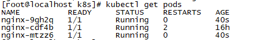

# 容器化进阶Kubernetes快速入门

## 1.Kubernetes概述

### 1.1 Kubernetes介绍
#### 1.1.1 Kubernetes是什么及作用
Kubernetes(K8S)是Google在2014年发布的一个开源项目，用于自动化容器化应用程序的部署、扩展和管理。Kubernetes通常结合docker容器工作，并且整合多个运行着docker容器的主机集群。
官网地址 https://Kubernetes.io

中文社区 https://www.kubernetes.org.cn/docs

Kubernetes的目标是让部署容器化的应用简单并且高效，Kubernetes一个核心特点就是能够自主的管理容器来保证云平台中的容器按照用户的期望运行。以下是Kubernetes相关特性：

- 自动包装

  根据资源需求和其他约束自动放置容器，同时不会牺牲可用性，混合关键和最大努力的工作负载，以提高资源利用率并节省更多资源。

- 横向缩放

  使用简单的命令或 UI，或者根据 CPU 的使用情况自动调整应用程序副本数。

- 自动部署和回滚

  Kubernetes 逐渐部署对应用程序或其配置的更改，同时监视应用程序运行状况，以确保它不会同时终止所有实例。 如果出现问题，Kubernetes会为您恢复更改，利用日益增长的部署解决方案的生态系统。

- 存储编排

  自动安装您所选择的存储系统，无论是本地存储，如公有云提供商 [GCP](https://cloud.google.com/storage/) 或 [AWS](https://aws.amazon.com/products/storage/), 还是网络存储系统 NFS, iSCSI, Gluster, Ceph, Cinder, 或 Flocker。

- 自我修复

  重新启动失败的容器，在节点不可用时，替换和重新编排节点上的容器，终止不对用户定义的健康检查做出响应的容器，并且不会在客户端准备投放之前将其通告给客户端。

- 服务发现和负载均衡

  不需要修改您的应用程序来使用不熟悉的服务发现机制，Kubernetes 为容器提供了自己的 IP 地址和一组容器的单个 DNS 名称，并可以在它们之间进行负载均衡。

- 密钥和配置管理

  部署和更新密钥和应用程序配置，不会重新编译您的镜像，不会在堆栈配置中暴露密钥(secrets)。

- 批处理

  除了服务之外，Kubernetes还可以管理您的批处理和 CI 工作负载，如果需要，替换出现故障的容器。

***使用Kubernetes能做什么***

Kubernetes是一个全新的基于容器技术的分布式架构领先方案（源于Brog，是google十几年经验的结晶）；Kubernetes是一个开放的开发平台（无侵入性，现有系统很容器迁移到Kubernetes上）；Kubernetes是一个完备的分布式系统支撑平台（完善的集群管理能力）。

使用Kubernetes可以在物理或虚拟机的Kubernetes集群上运行容器化应用，Kubernetes能够提供一个以容器为中心的基础架构，满足在生产环境中运行应用的一些常见需求，如:

- 多个进程协同工作
- 存储系统挂载
- Distributing secrets
- 应用健康检测
- 应用实例的复制
- Pod自动伸缩/扩展
- Naming and discovering
- 负载均衡
- 滚动更新
- 资源监控
- 日志访问
- 调度应用程序
- 提供认证和授权

***为什么使用Kubernetes***

使用Kubernetes最直接的感受就是我们可以轻装上阵的开发复杂的系统了；其次Kubernetes是在全面拥抱微服务架构（微服务的核心就是将一个巨大的单体应用拆分成很多小的互相连接的微服务，一个微服务后面可能是多个实例副本在支撑，副本数量可以随着系统负荷的变化而动态调整）；最后Kubernetes系统架构具备超强的横向扩展能力。

#### 1.1.2 Kubernetes快速入门

- 环境准备

  - 关闭CentOS防火墙

    systemctl disable firewalld

    systemctl stop firewalld

  - 安装etcd和kubernetes软件

    yum install -y etcd kubernetes

  - 启动服务

    systemctl start etcd

    systemctl start docker 

    ```
    如果docker启动失败，请参考(vi /etc/sysconfig/selinux    把selinux后面的改为disabled，重启一波   机器，再重启docker就可以了)
    ```

    systemctl start kube-apiserver

    systemctl start kube-controller-manager

    systemctl start kube-scheduler

    systemctl start kubelet

    systemctl start kube-proxy

- 配置

  - Tomcat配置

    - mytomcat.rc.yaml

      ```
      apiVersion: v1
      kind: ReplicationController
      metadata:
       name: mytomcat
      spec:
       replicas: 2
       selector:
        app: mytomcat
       template:
        metadata:
         labels:
          app: mytomcat
        spec:
         containers:
          - name: mytomcat
            image: tomcat:7-jre7
            ports: 
            - containerPort: 8080
      ```

      kubectl create -f mytomcat.rc.yaml

    - mytomcat.svc.yaml

      ```
      apiVersion: v1
      kind: Service
      metadata:
       name: mytomcat
      spec:
       type: NodePort
       ports:
        - port: 8080
          nodePort: 30001
       selector:
        app: mytomcat
      ```

      kubectl create -f mytomcat.svc.yaml

- 问题解决

  - docker pull失败

    - 解决方案1

      1、yum install *rhsm* -y

      2、docker pull registry.access.redhat.com/rhel7/pod-infrastructure:latest

      如果以上两步解决问题了，那么就不需要在执行下面操作

      3、docker search pod-infrastructure

      4、docker pull docker.io/tianyebj/pod-infrastructure

      5、docker tag tianyebj/pod-infrastructure 192.168.126.143:5000/pod-infrastructure  

      6、docker push 192.168.126.143:5000/pod-infrastructure

      7、vi /etc/kubernetes/kubelet 

      修改 KUBELET_POD_INFRA_CONTAINER="--pod-infra-container-image=192.168.126.143:5000/pod-	infrastructure:latest"

      8、重启服务

      systemctl restart kube-apiserver
      systemctl restart kube-controller-manager
      systemctl restart kube-scheduler
      systemctl restart kubelet
      systemctl restart kube-proxy

    - 解决方案2

      1、docker pull kubernetes/pause

      2、docker tag docker.io/kubernetes/pause:latest 192.168.126.143:5000/google_containers/pause-amd64.3.0

      3、docker push 192.168.126.143:5000/google_containers/pause-amd64.3.0

      4、vi /etc/kubernetes/kubelet配置为

      ​	KUBELET_ARGS="--pod_infra_container_image=192.168.126.143:5000/google_containers/pause-amd64.3.0"

      5、重启kubelet服务   systemctl restart kubelet

  - 外部网不能访问

    在搭建好的k8s集群内创建的容器，只能在其所在的节点上curl可访问，但是在其他任何主机上无法访问容器占用的端口 

    解决方案：

    1、vim /etc/sysctl.conf

    2、net.ipv4.ip_forward=1

  - 解决 kubectl get pods时No resources found问题
    1、vim /etc/kubernetes/apiserver
    2、找到”KUBE_ADMISSION_CONTROL="-   	admission_control=NamespaceLifecycle,NamespaceExists,LimitRanger,SecurityContextDeny,ServiceAccount,ResourceQuota"，去掉ServiceAccount，保存退出。
    3、systemctl restart kube-apiserver  重启此服务

- 浏览测试

  ​	

### 1.2 Kubernetes 基本架构与常用术语

Kubernetes集群包含有节点代理kubelet和Master组件(APIs, scheduler, etc)，一切都基于分布式的存储系统。下面这张图是Kubernetes的架构图。


在这张系统架构图中，我们把服务分为运行在工作节点上的服务和组成集群级别控制板的服务。

Kubernetes节点有运行应用容器必备的服务，而这些都是受Master的控制。

每次个节点上当然都要运行Docker。Docker来负责所有具体的映像下载和容器运行。

Kubernetes主要由以下几个核心组件组成：

- etcd保存了整个集群的状态；
- apiserver提供了资源操作的唯一入口，并提供认证、授权、访问控制、API注册和发现等机制；
- controller manager负责维护集群的状态，比如故障检测、自动扩展、滚动更新等；
- scheduler负责资源的调度，按照预定的调度策略将Pod调度到相应的机器上；
- kubelet负责维护容器的生命周期，同时也负责Volume（CVI）和网络（CNI）的管理；
- Container runtime负责镜像管理以及Pod和容器的真正运行（CRI）；
- kube-proxy负责为Service提供cluster内部的服务发现和负载均衡；

除了核心组件，还有一些推荐的Add-ons：

- kube-dns负责为整个集群提供DNS服务
- Ingress Controller为服务提供外网入口
- Heapster提供资源监控
- Dashboard提供GUI
- Federation提供跨可用区的集群
- Fluentd-elasticsearch提供集群日志采集、存储与查询

Kubernetes设计理念和功能其实就是一个类似Linux的分层架构

- 核心层：Kubernetes最核心的功能，对外提供API构建高层的应用，对内提供插件式应用执行环境
- 应用层：部署（无状态应用、有状态应用、批处理任务、集群应用等）和路由（服务发现、DNS解析等）
- 管理层：系统度量（如基础设施、容器和网络的度量），自动化（如自动扩展、动态Provision等）以及策略管理（RBAC、Quota、PSP、NetworkPolicy等）
- 接口层：kubectl命令行工具、客户端SDK以及集群联邦
- 生态系统：在接口层之上的庞大容器集群管理调度的生态系统，可以划分为两个范畴
  - Kubernetes外部：日志、监控、配置管理、CI、CD、Workflow、FaaS、OTS应用、ChatOps等
  - Kubernetes内部：CRI、CNI、CVI、镜像仓库、Cloud Provider、集群自身的配置和管理等

#### 1.2.1 Cluster

Cluster是计算、存储和网络资源的集合，Kubernetes利用这些资源运行各种基于容器的应用.

Kubernetes Cluster由Master和Node组成，节点上运行着若干Kubernetes服务

#### 1.2.1 Master

Master主要职责是调度，即决定将应用放在哪运行。Master运行Linux系统，可以是物理机或虚拟机。
Master是Kubernetes Cluster的大脑，运行着的Daemon服务包括kube-apiserver、kube-scheduler、kuber-controller-manager、etcd和Pod网络

- API Serer(kube-apiserver) 

  API Server 提供HTTP/HTTPS RESTful API,即Kubernetes API.是Kubernetes里所有资源的CRUD等操作的唯一入口，也是集群控制的入口进程

- Scheduler(kube-scheduler)

  Scheduler负责资源调度的里程，简单说，它决定将Pod放在哪个Node上运行

- Controller Manager(kube-controller-manager)

  所有资源对象的自动化控制中心。Controller Manager负责管理Cluster各种资源，保证资源处于预期的状态。Controller Manager有多种，如replication controller、endpoints controller、namespace controller、serviceaccounts controller等。

  不同的controller管理不同的资源，如replication controller管理Deployment、StatefulSet、DaemonSet的生命周期，namespace controller管理Namespace资源

- etcd

  etcd负责保存Kubernetes Cluster的配置信息和各种资源的状态信息。当数据发生变化时，etcd会快速地通知Kubernetes相关组件

- Pod网络

  Pod要能够相互通信，Kubernetes Cluster必须部署Pod网络，flannel是其中一个可选方案。

#### 1.2.2 Node

  除了Master，Kubernetes集群中的其它机器被称为Node节点。Node职责是运行容器应用，Node由Master管理，Node负责监控并汇报容器的状态，同时根据Master的要求管理容器的生命周期。Node也运行在Linux系统，可以是物理机或虚拟机。

每个Node节点上都运行着以下一组关键进程

- kubelet

  负责Pod对应的容器的创建、启动等任务，同时与Master节点密切协作，实现集群管理的基本功能

- kube-proxy

  实现Kubernetes Service的通信与负载均衡机制的重要组件

- Docker Enginer

  Docker引擎，负责本机的容器创建和管理工作


#### 1.2.3 Pod

  Pod是Kubernetes的最小单元，也是最重要和最基本的概念。每一个Pod包含一个或多个容器，Pod的容器会作为一个整体被Master调度到一个Node上运行。Kubenetes为每个Pod都分配了唯一的IP地址，称为PodIP,一个Pod里的多个容器共享PodIP地址。在Kubernetes里，一个Pod里的容器与另外主机上的Pod容器能够直接通信。

#### 1.2.4 Service

Kubernetes Service定义了外界访问一组特定Pod的方式，Service有自己的IP和端口，Service为Pod提供了负载均衡。它也是Kubernetes最核心的资源对象之一，每个Service其实就是我们经常提起的微服务架构中的一个"微服务"。

#### 1.2.5 Replication Controller

Replication Controller(简称RC)是Kubernetes系统中的核心概念之一，它其实是定义了一个期望的场景，即声明某种Pod的副本数量在任意时刻都符合某个预期值，所以RC的定义包括如下几个部分

- Pod期待的副本数(replicas)
- 用于筛选目标Pod的Label Selector
- 当Pod的副本数量小于预期数量时，用于创建新Pod的Pod模板(template)

以下是总结的RC的一些特性与作用

- 在大多数情况下，我们通过定义一个RC实现Pod的创建过程及副本数量的自动控制
- RC里包括完整的Pod定义模板
- RC通过Label Selector机制实现对Pod副本的自动控制
- 通过改变RC里的Pod副本数量，可以实现Pod的扩容或缩容功能
- 通过改变RC里Pod模板中镜像版本，可以实现Pod的滚动升级功能


## 2.Kubernetes集群

Kubernetes用于协调高度可用的计算机集群，这些计算机群集被连接作为单个单元工作。Kubernetes 在一个集群上以更有效的方式自动分发和调度容器应用程序。Kubernetes集群由两种类型的资源组成：

- Master是集群的调度节点
- Nodes是应用程序实际运行的工作节点

接下来为大家讲解一下如何快速部署一套Kubernetes集群，K8S集群部署有几种方式：kubeadm、minikube和二进制包。前两者属于自动部署，简化部署操作，我们这里强烈推荐初学者使用二进制包部署，因为自动部署屏蔽了很多细节，使得对各个模块感知很少，非常不利用学习。

### 2.1 环境准备与规划

- 推荐配置2核2G

  Docker version 17.05.0-ce

| 角色   | IP              | 组件                                                         |
| ------ | --------------- | ------------------------------------------------------------ |
| master | 192.168.126.140 | etcd、kube-apiserver、kube-controller-manager、 kube-scheduler、docker |
| node01 | 192.168.126.141 | kube-proxy、kubelet、docker                                  |
| node02 | 192.168.126.142 | kube-proxy、kubelet、docker                                  |

- 查看默认防火墙状态(关闭后显示not running ,开启后显示 running)

  firewall-cmd --state

- 关闭防火墙

  systemctl stop firewalld.service

- 禁止firewall开机启动

  systemctl disable firewalld.service

- 获取Kubernetes二进制包

  <https://github.com/kubernetes/kubernetes/blob/master/CHANGELOG-1.9.md>

  

  页面表格中找到Server Binaries中的kubernetes-server-linux-amd64.tar.gz文件，下载到本地。

  该压缩包中包括了k8s需要运行的全部服务程序文件

### 2.2 Master安装

#### 2.2.1 Docker安装

（1）设置yum源

```
vi /etc/yum.repos.d/docker.repo

[dockerrepo]
name=Docker Repository
baseurl=https://yum.dockerproject.org/repo/main/centos/$releasever/
enabled=1
gpgcheck=1
gpgkey=https://yum.dockerproject.org/gpg
```

（2）安装docker

```
yum install docker-engine
```

（3）安装后查看docker版本

```
docker -v
```

#### 2.2.2 etcd服务

etcd做为Kubernetes集群的主要服务，在安装Kubernetes各服务前需要首先安装和启动。

- 下载etcd二进制文件

  https://github.com/etcd-io/etcd/releases

  

- 上传到master

  可以使用lrzsz，如果没有安装，可以通过yum进行安装  yum install lrzsz

- 将将etcd和etcdctl文件复制到/usr/bin目录

- 配置systemd服务文件 /usr/lib/systemd/system/etcd.service

  ```
  [Unit]
  Description=Etcd Server
  After=network.target
  [Service]
  Type=simple
  EnvironmentFile=-/etc/etcd/etcd.conf
  WorkingDirectory=/var/lib/etcd/
  ExecStart=/usr/bin/etcd
  Restart=on-failure
  [Install]
  WantedBy=multi-user.target
  ```

- 启动与测试etcd服务

  ```
  systemctl daemon-reload
  systemctl enable etcd.service
  mkdir -p /var/lib/etcd/
  systemctl start etcd.service
  etcdctl cluster-health
  ```

  ​

#### 2.2.3 kube-apiserver服务

解压后将kube-apiserver、kube-controller-manager、kube-scheduler以及管理要使用的kubectl二进制命令文件放到/usr/bin目录，即完成这几个服务的安装。

```
cp kube-apiserver kube-controller-manager kube-scheduler kubectl /usr/bin/
```

下面是对kube-apiserver服务进行配置

编辑systemd服务文件 vi  /usr/lib/systemd/system/kube-apiserver.service

```
[Unit]
Description=Kubernetes API Server
Documentation=https://github.com/kubernetes/kubernetes
After=etcd.service
Wants=etcd.service
[Service]
EnvironmentFile=/etc/kubernetes/apiserver
ExecStart=/usr/bin/kube-apiserver $KUBE_API_ARGS
Restart=on-failure
Type=notify
[Install]
WantedBy=multi-user.target
```

配置文件

创建目录：mkdir /etc/kubernetes

vi /etc/kubernetes/apiserver

```
KUBE_API_ARGS="--storage-backend=etcd3 --etcd-servers=http://127.0.0.1:2379  --insecure-bind-address=0.0.0.0  --insecure-port=8080 --service-cluster-ip-range=169.169.0.0/16 --service-node-port-range=1-65535 --admission-control=NamespaceLifecycle,NamespaceExists,LimitRanger,SecurityContextDeny,ServiceAccount,DefaultStorageClass,ResourceQuota --logtostderr=true --log-dir=/var/log/kubernetes --v=2"
```


#### 2.2.4 kube-controller-manager服务

kube-controller-manager服务依赖于kube-apiserver服务：

配置systemd服务文件：vi /usr/lib/systemd/system/kube-controller-manager.service

```
[Unit]
Description=Kubernetes Controller Manager
Documentation=https://github.com/GoogleCloudPlatform/kubernetes
After=kube-apiserver.service
Requires=kube-apiserver.service

[Service]
EnvironmentFile=-/etc/kubernetes/controller-manager
ExecStart=/usr/bin/kube-controller-manager $KUBE_CONTROLLER_MANAGER_ARGS
Restart=on-failure
LimitNOFILE=65536

[Install]
WantedBy=multi-user.target
```

配置文件  vi /etc/kubernetes/controller-manager

```
KUBE_CONTROLLER_MANAGER_ARGS="--master=http://192.168.126.140:8080 --logtostderr=true --log-dir=/var/log/kubernetes --v=2"
```


#### 2.2.5 kube-scheduler服务

kube-scheduler服务也依赖于kube-apiserver服务。

配置systemd服务文件：vi /usr/lib/systemd/system/kube-scheduler.service

```
[Unit]
Description=Kubernetes Scheduler
Documentation=https://github.com/GoogleCloudPlatform/kubernetes
After=kube-apiserver.service
Requires=kube-apiserver.service

[Service]
EnvironmentFile=-/etc/kubernetes/scheduler
ExecStart=/usr/bin/kube-scheduler $KUBE_SCHEDULER_ARGS
Restart=on-failure
LimitNOFILE=65536

[Install]
WantedBy=multi-user.target
```

配置文件：vi /etc/kubernetes/scheduler

```
KUBE_SCHEDULER_ARGS="--master=http://192.168.126.140:8080 --logtostderr=true --log-dir=/var/log/kubernetes --v=2"
```

#### 2.2.6 启动

完成以上配置后，按顺序启动服务

systemctl daemon-reload

systemctl enable kube-apiserver.service

systemctl start kube-apiserver.service

systemctl enable kube-controller-manager.service

systemctl start kube-controller-manager.service

systemctl enable kube-scheduler.service

systemctl start kube-scheduler.service

检查每个服务的健康状态：

systemctl status kube-apiserver.service

systemctl status kube-controller-manager.service

systemctl status kube-scheduler.service

### 2.3 Node1安装

在Node1节点上，以同样的方式把从压缩包中解压出的二进制文件kubelet  kube-proxy放到/usr/bin目录中。

在Node1节点上需要预先安装docker,请参考Master上Docker的安装，并启动Docker

#### 2.3.1 kubelet服务

配置systemd服务文件：vi /usr/lib/systemd/system/kubelet.service

```
[Unit]
Description=Kubernetes Kubelet Server
Documentation=https://github.com/GoogleCloudPlatform/kubernetes
After=docker.service
Requires=docker.service

[Service]
WorkingDirectory=/var/lib/kubelet
EnvironmentFile=-/etc/kubernetes/kubelet
ExecStart=/usr/bin/kubelet $KUBELET_ARGS
Restart=on-failure
KillMode=process

[Install]
WantedBy=multi-user.target
```

mkdir -p /var/lib/kubelet

配置文件：vi /etc/kubernetes/kubelet

```
KUBELET_ARGS="--kubeconfig=/etc/kubernetes/kubeconfig --hostname-override=192.168.126.142 --logtostderr=false --log-dir=/var/log/kubernetes --v=2 --fail-swap-on=false"
```

用于kubelet连接Master Apiserver的配置文件

vi /etc/kubernetes/kubeconfig

```
apiVersion: v1
kind: Config
clusters:
  - cluster:
      server: http://192.168.126.140:8080
    name: local
contexts:
  - context:
      cluster: local
    name: mycontext
current-context: mycontext
```


#### 2.3.2 kube-proxy服务

kube-proxy服务依赖于network服务,所以一定要保证network服务正常，如果network服务启动失败，常见解决方案有以下几中：

```
1.和 NetworkManager 服务有冲突，这个好解决，直接关闭 NetworkManger 服务就好了， service NetworkManager stop，并且禁止开机启动 chkconfig NetworkManager off 。之后重启就好了
2.和配置文件的MAC地址不匹配，这个也好解决，使用ip addr（或ifconfig）查看mac地址，将/etc/sysconfig/network-scripts/ifcfg-xxx中的HWADDR改为查看到的mac地址
3.设定开机启动一个名为NetworkManager-wait-online服务，命令为：
systemctl enable NetworkManager-wait-online.service
4.查看/etc/sysconfig/network-scripts下，将其余无关的网卡位置文件全删掉，避免不必要的影响，即只留一个以ifcfg开头的文件
```

配置systemd服务文件：vi /usr/lib/systemd/system/kube-proxy.service

```
[Unit]
Description=Kubernetes Kube-proxy Server
Documentation=https://github.com/GoogleCloudPlatform/kubernetes
After=network.service
Requires=network.service

[Service]
EnvironmentFile=/etc/kubernetes/proxy
ExecStart=/usr/bin/kube-proxy $KUBE_PROXY_ARGS
Restart=on-failure
LimitNOFILE=65536
KillMode=process

[Install]
WantedBy=multi-user.target
```

配置文件：vi /etc/kubernetes/proxy

```
KUBE_PROXY_ARGS="--master=http://192.168.126.140:8080 --hostname-override=192.168.126.142 --logtostderr=true --log-dir=/var/log/kubernetes --v=2"
```

#### 2.3.3 启动

systemctl daemon-reload

systemctl enable kubelet

systemctl start kubelet

systemctl status kubelet

systemctl enable kube-proxy

systemctl start kube-proxy

systemctl status kube-proxy


### 2.4 Node2安装

请参考Node1安装，注意修改IP

### 2.5 健康检查与示例测试

- 查看集群状态

  

- 查看master集群组件状态

  

  ### 

- nginx-rc.yaml

  ```
  apiVersion: v1
  kind: ReplicationController
  metadata:
   name: nginx
  spec:
   replicas: 3
   selector:
    app: nginx
   template:
    metadata:
     labels:
      app: nginx
    spec:
     containers:
     - name: nginx
       image: nginx
       ports:
       - containerPort: 80     
  ```

  kubectl create -f nginx-rc.yaml

- nginx-svc.yaml

  ```
  apiVersion: v1
  kind: Service
  metadata:
   name: nginx
  spec:
   type: NodePort
   ports:
    - port: 80
      nodePort: 33333
   selector:
     app: nginx
   
  ```

  kubectl create -f nginx-svc.yaml

- 查看pod

  

- 查看具体pod详情
    
  

  ​

