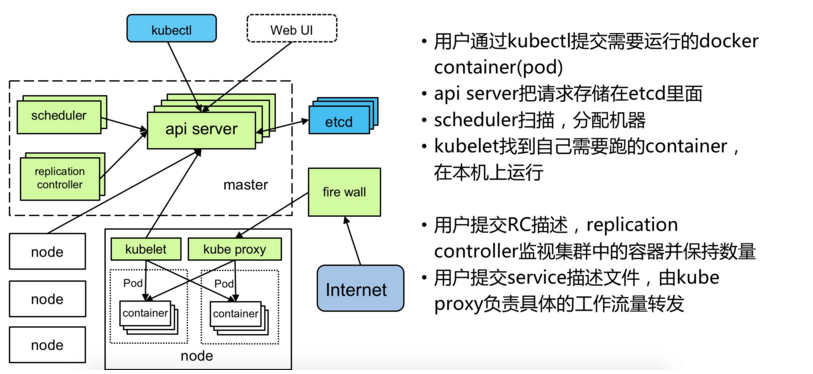

# 总结

## 1.K8S架构和组件



### 1.1 Master

- Kubernetes API Server

  作为Kubernetes系统的入口，其封装了核心对象的增删改查操作，以RESTful API接口方式提供给外部客户和内部组件调用。维护的REST对象持久化到Etcd中存储。

- Kubernetes Scheduler
  为新建立的Pod进行节点(node)选择(即分配机器)，负责集群的资源调度。组件抽离，可以方便替换成其他调度器。

- Kubernetes Controller

  负责执行各种控制器，目前已经提供了很多控制器来保证Kubernetes的正常运行。

- Replication Controller

  管理维护Replication Controller，关联Replication Controller和Pod，保证Replication Controller定义的副本数量与实际运行Pod数量一致。

### 1.2 Node

- Kubelet

  负责管控容器，Kubelet会从Kubernetes API Server接收Pod的创建请求，启动和停止容器，监控容器运行状态并汇报给Kubernetes API Server。


- Kubernetes Proxy

  负责为Pod创建代理服务，Kubernetes Proxy会从Kubernetes API Server获取所有的Service信息，并根据Service的信息创建代理服务，实现Service到Pod的请求路由和转发，从而实现Kubernetes层级的虚拟转发网络。


- Docker  

  Node上需要运行容器服务

## 2.K8S集群搭建常见问题 

- 解决 kubectl get pods时No resources found问题

  1、vim /etc/kubernetes/apiserver
  2、找到”KUBE_ADMISSION_CONTROL="-   	admission_control=NamespaceLifecycle,NamespaceExists,LimitRanger,SecurityContextDeny,ServiceAccount,ResourceQuota"，去掉ServiceAccount，保存退出。
  3、systemctl restart kube-apiserver  重启此服务

- pull 失败

  - 解决方案1

    1、yum install *rhsm* -y

    2、docker pull registry.access.redhat.com/rhel7/pod-infrastructure:latest

    如果以上两步解决问题了，那么就不需要在执行下面操作

    3、docker search pod-infrastructure

    4、docker pull docker.io/tianyebj/pod-infrastructure

    5、docker tag tianyebj/pod-infrastructure 192.168.126.143:5000/pod-infrastructure  

    6、docker push 192.168.126.143:5000/pod-infrastructure

    7、vi /etc/kubernetes/kubelet 

    修改 KUBELET_POD_INFRA_CONTAINER="--pod-infra-container-image=192.168.126.143:5000/pod-	infrastructure:latest"

    8、重启服务

    systemctl restart kube-apiserver
    systemctl restart kube-controller-manager
    systemctl restart kube-scheduler
    systemctl restart kubelet
    systemctl restart kube-proxy

  - 解决方案2

    1、docker pull kubernetes/pause

    2、docker tag docker.io/kubernetes/pause:latest 192.168.126.143:5000/google_containers/pause-amd64.3.0

    3、docker push 192.168.126.143:5000/google_containers/pause-amd64.3.0

    4、vi /etc/kubernetes/kubelet配置为

    ​	KUBELET_ARGS="--pod_infra_container_image=192.168.126.143:5000/google_containers/pause-amd64.3.0"

    5、重启kubelet服务   systemctl restart kubelet

  ```
  私有仓库搭建
  docker pull registry
  docker run -di --name=registry -p 5000:5000 registry
  修改daemon.json {"insecure-registries":["192.168.126.148:5000"]}
  重启docker服务 systemctl restart docker
  ```

  ​

## 3.常用命令

- 获取当前命名空间下的容器

  kubectl get pods

- 获取所有容器l列表

  kubectl get  all

- 创建 容器

  kubectl create -f kubernate-pvc.yaml

- 删除容器

  kubectl delete pods/test-pd  或者 kubectl delete -f rc-nginx.yaml

- 查看指定pod跑在哪个node上

  kubectl get pod /test-pd -o wide 

- 查看容器日志

  Kubectl logs nginx-8586cf59-mwwtc

- 进入容器终端命令

  kubectl exec -it nginx-8586cf59-mwwtc /bin/bash

- 一个Pod里含有多个容器 用--container or -c 参数。

  例如:假如这里有个Pod名为my-pod,这个Pod有两个容器,分别名为main-app 和 helper-app,下面的命令将打开到main-app的shell的容器里。

  kubectl exec -it my-pod --container main-app -- /bin/bash

- 容器详情列表

  kubectl *describe* pod/mysql- m8rbl

- 查看容器状态

  kubectl get svc