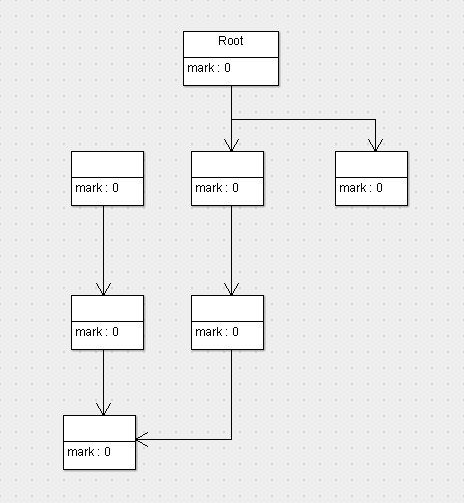

# JVM优化 - 第二天

## 今日内容

- 了解什么是垃圾回收
- 掌握垃圾会回收的常见算法
- 学习串行、并行、并发、G1垃圾收集器
- 学习GC日志的可视化查看


## 1、什么是垃圾回收？

程序的运行必然需要申请内存资源，无效的对象资源如果不及时处理就会一直占有内存资源，最终将导致内存溢出，所以对内存资源的管理是非常重要了。

### 1.1、C/C++语言的垃圾回收

在C/C++语言中，没有自动垃圾回收机制，是通过new关键字申请内存资源，通过delete关键字释放内存资源。

如果，程序员在某些位置没有写delete进行释放，那么申请的对象将一直占用内存资源，最终可能会导致内存溢出。

### 1.2、Java语言的垃圾回收

为了让程序员更专注于代码的实现，而不用过多的考虑内存释放的问题，所以，在Java语言中，有了自动的垃圾回收机制，也就是我们熟悉的GC。

有了垃圾回收机制后，程序员只需要关心内存的申请即可，内存的释放由系统自动识别完成。

换句话说，自动的垃圾回收的算法就会变得非常重要了，如果因为算法的不合理，导致内存资源一直没有释放，同样也可能会导致内存溢出的。

当然，除了Java语言，C#、Python等语言也都有自动的垃圾回收机制。

## 2、垃圾回收的常见算法

自动化的管理内存资源，垃圾回收机制必须要有一套算法来进行计算，哪些是有效的对象，哪些是无效的对象，对于无效的对象就要进行回收处理。

常见的垃圾回收算法有：引用计数法、标记清除法、标记压缩法、复制算法、分代算法等。

### 2.1、引用计数法

引用计数是历史最悠久的一种算法，最早George E. Collins在1960的时候首次提出，50年后的今天，该算法依然被很多编程语言使用。

#### 2.1.1、原理

假设有一个对象A，任何一个对象对A的引用，那么对象A的引用计数器+1，当引用失败时，对象A的引用计数器就-1，如果对象A的计数器的值为0，就说明对象A没有引用了，可以被回收。

#### 2.1.2、优缺点

优点：

- 实时性较高，无需等到内存不够的时候，才开始回收，运行时根据对象的计数器是否为0，就可以直接回收。
- 在垃圾回收过程中，应用无需挂起。如果申请内存时，内存不足，则立刻报outofmember 错误。
- 区域性，更新对象的计数器时，只是影响到该对象，不会扫描全部对象。

缺点：

- 每次对象被引用时，都需要去更新计数器，有一点时间开销。
- 浪费CPU资源，即使内存够用，仍然在运行时进行计数器的统计。
- 无法解决循环引用问题。（最大的缺点）


什么是循环引用？

~~~java
class TestA{
  public TestB b;

}
class TestB{
  public TestA a;
}
public class Main{
    public static void main(String[] args){
        A a = new A();
        B b = new B();
        a.b=b;
        b.a=a;
        a = null;
        b = null;
    }
}
~~~

虽然a和b都为null，但是由于a和b存在循环引用，这样a和b永远都不会被回收。

### 2.2、标记清除法

标记清除算法，是将垃圾回收分为2个阶段，分别是标记和清除。

- 标记：从根节点开始标记引用的对象。
- 清除：未被标记引用的对象就是垃圾对象，可以被清理。

#### 2.2.1、原理

 

这张图代表的是程序运行期间所有对象的状态，它们的标志位全部是0（也就是未标记，以下默认0就是未标记，1为已标记），假设这会儿有效内存空间耗尽了，JVM将会停止应用程序的运行并开启GC线程，然后开始进行标记工作，按照根搜索算法，标记完以后，对象的状态如下图。

 

可以看到，按照根搜索算法，所有从root对象可达的对象就被标记为了存活的对象，此时已经完成了第一阶段标记。接下来，就要执行第二阶段清除了，那么清除完以后，剩下的对象以及对象的状态如下图所示。

 

可以看到，没有被标记的对象将会回收清除掉，而被标记的对象将会留下，并且会将标记位重新归0。接下来就不用说了，唤醒停止的程序线程，让程序继续运行即可。

#### 2.2.2、优缺点

可以看到，标记清除算法解决了引用计数算法中的循环引用的问题，没有从root节点引用的对象都会被回收。

同样，标记清除算法也是有缺点的：

- 效率较低，标记和清除两个动作都需要遍历所有的对象，并且在GC时，需要停止应用程序，对于交互性要求比较高的应用而言这个体验是非常差的。
- 通过标记清除算法清理出来的内存，碎片化较为严重，因为被回收的对象可能存在于内存的各个角落，所以清理出来的内存是不连贯的。

### 2.3、标记压缩算法

标记压缩算法是在标记清除算法的基础之上，做了优化改进的算法。和标记清除算法一样，也是从根节点开始，对对象的引用进行标记，在清理阶段，并不是简单的清理未标记的对象，而是将存活的对象压缩到内存的一端，然后清理边界以外的垃圾，从而解决了碎片化的问题。

#### 2.3.1、原理

 

#### 2.3.2、优缺点

优缺点同标记清除算法，解决了标记清除算法的碎片化的问题，同时，标记压缩算法多了一步，对象移动内存位置的步骤，其效率也有有一定的影响。

### 2.4、复制算法

复制算法的核心就是，将原有的内存空间一分为二，每次只用其中的一块，在垃圾回收时，将正在使用的对象复制到另一个内存空间中，然后将该内存空间清空，交换两个内存的角色，完成垃圾的回收。

如果内存中的垃圾对象较多，需要复制的对象就较少，这种情况下适合使用该方式并且效率比较高，反之，则不适合。 

 


#### 2.4.1、JVM中年轻代内存空间


1. 在GC开始的时候，对象只会存在于Eden区和名为“From”的Survivor区，Survivor区“To”是空的。
2. 紧接着进行GC，Eden区中所有存活的对象都会被复制到“To”，而在“From”区中，仍存活的对象会根据他们的年龄值来决定去向。年龄达到一定值(年龄阈值，可以通过-XX:MaxTenuringThreshold来设置)的对象会被移动到年老代中，没有达到阈值的对象会被复制到“To”区域。
3. 经过这次GC后，Eden区和From区已经被清空。这个时候，“From”和“To”会交换他们的角色，也就是新的“To”就是上次GC前的“From”，新的“From”就是上次GC前的“To”。不管怎样，都会保证名为To的Survivor区域是空的。
4. GC会一直重复这样的过程，直到“To”区被填满，“To”区被填满之后，会将所有对象移动到年老代中。

#### 2.4.2、优缺点

优点：

- 在垃圾对象多的情况下，效率较高
- 清理后，内存无碎片

缺点：

- 在垃圾对象少的情况下，不适用，如：老年代内存
- 分配的2块内存空间，在同一个时刻，只能使用一半，内存使用率较低

### 2.5、分代算法

前面介绍了多种回收算法，每一种算法都有自己的优点也有缺点，谁都不能替代谁，所以根据垃圾回收对象的特点进行选择，才是明智的选择。

分代算法其实就是这样的，根据回收对象的特点进行选择，在jvm中，年轻代适合使用复制算法，老年代适合使用标记清除或标记压缩算法。


## 3、垃圾收集器以及内存分配

前面我们讲了垃圾回收的算法，还需要有具体的实现，在jvm中，实现了多种垃圾收集器，包括：串行垃圾收集器、并行垃圾收集器、CMS（并发）垃圾收集器、G1垃圾收集器，接下来，我们一个个的了解学习。

### 3.1、串行垃圾收集器

串行垃圾收集器，是指使用单线程进行垃圾回收，垃圾回收时，只有一个线程在工作，并且java应用中的所有线程都要暂停，等待垃圾回收的完成。这种现象称之为STW（Stop-The-World）。

对于交互性较强的应用而言，这种垃圾收集器是不能够接受的。

一般在Javaweb应用中是不会采用该收集器的。

#### 3.1.1、编写测试代码

~~~java
package cn.bebopze.jvm;

import java.util.ArrayList;
import java.util.List;
import java.util.Properties;
import java.util.Random;

public class TestGC {

    public static void main(String[] args) throws Exception {
        List<Object> list = new ArrayList<Object>();
        while (true){
            int sleep = new Random().nextInt(100);
            if(System.currentTimeMillis() % 2 ==0){
                list.clear();
            }else{
                for (int i = 0; i < 10000; i++) {
                    Properties properties = new Properties();
                    properties.put("key_"+i, "value_" + System.currentTimeMillis() + i);
                    list.add(properties);
                }
            }

           // System.out.println("list大小为：" + list.size());

            Thread.sleep(sleep);
        }
    }
}

~~~


#### 3.1.2、设置垃圾回收为串行收集器

在程序运行参数中添加2个参数，如下：

- -XX:+UseSerialGC
  - 指定年轻代和老年代都使用串行垃圾收集器

- -XX:+PrintGCDetails
  - 打印垃圾回收的详细信息

~~~shell
# 为了测试GC，将堆的初始和最大内存都设置为16M
-XX:+UseSerialGC -XX:+PrintGCDetails -Xms16m -Xmx16m
~~~

 


启动程序，可以看到下面信息：

~~~shell
[GC (Allocation Failure) [DefNew: 4416K->512K(4928K), 0.0046102 secs] 4416K->1973K(15872K), 0.0046533 secs] [Times: user=0.00 sys=0.00, real=0.00 secs] 

[Full GC (Allocation Failure) [Tenured: 10944K->3107K(10944K), 0.0085637 secs] 15871K->3107K(15872K), [Metaspace: 3496K->3496K(1056768K)], 0.0085974 secs] [Times: user=0.02 sys=0.00, real=0.01 secs] 
~~~

GC日志信息解读：

年轻代的内存GC前后的大小：

- DefNew
  - 表示使用的是串行垃圾收集器。
- 4416K->512K(4928K)
  - 表示，年轻代GC前，占有4416K内存，GC后，占有512K内存，总大小4928K
- 0.0046102 secs
  - 表示，GC所用的时间，单位为毫秒。
- 4416K->1973K(15872K)
  - 表示，GC前，堆内存占有4416K，GC后，占有1973K，总大小为15872K
- Full GC
  - 表示，内存空间全部进行GC

### 3.2、并行垃圾收集器

并行垃圾收集器在串行垃圾收集器的基础之上做了改进，将单线程改为了多线程进行垃圾回收，这样可以缩短垃圾回收的时间。（这里是指，并行能力较强的机器）

当然了，并行垃圾收集器在收集的过程中也会暂停应用程序，这个和串行垃圾回收器是一样的，只是并行执行，速度更快些，暂停的时间更短一些。

#### 3.2.1、ParNew垃圾收集器

ParNew垃圾收集器是工作在年轻代上的，只是将串行的垃圾收集器改为了并行。

通过-XX:+UseParNewGC参数设置年轻代使用ParNew回收器，老年代使用的依然是串行收集器。


测试：

 


~~~shell
#参数
-XX:+UseParNewGC -XX:+PrintGCDetails -Xms16m -Xmx16m

#打印出的信息
[GC (Allocation Failure) [ParNew: 4416K->512K(4928K), 0.0032106 secs] 4416K->1988K(15872K), 0.0032697 secs] [Times: user=0.00 sys=0.00, real=0.00 secs] 
~~~

由以上信息可以看出，`ParNew:` 使用的是ParNew收集器。其他信息和串行收集器一致。

#### 3.2.2、ParallelGC垃圾收集器

ParallelGC收集器工作机制和ParNewGC收集器一样，只是在此基础之上，新增了两个和系统吞吐量相关的参数，使得其使用起来更加的灵活和高效。

相关参数如下：

- -XX:+UseParallelGC
  - 年轻代使用ParallelGC垃圾回收器，老年代使用串行回收器。
- -XX:+UseParallelOldGC
  - 年轻代使用ParallelGC垃圾回收器，老年代使用ParallelOldGC垃圾回收器。
- -XX:MaxGCPauseMillis
  - 设置最大的垃圾收集时的停顿时间，单位为毫秒
  - 需要注意的时，ParallelGC为了达到设置的停顿时间，可能会调整堆大小或其他的参数，如果堆的大小设置的较小，就会导致GC工作变得很频繁，反而可能会影响到性能。
  - 该参数使用需谨慎。
- -XX:GCTimeRatio
  - 设置垃圾回收时间占程序运行时间的百分比，公式为1/(1+n)。
  - 它的值为0~100之间的数字，默认值为99，也就是垃圾回收时间不能超过1%
- -XX:UseAdaptiveSizePolicy
  - 自适应GC模式，垃圾回收器将自动调整年轻代、老年代等参数，达到吞吐量、堆大小、停顿时间之间的平衡。
  - 一般用于，手动调整参数比较困难的场景，让收集器自动进行调整。


测试： 


~~~shell
#参数
-XX:+UseParallelGC -XX:+UseParallelOldGC -XX:MaxGCPauseMillis=100 -XX:+PrintGCDetails -Xms16m -Xmx16m

#打印的信息
[GC (Allocation Failure) [PSYoungGen: 4096K->480K(4608K)] 4096K->1840K(15872K), 0.0034307 secs] [Times: user=0.00 sys=0.00, real=0.00 secs] 

[Full GC (Ergonomics) [PSYoungGen: 505K->0K(4608K)] [ParOldGen: 10332K->10751K(11264K)] 10837K->10751K(15872K), [Metaspace: 3491K->3491K(1056768K)], 0.0793622 secs] [Times: user=0.13 sys=0.00, real=0.08 secs] 

~~~

有以上信息可以看出，年轻代和老年代都使用了ParallelGC垃圾回收器。

### 3.3、CMS垃圾收集器

CMS全称 Concurrent Mark Sweep，是一款并发的、使用标记-清除算法的垃圾回收器，该回收器是针对老年代垃圾回收的，通过参数-XX:+UseConcMarkSweepGC进行设置。

CMS垃圾回收器的执行过程如下：

 

- 初始化标记(CMS-initial-mark) ,标记root，会导致stw； 
- 并发标记(CMS-concurrent-mark)，与用户线程同时运行； 
- 预清理（CMS-concurrent-preclean），与用户线程同时运行； 
- 重新标记(CMS-remark) ，会导致stw； 
- 并发清除(CMS-concurrent-sweep)，与用户线程同时运行； 
- 调整堆大小，设置CMS在清理之后进行内存压缩，目的是清理内存中的碎片；
- 并发重置状态等待下次CMS的触发(CMS-concurrent-reset)，与用户线程同时运行； 

#### 3.3.1、测试

~~~shell
#设置启动参数
-XX:+UseConcMarkSweepGC -XX:+PrintGCDetails -Xms16m -Xmx16m

#运行日志
[GC (Allocation Failure) [ParNew: 4926K->512K(4928K), 0.0041843 secs] 9424K->6736K(15872K), 0.0042168 secs] [Times: user=0.00 sys=0.00, real=0.00 secs] 

#第一步，初始标记
[GC (CMS Initial Mark) [1 CMS-initial-mark: 6224K(10944K)] 6824K(15872K), 0.0004209 secs] [Times: user=0.00 sys=0.00, real=0.00 secs] 
#第二步，并发标记
[CMS-concurrent-mark-start]
[CMS-concurrent-mark: 0.002/0.002 secs] [Times: user=0.00 sys=0.00, real=0.00 secs] 
#第三步，预处理
[CMS-concurrent-preclean-start]
[CMS-concurrent-preclean: 0.000/0.000 secs] [Times: user=0.00 sys=0.00, real=0.00 secs] 
#第四步，重新标记
[GC (CMS Final Remark) [YG occupancy: 1657 K (4928 K)][Rescan (parallel) , 0.0005811 secs][weak refs processing, 0.0000136 secs][class unloading, 0.0003671 secs][scrub symbol table, 0.0006813 secs][scrub string table, 0.0001216 secs][1 CMS-remark: 6224K(10944K)] 7881K(15872K), 0.0018324 secs] [Times: user=0.00 sys=0.00, real=0.00 secs] 
#第五步，并发清理
[CMS-concurrent-sweep-start]
[CMS-concurrent-sweep: 0.004/0.004 secs] [Times: user=0.00 sys=0.00, real=0.00 secs] 
#第六步，重置
[CMS-concurrent-reset-start]
[CMS-concurrent-reset: 0.000/0.000 secs] [Times: user=0.00 sys=0.00, real=0.00 secs] 

~~~

由以上日志信息，可以看出CMS执行的过程。

### 3.4、G1垃圾收集器（重点）

G1垃圾收集器是在jdk1.7中正式使用的全新的垃圾收集器，oracle官方计划在jdk9中将G1变成默认的垃圾收集器，以替代CMS。

G1的设计原则就是简化JVM性能调优，开发人员只需要简单的三步即可完成调优：

1. 第一步，开启G1垃圾收集器
2. 第二步，设置堆的最大内存
3. 第三步，设置最大的停顿时间

G1中提供了三种模式垃圾回收模式，Young GC、Mixed GC 和 Full GC，在不同的条件下被触发。

#### 3.4.1、原理

G1垃圾收集器相对比其他收集器而言，最大的区别在于它取消了年轻代、老年代的物理划分，取而代之的是将堆划分为若干个区域（Region），这些区域中包含了有逻辑上的年轻代、老年代区域。

这样做的好处就是，我们再也不用单独的空间对每个代进行设置了，不用担心每个代内存是否足够。

 


 

在G1划分的区域中，年轻代的垃圾收集依然采用暂停所有应用线程的方式，将存活对象拷贝到老年代或者Survivor空间，G1收集器通过将对象从一个区域复制到另外一个区域，完成了清理工作。

这就意味着，在正常的处理过程中，G1完成了堆的压缩（至少是部分堆的压缩），这样也就不会有cms内存碎片问题的存在了。


在G1中，有一种特殊的区域，叫Humongous区域。 

- 如果一个对象占用的空间超过了分区容量50%以上，G1收集器就认为这是一个巨型对象。
- 这些巨型对象，默认直接会被分配在老年代，但是如果它是一个短期存在的巨型对象，就会对垃圾收集器造成负面影响。
- 为了解决这个问题，G1划分了一个Humongous区，它用来专门存放巨型对象。如果一个H区装不下一个巨型对象，那么G1会寻找连续的H分区来存储。为了能找到连续的H区，有时候不得不启动Full GC。

#### 3.4.2、Young GC

Young GC主要是对Eden区进行GC，它在Eden空间耗尽时会被触发。

- Eden空间的数据移动到Survivor空间中，如果Survivor空间不够，Eden空间的部分数据会直接晋升到年老代空间。
- Survivor区的数据移动到新的Survivor区中，也有部分数据晋升到老年代空间中。
- 最终Eden空间的数据为空，GC停止工作，应用线程继续执行。

 

 

##### 3.4.2.1、Remembered Set（已记忆集合）

在GC年轻代的对象时，我们如何找到年轻代中对象的根对象呢？ 

根对象可能是在年轻代中，也可以在老年代中，那么老年代中的所有对象都是根么？

如果全量扫描老年代，那么这样扫描下来会耗费大量的时间。

于是，G1引进了RSet的概念。它的全称是Remembered Set，其作用是跟踪指向某个堆内的对象引用。

 

每个Region初始化时，会初始化一个RSet，该集合用来记录并跟踪其它Region指向该Region中对象的引用，每个Region默认按照512Kb划分成多个Card，所以RSet需要记录的东西应该是 xx Region的 xx Card。

#### 3.4.3、Mixed GC

当越来越多的对象晋升到老年代old region时，为了避免堆内存被耗尽，虚拟机会触发一个混合的垃圾收集器，即Mixed GC，该算法并不是一个Old GC，除了回收整个Young Region，还会回收一部分的Old Region，这里需要注意：是一部分老年代，而不是全部老年代，可以选择哪些old region进行收集，从而可以对垃圾回收的耗时时间进行控制。也要注意的是Mixed GC 并不是 Full GC。

MixedGC什么时候触发？  由参数 -XX:InitiatingHeapOccupancyPercent=n 决定。默认：45%，该参数的意思是：当老年代大小占整个堆大小百分比达到该阀值时触发。

它的GC步骤分2步：

1. 全局并发标记（global concurrent marking）
2. 拷贝存活对象（evacuation）

##### 3.4.3.1、全局并发标记

全局并发标记，执行过程分为五个步骤：

- 初始标记（initial mark，STW）
  - 标记从根节点直接可达的对象，这个阶段会执行一次年轻代GC，会产生全局停顿。
- 根区域扫描（root region scan）
  - G1 GC 在初始标记的存活区扫描对老年代的引用，并标记被引用的对象。
  - 该阶段与应用程序（非 STW）同时运行，并且只有完成该阶段后，才能开始下一次 STW 年轻代垃圾回收。
- 并发标记（Concurrent Marking）
  - G1 GC 在整个堆中查找可访问的（存活的）对象。该阶段与应用程序同时运行，可以被 STW 年轻代垃圾回收中断。
- 重新标记（Remark，STW）
  - 该阶段是 STW 回收，因为程序在运行，针对上一次的标记进行修正。
- 清除垃圾（Cleanup，STW）
  - 清点和重置标记状态，该阶段会STW，这个阶段并不会实际上去做垃圾的收集，等待evacuation阶段来回收。

##### 3.4.3.2、拷贝存活对象

Evacuation阶段是全暂停的。该阶段把一部分Region里的活对象拷贝到另一部分Region中，从而实现垃圾的回收清理。

#### 3.4.4、G1收集器相关参数

- -XX:+UseG1GC
  - 使用 G1 垃圾收集器
- -XX:MaxGCPauseMillis
  - 设置期望达到的最大GC停顿时间指标（JVM会尽力实现，但不保证达到），默认值是 200 毫秒。
- -XX:G1HeapRegionSize=n
  - 设置的 G1 区域的大小。值是 2 的幂，范围是 1 MB 到 32 MB 之间。目标是根据最小的 Java 堆大小划分出约 2048 个区域。
  - 默认是堆内存的1/2000。
- -XX:ParallelGCThreads=n
  - 设置 STW 工作线程数的值。将 n 的值设置为逻辑处理器的数量。n 的值与逻辑处理器的数量相同，最多为 8。
- -XX:ConcGCThreads=n
  - 设置并行标记的线程数。将 n 设置为并行垃圾回收线程数 (ParallelGCThreads) 的 1/4 左右。
- -XX:InitiatingHeapOccupancyPercent=n
  - 设置触发标记周期的 Java 堆占用率阈值。默认占用率是整个 Java 堆的 45%。

#### 3.4.5、测试

~~~shell
-XX:+UseG1GC -XX:MaxGCPauseMillis=100 -XX:+PrintGCDetails -Xmx256m

#日志
[GC pause (G1 Evacuation Pause) (young), 0.0044882 secs]
   [Parallel Time: 3.7 ms, GC Workers: 3]
      [GC Worker Start (ms): Min: 14763.7, Avg: 14763.8, Max: 14763.8, Diff: 0.1]
      #扫描根节点
      [Ext Root Scanning (ms): Min: 0.2, Avg: 0.3, Max: 0.3, Diff: 0.1, Sum: 0.8]
      #更新RS区域所消耗的时间
      [Update RS (ms): Min: 1.8, Avg: 1.9, Max: 1.9, Diff: 0.2, Sum: 5.6]
         [Processed Buffers: Min: 1, Avg: 1.7, Max: 3, Diff: 2, Sum: 5]
      [Scan RS (ms): Min: 0.0, Avg: 0.0, Max: 0.0, Diff: 0.0, Sum: 0.0]
      [Code Root Scanning (ms): Min: 0.0, Avg: 0.0, Max: 0.0, Diff: 0.0, Sum: 0.0]
      #对象拷贝
      [Object Copy (ms): Min: 1.1, Avg: 1.2, Max: 1.3, Diff: 0.2, Sum: 3.6]
      [Termination (ms): Min: 0.0, Avg: 0.1, Max: 0.2, Diff: 0.2, Sum: 0.2]
         [Termination Attempts: Min: 1, Avg: 1.0, Max: 1, Diff: 0, Sum: 3]
      [GC Worker Other (ms): Min: 0.0, Avg: 0.0, Max: 0.0, Diff: 0.0, Sum: 0.0]
      [GC Worker Total (ms): Min: 3.4, Avg: 3.4, Max: 3.5, Diff: 0.1, Sum: 10.3]
      [GC Worker End (ms): Min: 14767.2, Avg: 14767.2, Max: 14767.3, Diff: 0.1]
   [Code Root Fixup: 0.0 ms]
   [Code Root Purge: 0.0 ms]
   [Clear CT: 0.0 ms] #清空CardTable
   [Other: 0.7 ms]
      [Choose CSet: 0.0 ms] #选取CSet
      [Ref Proc: 0.5 ms] #弱引用、软引用的处理耗时
      [Ref Enq: 0.0 ms] #弱引用、软引用的入队耗时
      [Redirty Cards: 0.0 ms]
      [Humongous Register: 0.0 ms] #大对象区域注册耗时
      [Humongous Reclaim: 0.0 ms] #大对象区域回收耗时
      [Free CSet: 0.0 ms]
   [Eden: 7168.0K(7168.0K)->0.0B(13.0M) Survivors: 2048.0K->2048.0K Heap: 55.5M(192.0M)->48.5M(192.0M)] #年轻代的大小统计
 [Times: user=0.00 sys=0.00, real=0.00 secs] 
~~~

#### 3.4.6、对于G1垃圾收集器优化建议

- 年轻代大小
  - 避免使用 -Xmn 选项或 -XX:NewRatio 等其他相关选项显式设置年轻代大小。
  - 固定年轻代的大小会覆盖暂停时间目标。
- 暂停时间目标不要太过严苛
  - G1 GC 的吞吐量目标是 90% 的应用程序时间和 10%的垃圾回收时间。
  - 评估 G1 GC 的吞吐量时，暂停时间目标不要太严苛。目标太过严苛表示您愿意承受更多的垃圾回收开销，而这会直接影响到吞吐量。

## 4、可视化GC日志分析工具

### 4.1、GC日志输出参数

前面通过-XX:+PrintGCDetails可以对GC日志进行打印，我们就可以在控制台查看，这样虽然可以查看GC的信息，但是并不直观，可以借助于第三方的GC日志分析工具进行查看。

在日志打印输出涉及到的参数如下：

```shell
-XX:+PrintGC 输出GC日志
-XX:+PrintGCDetails 输出GC的详细日志
-XX:+PrintGCTimeStamps 输出GC的时间戳（以基准时间的形式）
-XX:+PrintGCDateStamps 输出GC的时间戳（以日期的形式，如 2013-05-04T21:53:59.234+0800）
-XX:+PrintHeapAtGC 在进行GC的前后打印出堆的信息
-Xloggc:../logs/gc.log 日志文件的输出路径
```

测试：

~~~shell
-XX:+UseG1GC -XX:MaxGCPauseMillis=100 -Xmx256m -XX:+PrintGCDetails -XX:+PrintGCTimeStamps -XX:+PrintGCDateStamps -XX:+PrintHeapAtGC -Xloggc:F://test//gc.log
~~~

运行后就可以在E盘下生成gc.log文件。

如下：

~~~shell
Java HotSpot(TM) 64-Bit Server VM (25.144-b01) for windows-amd64 JRE (1.8.0_144-b01), built on Jul 21 2017 21:57:33 by "java_re" with MS VC++ 10.0 (VS2010)
Memory: 4k page, physical 12582392k(1939600k free), swap 17300984k(5567740k free)
CommandLine flags: -XX:InitialHeapSize=201318272 -XX:MaxGCPauseMillis=100 -XX:MaxHeapSize=268435456 -XX:+PrintGC -XX:+PrintGCDateStamps -XX:+PrintGCDetails -XX:+PrintGCTimeStamps -XX:+PrintHeapAtGC -XX:+UseCompressedClassPointers -XX:+UseCompressedOops -XX:+UseG1GC -XX:-UseLargePagesIndividualAllocation 
{Heap before GC invocations=0 (full 0):
 garbage-first heap   total 196608K, used 9216K [0x00000000f0000000, 0x00000000f0100600, 0x0000000100000000)
  region size 1024K, 9 young (9216K), 0 survivors (0K)
 Metaspace       used 3491K, capacity 4500K, committed 4864K, reserved 1056768K
  class space    used 381K, capacity 388K, committed 512K, reserved 1048576K
2018-09-24T23:06:02.230+0800: 0.379: [GC pause (G1 Evacuation Pause) (young), 0.0031038 secs]
   [Parallel Time: 2.8 ms, GC Workers: 3]
      [GC Worker Start (ms): Min: 378.6, Avg: 378.8, Max: 379.0, Diff: 0.3]
      [Ext Root Scanning (ms): Min: 0.0, Avg: 0.4, Max: 0.8, Diff: 0.8, Sum: 1.3]
      [Update RS (ms): Min: 0.0, Avg: 0.0, Max: 0.0, Diff: 0.0, Sum: 0.0]
         [Processed Buffers: Min: 0, Avg: 0.0, Max: 0, Diff: 0, Sum: 0]
      [Scan RS (ms): Min: 0.0, Avg: 0.0, Max: 0.0, Diff: 0.0, Sum: 0.0]
      [Code Root Scanning (ms): Min: 0.0, Avg: 0.0, Max: 0.1, Diff: 0.1, Sum: 0.1]
      [Object Copy (ms): Min: 1.8, Avg: 1.9, Max: 1.9, Diff: 0.1, Sum: 5.6]
      [Termination (ms): Min: 0.0, Avg: 0.0, Max: 0.0, Diff: 0.0, Sum: 0.0]
         [Termination Attempts: Min: 1, Avg: 1.0, Max: 1, Diff: 0, Sum: 3]
      [GC Worker Other (ms): Min: 0.0, Avg: 0.2, Max: 0.6, Diff: 0.6, Sum: 0.6]
      [GC Worker Total (ms): Min: 2.4, Avg: 2.5, Max: 2.7, Diff: 0.3, Sum: 7.6]
      [GC Worker End (ms): Min: 381.4, Avg: 381.4, Max: 381.4, Diff: 0.0]
   [Code Root Fixup: 0.0 ms]
   [Code Root Purge: 0.0 ms]
   [Clear CT: 0.0 ms]
   [Other: 0.2 ms]
      [Choose CSet: 0.0 ms]
      [Ref Proc: 0.1 ms]
      [Ref Enq: 0.0 ms]
      [Redirty Cards: 0.0 ms]
      [Humongous Register: 0.0 ms]
      [Humongous Reclaim: 0.0 ms]
      [Free CSet: 0.0 ms]
   [Eden: 9216.0K(9216.0K)->0.0B(7168.0K) Survivors: 0.0B->2048.0K Heap: 9216.0K(192.0M)->1888.0K(192.0M)]
Heap after GC invocations=1 (full 0):
 garbage-first heap   total 196608K, used 1888K [0x00000000f0000000, 0x00000000f0100600, 0x0000000100000000)
  region size 1024K, 2 young (2048K), 2 survivors (2048K)
 Metaspace       used 3491K, capacity 4500K, committed 4864K, reserved 1056768K
  class space    used 381K, capacity 388K, committed 512K, reserved 1048576K
}
 [Times: user=0.00 sys=0.00, real=0.00 secs] 
{Heap before GC invocations=1 (full 0):
 garbage-first heap   total 196608K, used 9056K [0x00000000f0000000, 0x00000000f0100600, 0x0000000100000000)
  region size 1024K, 9 young (9216K), 2 survivors (2048K)
 Metaspace       used 3492K, capacity 4500K, committed 4864K, reserved 1056768K
  class space    used 381K, capacity 388K, committed 512K, reserved 1048576K
2018-09-24T23:06:02.310+0800: 0.458: [GC pause (G1 Evacuation Pause) (young), 0.0070126 secs]
。。。。。。。。。。。。。。。。。。。

~~~

### 4.2、GC Easy 可视化工具

GC Easy是一款在线的可视化工具，易用、功能强大，网站：

http://gceasy.io/

 

上传后，点击“Analyze”按钮，即可查看报告。

 

 

 

