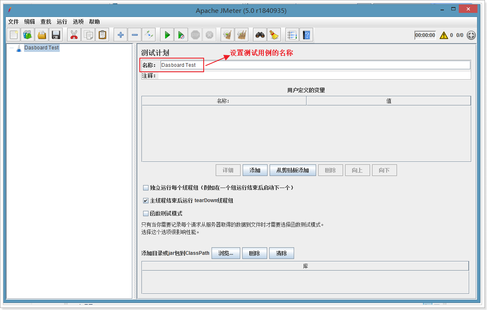

#  JVM优化 - 第三天

## 今日内容

- Tomcat8的优化
- 看懂Java底层字节码
- 编码的优化建议

## 1、Tomcat8优化

tomcat服务器在JavaEE项目中使用率非常高，所以在生产环境对tomcat的优化也变得非常重要了。

对于tomcat的优化，主要是从2个方面入手，一是，tomcat自身的配置，另一个是tomcat所运行的jvm虚拟机的调优。

下面我们将从这2个方面进行讲解。

### 1.1、Tomcat配置优化

#### 1.1.1、部署安装tomcat8

下载并安装：

https://tomcat.apache.org/download-80.cgi

 

~~~shell
cd /tmp
wget http://mirrors.tuna.tsinghua.edu.cn/apache/tomcat/tomcat-8/v8.5.34/bin/apache-tomcat-8.5.34.tar.gz

tar -xvf apache-tomcat-8.5.34.tar.gz
cd apache-tomcat-8.5.34/conf
#修改配置文件，配置tomcat的管理用户
vim tomcat-users.xml
#写入如下内容：
<role rolename="manager"/>
<role rolename="manager-gui"/>
<role rolename="admin"/>
<role rolename="admin-gui"/>
<user username="tomcat" password="tomcat" roles="admin-gui,admin,manager-gui,manager"/>
#保存退出

#如果是tomcat7，配置了tomcat用户就可以登录系统了，但是tomcat8中不行，还需要修改另一个配置文件，否则访问不了，提示403
vim webapps/manager/META-INF/context.xml

#将<Valve的内容注释掉
<Context antiResourceLocking="false" privileged="true" >
 <!-- <Valve className="org.apache.catalina.valves.RemoteAddrValve"
         allow="127\.\d+\.\d+\.\d+|::1|0:0:0:0:0:0:0:1" /> -->
  <Manager sessionAttributeValueClassNameFilter="java\.lang\.(?:Boolean|Integer|Long|Number|String)|org\.apache\.catalina\.filters\.CsrfPreventionFilter\$LruCache(?:\$1)?|java\.util\.(?:Linked)?HashMap"/>
</Context>
#保存退出即可

#启动tomcat
cd /tmp/apache-tomcat-8.5.34/bin/
./startup.sh && tail -f ../logs/catalina.out

#打开浏览器进行测试访问
http://192.168.40.133:8080/

~~~

 

点击“Server Status”，输入用户名、密码进行登录，tomcat/tomcat

 

 

进入之后即可看到服务的信息。

#### 1.1.2、禁用AJP连接

在服务状态页面中可以看到，默认状态下会启用AJP服务，并且占用8009端口。

 

什么是AJP呢？

AJP（Apache JServer Protocol）
AJPv13协议是面向包的。WEB服务器和Servlet容器通过TCP连接来交互；为了节省SOCKET创建的昂贵代价，WEB服务器会尝试维护一个永久TCP连接到servlet容器，并且在多个请求和响应周期过程会重用连接。

 

我们一般是使用Nginx+tomcat的架构，所以用不着AJP协议，所以把AJP连接器禁用。

修改conf下的server.xml文件，将AJP服务禁用掉即可。

~~~shell
<Connector port="8009" protocol="AJP/1.3" redirectPort="8443" />
~~~

 

重启tomcat，查看效果。

 

可以看到AJP服务以及不存在了。

#### 1.1.3、执行器（线程池）

在tomcat中每一个用户请求都是一个线程，所以可以使用线程池提高性能。

修改server.xml文件：

~~~xml
<!--将注释打开-->
<Executor name="tomcatThreadPool" namePrefix="catalina-exec-"
        maxThreads="500" minSpareThreads="50" prestartminSpareThreads="true" maxQueueSize="100"/>
<!--
参数说明：
maxThreads：最大并发数，默认设置 200，一般建议在 500 ~ 1000，根据硬件设施和业务来判断
minSpareThreads：Tomcat 初始化时创建的线程数，默认设置 25
prestartminSpareThreads： 在 Tomcat 初始化的时候就初始化 minSpareThreads 的参数值，如果不等于 true，minSpareThreads 的值就没啥效果了
maxQueueSize，最大的等待队列数，超过则拒绝请求
-->

<!--在Connector中设置executor属性指向上面的执行器-->
<Connector executor="tomcatThreadPool"  port="8080" protocol="HTTP/1.1"
               connectionTimeout="20000"
               redirectPort="8443" />

~~~

保存退出，重启tomcat，查看效果。

 

在页面中显示最大线程数为-1，这个是正常的，仅仅是显示的问题，实际使用的指定的值。

也有人遇到这样的问题：https://blog.csdn.net/weixin_38278878/article/details/80144397

#### 1.1.4、3种运行模式

tomcat的运行模式有3种：

1. bio
   默认的模式,性能非常低下,没有经过任何优化处理和支持.
2. nio
   nio(new I/O)，是Java SE 1.4及后续版本提供的一种新的I/O操作方式(即java.nio包及其子包)。Java nio是一个基于缓冲区、并能提供非阻塞I/O操作的Java API，因此nio也被看成是non-blocking I/O的缩写。它拥有比传统I/O操作(bio)更好的并发运行性能。
3. apr
   安装起来最困难,但是从操作系统级别来解决异步的IO问题,大幅度的提高性能.

推荐使用nio，不过，在tomcat8中有最新的nio2，速度更快，建议使用nio2.

设置nio2：

~~~xml
<Connector executor="tomcatThreadPool"  port="8080" protocol="org.apache.coyote.http11.Http11Nio2Protocol"
               connectionTimeout="20000"
               redirectPort="8443" />
~~~

 

可以看到已经设置为nio2了。

### 1.2、部署测试用的java web项目

为了方便测试性能，我们将部署一个java web项目，这个项目本身和本套课程没有什么关系，仅仅用于测试。

> 注意：这里在测试时，我们使用一个新的tomcat，进行测试，后面再对其进行优化调整，再测试。

#### 1.2.1、创建dashboard数据库

在资料中找到sql脚本文件dashboard.sql，在linux服务器上执行。

~~~shell
cat dashboard.sql | mysql -uroot -proot
~~~

创建完成后，可以看到有3张表。

 

#### 1.2.2、部署web应用

在资料中找到itcat-dashboard-web.war，上传到linux服务器，进行部署安装。

~~~shell
cd /tmp/apache-tomcat-8.5.34/webapps
rm -rf *
mkdir ROOT
cd ROOT/

rz上传war包
jar -xvf itcat-dashboard-web.war
rm -rf itcat-dashboard-web.war

#修改数据库配置文件
cd /tmp/apache-tomcat-8.5.34/webapps/ROOT/WEB-INF/classes
vim jdbc.properties

#这里根据自己的实际情况进行配置

jdbc.driverClassName=com.mysql.jdbc.Driver
jdbc.url=jdbc:mysql://node01:3306/dashboard?useUnicode=true&characterEncoding=utf8&autoReconnect=true&allowMultiQueries=true
jdbc.username=root
jdbc.password=root

~~~

重新启动tomcat。

访问首页，查看是否已经启动成功：http://192.168.40.133:8080/index 

### 1.3、使用Apache JMeter进行测试

Apache Jmeter是开源的压力测试工具，我们借助于此工具进行测试，将测试出tomcat的吞吐量等信息。

#### 1.3.1、下载安装

下载地址：http://jmeter.apache.org/download_jmeter.cgi

 

安装：直接将下载好的zip压缩包进行解压即可。

 

进入bin目录，找到jmeter.bat文件，双机打开即可启动。

 

 

 

#### 1.3.2、修改主题和语言

默认的主题是黑色风格的主题并且语言是英语，这样不太方便使用，所以需要修改下主题和中文语言。

 

 

 

主题修改完成。

接下来设置语言为简体中文。

 

语言修改完成。 

#### 1.3.3、创建首页的测试用例

第一步：保存测试用例 

第二步：添加线程组，使用线程模拟用户的并发

 

 

1000个线程，每个线程循环10次，也就是tomcat会接收到10000个请求。

第三步：添加http请求

 

 

第四步：添加请求监控

 

 

#### 1.3.4、启动、进行测试 

 

#### 1.3.5、聚合报告

在聚合报告中，重点看吞吐量。

 

### 1.4、调整tomcat参数进行优化

通过上面测试可以看出，tomcat在不做任何调整时，吞吐量为73次/秒。

#### 1.4.1、禁用AJP服务

 

 

可以看到，禁用AJP服务后，吞吐量会有所提升。

当然了，测试不一定准确，需要多测试几次才能看出是否有提升。

#### 1.4.2、设置线程池

通过设置线程池，调整线程池相关的参数进行测试tomcat的性能。

##### 1.4.2.1、最大线程数为500，初始为50

~~~xml
<Executor name="tomcatThreadPool" namePrefix="catalina-exec-"
        maxThreads="500" minSpareThreads="50" prestartminSpareThreads="true"/>
~~~

测试结果：

 

吞吐量为128次/秒，性能有所提升。

##### 1.4.2.2、最大线程数为1000，初始为200

~~~xml
<Executor name="tomcatThreadPool" namePrefix="catalina-exec-"
        maxThreads="1000" minSpareThreads="200" prestartminSpareThreads="true"/>
~~~

 

吞吐量为151，性能有所提升。

##### 1.4.2.3、最大线程数为5000，初始为1000

是否是线程数最多，速度越快呢？ 我们来测试下。

~~~xml
<Executor name="tomcatThreadPool" namePrefix="catalina-exec-"
        maxThreads="5000" minSpareThreads="1000" prestartminSpareThreads="true"/>
~~~

 

可以看到，虽然最大线程已经设置到5000，但是实际测试效果并不理想，并且平均的响应时间也边长了，所以单纯靠提升线程数量是不能一直得到性能提升的。

##### 1.4.2.4、设置最大等待队列数

默认情况下，请求发送到tomcat，如果tomcat正忙，那么该请求会一直等待。这样虽然可以保证每个请求都能请求到，但是请求时间就会边长。

有些时候，我们也不一定要求请求一定等待，可以设置最大等待队列大小，如果超过就不等待了。这样虽然有些请求是失败的，但是请求时间会虽短。典型的应用：12306。

~~~xml
<!--最大等待数为100-->
<Executor name="tomcatThreadPool" namePrefix="catalina-exec-"
        maxThreads="500" minSpareThreads="100" prestartminSpareThreads="true" maxQueueSize="100"/>
~~~

 

测试结果：

- 平均响应时间：3.1秒
  - 响应时间明显缩短
- 错误率：49.88%
  - 错误率提升到一半，也可以理解，最大线程为500，测试的并发为1000
- 吞吐量：238次/秒
  - 吞吐量明显提升

结论：响应时间、吞吐量这2个指标需要找到平衡才能达到更好的性能。

#### 1.4.3、设置nio2的运行模式

将最大线程设置为500进行测试：

~~~xml
<Executor name="tomcatThreadPool" namePrefix="catalina-exec-"
        maxThreads="500" minSpareThreads="50" prestartminSpareThreads="true"/>

<!-- 设置nio2 -->
<Connector executor="tomcatThreadPool" port="8080" protocol="org.apache.coyote.http11.Http11Nio2Protocol"
               connectionTimeout="20000"
               redirectPort="8443" />

~~~

 

可以看到，平均响应时间有缩短，吞吐量有提升，可以得出结论：nio2的性能要高于nio。

### 1.5、调整JVM参数进行优化

接下来，测试通过jvm参数进行优化，为了测试一致性，依然将最大线程数设置为500，启用nio2运行模式。

#### 1.5.1、设置并行垃圾回收器

~~~shell
#年轻代、老年代均使用并行收集器，初始堆内存64M，最大堆内存512M
JAVA_OPTS="-XX:+UseParallelGC -XX:+UseParallelOldGC -Xms64m -Xmx512m -XX:+PrintGCDetails -XX:+PrintGCTimeStamps -XX:+PrintGCDateStamps -XX:+PrintHeapAtGC -Xloggc:../logs/gc.log"
~~~


测试结果与默认的JVM参数结果接近。（执行了2次测试，结果是第二次测试的结果）

#### 1.5.2、查看gc日志文件

将gc.log文件上传到gceasy.io查看gc中是否存在问题。

问题一： 

在报告中显示，在5次GC时，系统所消耗的时间大于用户时间，这反应出的服务器的性能存在瓶颈，调度CPU等资源所消耗的时间要长一些。

问题二： 

可以关键指标中可以看出，吞吐量表现不错，但是gc时，线程的暂停时间稍有点长。

问题三： 

通过GC的统计可以看出：

- 年轻代的gc有74次，次数稍有多，说明年轻代设置的大小不合适需要调整
- FullGC有8次，说明堆内存的大小不合适，需要调整

问题四： 

从GC原因的可以看出，年轻代大小设置不合理，导致了多次GC。

#### 1.5.3、调整年轻代大小

~~~shell
JAVA_OPTS="-XX:+UseParallelGC -XX:+UseParallelOldGC -Xms128m -Xmx1024m -XX:NewSize=64m -XX:MaxNewSize=256m -XX:+PrintGCDetails -XX:+PrintGCTimeStamps -XX:+PrintGCDateStamps -XX:+PrintHeapAtGC -Xloggc:../logs/gc.log"
~~~

将初始堆大小设置为128m，最大为1024m

初始年轻代大小64m，年轻代最大256m 

从测试结果来看，吞吐量以及响应时间均有提升。

查看gc日志：

 

 

可以看到GC次数要明显减少，说明调整是有效的。

#### 1.5.4、设置G1垃圾回收器

~~~shell
#设置了最大停顿时间100毫秒，初始堆内存128m，最大堆内存1024m
JAVA_OPTS="-XX:+UseG1GC -XX:MaxGCPauseMillis=100 -Xms128m -Xmx1024m -XX:+PrintGCDetails -XX:+PrintGCTimeStamps -XX:+PrintGCDateStamps -XX:+PrintHeapAtGC -Xloggc:../logs/gc.log"
~~~

测试结果：  


可以看到，吞吐量有所提升，评价响应时间也有所缩短。

#### 1.5.5、小结

通过上述的测试，可以总结出，对tomcat性能优化就是需要不断的进行调整参数，然后测试结果，可能会调优也可能会调差，这时就需要借助于gc的可视化工具来看gc的情况。再帮我我们做出决策应该调整哪些参数。

## 2、JVM字节码

前面我们通过tomcat本身的参数以及jvm的参数对tomcat做了优化，其实要想将应用程序跑的更快、效率更高，除了对tomcat容器以及jvm优化外，应用程序代码本身如果写的效率不高的，那么也是不行的，所以，对于程序本身的优化也就很重要了。

对于程序本身的优化，可以借鉴很多前辈们的经验，但是有些时候，在从源码角度方面分析的话，不好鉴别出哪个效率高，如对字符串拼接的操作，是直接“+”号拼接效率高还是使用StringBuilder效率高？

这个时候，就需要通过查看编译好的class文件中字节码，就可以找到答案。

我们都知道，java编写应用，需要先通过javac命令编译成class文件，再通过jvm执行，jvm执行时是需要将class文件中的字节码载入到jvm进行运行的。

### 2.1、通过javap命令查看class文件的字节码内容

首先，看一个简单的Test1类的代码：

~~~java
package cn.bebopze.jvm;

public class Test1 {

    public static void main(String[] args) {
        int a = 2;
        int b = 5;
        int c = b - a;
        System.out.println(c);
    }

}

~~~

通过javap命令查看class文件中的字节码内容：

~~~shell
javap -v Test1.class > Test1.txt

javap用法: javap <options> <classes>
其中, 可能的选项包括:
  -help  --help  -?        输出此用法消息
  -version                 版本信息
  -v  -verbose             输出附加信息
  -l                       输出行号和本地变量表
  -public                  仅显示公共类和成员
  -protected               显示受保护的/公共类和成员
  -package                 显示程序包/受保护的/公共类
                           和成员 (默认)
  -p  -private             显示所有类和成员
  -c                       对代码进行反汇编
  -s                       输出内部类型签名
  -sysinfo                 显示正在处理的类的
                           系统信息 (路径, 大小, 日期, MD5 散列)
  -constants               显示最终常量
  -classpath <path>        指定查找用户类文件的位置
  -cp <path>               指定查找用户类文件的位置
  -bootclasspath <path>    覆盖引导类文件的位置
~~~

查看Test1.txt文件，内容如下：

~~~java
Classfile /F:/code/bebopze-jvm/bebopze-jvm-test/target/classes/cn/bebopze/jvm/Test1.class
  Last modified 2018-9-27; size 577 bytes
  MD5 checksum 4214859db3543c0c783ec8a216a4795f
  Compiled from "Test1.java"
public class cn.bebopze.jvm.Test1
  minor version: 0
  major version: 52
  flags: ACC_PUBLIC, ACC_SUPER
Constant pool:
   #1 = Methodref          #5.#23         // java/lang/Object."<init>":()V
   #2 = Fieldref           #24.#25        // java/lang/System.out:Ljava/io/PrintStream;
   #3 = Methodref          #26.#27        // java/io/PrintStream.println:(I)V
   #4 = Class              #28            // cn/bebopze/jvm/Test1
   #5 = Class              #29            // java/lang/Object
   #6 = Utf8               <init>
   #7 = Utf8               ()V
   #8 = Utf8               Code
   #9 = Utf8               LineNumberTable
  #10 = Utf8               LocalVariableTable
  #11 = Utf8               this
  #12 = Utf8               Lcn/bebopze/jvm/Test1;
  #13 = Utf8               main
  #14 = Utf8               ([Ljava/lang/String;)V
  #15 = Utf8               args
  #16 = Utf8               [Ljava/lang/String;
  #17 = Utf8               a
  #18 = Utf8               I
  #19 = Utf8               b
  #20 = Utf8               c
  #21 = Utf8               SourceFile
  #22 = Utf8               Test1.java
  #23 = NameAndType        #6:#7          // "<init>":()V
  #24 = Class              #30            // java/lang/System
  #25 = NameAndType        #31:#32        // out:Ljava/io/PrintStream;
  #26 = Class              #33            // java/io/PrintStream
  #27 = NameAndType        #34:#35        // println:(I)V
  #28 = Utf8               cn/bebopze/jvm/Test1
  #29 = Utf8               java/lang/Object
  #30 = Utf8               java/lang/System
  #31 = Utf8               out
  #32 = Utf8               Ljava/io/PrintStream;
  #33 = Utf8               java/io/PrintStream
  #34 = Utf8               println
  #35 = Utf8               (I)V
{
  public cn.bebopze.jvm.Test1();
    descriptor: ()V
    flags: ACC_PUBLIC
    Code:
      stack=1, locals=1, args_size=1
         0: aload_0
         1: invokespecial #1                  // Method java/lang/Object."<init>":()V
         4: return
      LineNumberTable:
        line 3: 0
      LocalVariableTable:
        Start  Length  Slot  Name   Signature
            0       5     0  this   Lcn/bebopze/jvm/Test1;

  public static void main(java.lang.String[]);
    descriptor: ([Ljava/lang/String;)V
    flags: ACC_PUBLIC, ACC_STATIC
    Code:
      stack=2, locals=4, args_size=1
         0: iconst_2
         1: istore_1
         2: iconst_5
         3: istore_2
         4: iload_2
         5: iload_1
         6: isub
         7: istore_3
         8: getstatic     #2                  // Field java/lang/System.out:Ljava/io/PrintStream;
        11: iload_3
        12: invokevirtual #3                  // Method java/io/PrintStream.println:(I)V
        15: return
      LineNumberTable:
        line 6: 0
        line 7: 2
        line 8: 4
        line 9: 8
        line 10: 15
      LocalVariableTable:
        Start  Length  Slot  Name   Signature
            0      16     0  args   [Ljava/lang/String;
            2      14     1     a   I
            4      12     2     b   I
            8       8     3     c   I
}
SourceFile: "Test1.java"

~~~

内容大致分为4个部分：

第一部分：显示了生成这个class的java源文件、版本信息、生成时间等。

第二部分：显示了该类中所涉及到常量池，共35个常量。

第三部分：显示该类的构造器，编译器自动插入的。

第四部分：显示了main方的信息。（这个是需要我们重点关注的）

### 2.2、常量池

官网文档：

https://docs.oracle.com/javase/specs/jvms/se8/html/jvms-4.html#jvms-4.4-140

| Constant Type                 | Value | 说明                   |
| ----------------------------- | ----- | ---------------------- |
| `CONSTANT_Class`              | 7     | 类或接口的符号引用     |
| `CONSTANT_Fieldref`           | 9     | 字段的符号引用         |
| `CONSTANT_Methodref`          | 10    | 类中方法的符号引用     |
| `CONSTANT_InterfaceMethodref` | 11    | 接口中方法的符号引用   |
| `CONSTANT_String`             | 8     | 字符串类型常量         |
| `CONSTANT_Integer`            | 3     | 整形常量               |
| `CONSTANT_Float`              | 4     | 浮点型常量             |
| `CONSTANT_Long`               | 5     | 长整型常量             |
| `CONSTANT_Double`             | 6     | 双精度浮点型常量       |
| `CONSTANT_NameAndType`        | 12    | 字段或方法的符号引用   |
| `CONSTANT_Utf8`               | 1     | UTF-8编码的字符串      |
| `CONSTANT_MethodHandle`       | 15    | 表示方法句柄           |
| `CONSTANT_MethodType`         | 16    | 标志方法类型           |
| `CONSTANT_InvokeDynamic`      | 18    | 表示一个动态方法调用点 |

### 2.3、描述符

#### 2.3.1、字段描述符

官网：https://docs.oracle.com/javase/specs/jvms/se8/html/jvms-4.html#jvms-4.3.2

| *FieldType* term | Type        | Interpretation                                               |
| ---------------- | ----------- | ------------------------------------------------------------ |
| `B`              | `byte`      | signed byte                                                  |
| `C`              | `char`      | Unicode character code point in the Basic Multilingual Plane, encoded with UTF-16 |
| `D`              | `double`    | double-precision floating-point value                        |
| `F`              | `float`     | single-precision floating-point value                        |
| `I`              | `int`       | integer                                                      |
| `J`              | `long`      | long integer                                                 |
| `LClassName;`    | `reference` | an instance of class *ClassName*                             |
| `S`              | `short`     | signed short                                                 |
| `Z`              | `boolean`   | `true` or `false`                                            |
| `[`              | `reference` | one array dimension                                          |


#### 2.3.2、方法描述符

官网：https://docs.oracle.com/javase/specs/jvms/se8/html/jvms-4.html#jvms-4.3.3

示例：

The method descriptor for the method:

```java
Object m(int i, double d, Thread t) {...}
```

is:

```java
(IDLjava/lang/Thread;)Ljava/lang/Object;
```

### 2.4、解读方法字节码

~~~java
  public static void main(java.lang.String[]);
    descriptor: ([Ljava/lang/String;)V  //方法描述，V表示该方法的放回值为void
    flags: ACC_PUBLIC, ACC_STATIC  // 方法修饰符，public、static的
    Code:
      // stack=2,操作栈的大小为2、locals=4，本地变量表大小，args_size=1, 参数的个数
      stack=2, locals=4, args_size=1 
         0: iconst_2  //将数字2值压入操作栈，位于栈的最上面
         1: istore_1  //从操作栈中弹出一个元素(数字2)，放入到本地变量表中，位于下标为1的位置（下标为0的是this）
         2: iconst_5  //将数字5值压入操作栈，位于栈的最上面
         3: istore_2  //从操作栈中弹出一个元素(5)，放入到本地变量表中，位于第下标为2个位置
         4: iload_2  //将本地变量表中下标为2的位置元素压入操作栈（5）
         5: iload_1  //将本地变量表中下标为1的位置元素压入操作栈（2）
         6: isub  //操作栈中的2个数字相减
         7: istore_3 // 将相减的结果压入到本地本地变量表中，位于下标为3的位置
         // 通过#2号找到对应的常量，即可找到对应的引用       
         8: getstatic     #2                  // Field java/lang/System.out:Ljava/io/PrintStream;
        11: iload_3 //将本地变量表中下标为3的位置元素压入操作栈（3）
        // 通过#3号找到对应的常量，即可找到对应的引用，进行方法调用
        12: invokevirtual #3                  // Method java/io/PrintStream.println:(I)V
        15: return //返回
      LineNumberTable:  //行号的列表
        line 6: 0
        line 7: 2
        line 8: 4
        line 9: 8
        line 10: 15
      LocalVariableTable: // 本地变量表
        Start  Length  Slot  Name   Signature
            0      16     0  args   [Ljava/lang/String;
            2      14     1     a   I
            4      12     2     b   I
            8       8     3     c   I
}
SourceFile: "Test1.java"
~~~

#### 2.4.1、图解

 

 

 

### 2.5、研究 i++ 与 ++i 的不同

我们都知道，i++表示，先返回再+1，++i表示，先+1再返回。它的底层是怎么样的呢? 我们一起探究下。

编写测试代码：

~~~java
public class Test2 {

    public static void main(String[] args) {
        new Test2().method1();
        new Test2().method2();
    }

    public void method1(){
        int i = 1;
        int a = i++;
        System.out.println(a); //打印1
    }

    public void method2(){
        int i = 1;
        int a = ++i;
        System.out.println(a);//打印2
    }

}
~~~

#### 2.5.1、查看class字节码

~~~java
Classfile /F:/code/bebopze-jvm/bebopze-jvm-test/target/classes/cn/bebopze/jvm/Test2.class
  MD5 checksum 901660fc11c43b6daadd0942150960ed
  Compiled from "Test2.java"
public class cn.bebopze.jvm.Test2
  minor version: 0
  major version: 52
  flags: ACC_PUBLIC, ACC_SUPER
Constant pool:
   #1 = Methodref          #8.#27         // java/lang/Object."<init>":()V
   #2 = Class              #28            // cn/bebopze/jvm/Test2
   #3 = Methodref          #2.#27         // cn/bebopze/jvm/Test2."<init>":()V
   #4 = Methodref          #2.#29         // cn/bebopze/jvm/Test2.method1:()V
   #5 = Methodref          #2.#30         // cn/bebopze/jvm/Test2.method2:()V
   #6 = Fieldref           #31.#32        // java/lang/System.out:Ljava/io/PrintStream;
   #7 = Methodref          #33.#34        // java/io/PrintStream.println:(I)V
   #8 = Class              #35            // java/lang/Object
   #9 = Utf8               <init>
  #10 = Utf8               ()V
  #11 = Utf8               Code
  #12 = Utf8               LineNumberTable
  #13 = Utf8               LocalVariableTable
  #14 = Utf8               this
  #15 = Utf8               Lcn/bebopze/jvm/Test2;
  #16 = Utf8               main
  #17 = Utf8               ([Ljava/lang/String;)V
  #18 = Utf8               args
  #19 = Utf8               [Ljava/lang/String;
  #20 = Utf8               method1
  #21 = Utf8               i
  #22 = Utf8               I
  #23 = Utf8               a
  #24 = Utf8               method2
  #25 = Utf8               SourceFile
  #26 = Utf8               Test2.java
  #27 = NameAndType        #9:#10         // "<init>":()V
  #28 = Utf8               cn/bebopze/jvm/Test2
  #29 = NameAndType        #20:#10        // method1:()V
  #30 = NameAndType        #24:#10        // method2:()V
  #31 = Class              #36            // java/lang/System
  #32 = NameAndType        #37:#38        // out:Ljava/io/PrintStream;
  #33 = Class              #39            // java/io/PrintStream
  #34 = NameAndType        #40:#41        // println:(I)V
  #35 = Utf8               java/lang/Object
  #36 = Utf8               java/lang/System
  #37 = Utf8               out
  #38 = Utf8               Ljava/io/PrintStream;
  #39 = Utf8               java/io/PrintStream
  #40 = Utf8               println
  #41 = Utf8               (I)V
{
  public cn.bebopze.jvm.Test2();
    descriptor: ()V
    flags: ACC_PUBLIC
    Code:
      stack=1, locals=1, args_size=1
         0: aload_0
         1: invokespecial #1                  // Method java/lang/Object."<init>":()V
         4: return
      LineNumberTable:
        line 3: 0
      LocalVariableTable:
        Start  Length  Slot  Name   Signature
            0       5     0  this   Lcn/bebopze/jvm/Test2;

  public static void main(java.lang.String[]);
    descriptor: ([Ljava/lang/String;)V
    flags: ACC_PUBLIC, ACC_STATIC
    Code:
      stack=2, locals=1, args_size=1
         0: new           #2                  // class cn/bebopze/jvm/Test2
         3: dup
         4: invokespecial #3                  // Method "<init>":()V
         7: invokevirtual #4                  // Method method1:()V
        10: new           #2                  // class cn/bebopze/jvm/Test2
        13: dup
        14: invokespecial #3                  // Method "<init>":()V
        17: invokevirtual #5                  // Method method2:()V
        20: return
      LineNumberTable:
        line 6: 0
        line 7: 10
        line 8: 20
      LocalVariableTable:
        Start  Length  Slot  Name   Signature
            0      21     0  args   [Ljava/lang/String;

  public void method1();
    descriptor: ()V
    flags: ACC_PUBLIC
    Code:
      stack=2, locals=3, args_size=1
         0: iconst_1
         1: istore_1
         2: iload_1
         3: iinc          1, 1
         6: istore_2
         7: getstatic     #6                  // Field java/lang/System.out:Ljava/io/PrintStream;
        10: iload_2
        11: invokevirtual #7                  // Method java/io/PrintStream.println:(I)V
        14: return
      LineNumberTable:
        line 11: 0
        line 12: 2
        line 13: 7
        line 14: 14
      LocalVariableTable:
        Start  Length  Slot  Name   Signature
            0      15     0  this   Lcn/bebopze/jvm/Test2;
            2      13     1     i   I
            7       8     2     a   I

  public void method2();
    descriptor: ()V
    flags: ACC_PUBLIC
    Code:
      stack=2, locals=3, args_size=1
         0: iconst_1
         1: istore_1
         2: iinc          1, 1
         5: iload_1
         6: istore_2
         7: getstatic     #6                  // Field java/lang/System.out:Ljava/io/PrintStream;
        10: iload_2
        11: invokevirtual #7                  // Method java/io/PrintStream.println:(I)V
        14: return
      LineNumberTable:
        line 17: 0
        line 18: 2
        line 19: 7
        line 20: 14
      LocalVariableTable:
        Start  Length  Slot  Name   Signature
            0      15     0  this   Lcn/bebopze/jvm/Test2;
            2      13     1     i   I
            7       8     2     a   I
}
SourceFile: "Test2.java"

~~~

#### 2.5.2、对比

i++：

~~~java
         0: iconst_1  //将数字1压入到操作栈
         1: istore_1  //将数字1从操作栈弹出，压入到本地变量表中，下标为1
         2: iload_1   //从本地变量表中获取下标为1的数据，压入到操作栈中
         3: iinc          1, 1 // 将本地变量中的1，再+1
         6: istore_2  // 将数字1从操作栈弹出，压入到本地变量表中，下标为2
         7: getstatic     #6                  // Field java/lang/System.out:Ljava/io/PrintStream;
        10: iload_2   //从本地变量表中获取下标为2的数据，压入到操作栈中
        11: invokevirtual #7                  // Method java/io/PrintStream.println:(I)V
        14: return
~~~

++i：

~~~java
         0: iconst_1  //将数字1压入到操作栈
         1: istore_1  //将数字1从操作栈弹出，压入到本地变量表中，下标为1
         2: iinc          1, 1// 将本地变量中的1，再+1
         5: iload_1  //从本地变量表中获取下标为1的数据（2），压入到操作栈中
         6: istore_2 //将数字2从操作栈弹出，压入到本地变量表中，下标为2
         7: getstatic     #6                  // Field java/lang/System.out:Ljava/io/PrintStream;
        10: iload_2 //从本地变量表中获取下标为2的数据（2），压入到操作栈中
        11: invokevirtual #7                  // Method java/io/PrintStream.println:(I)V
        14: return
~~~

区别：

- i++
  - 只是在本地变量中对数字做了相加，并没有将数据压入到操作栈
  - 将前面拿到的数字1，再次从操作栈中拿到，压入到本地变量中
- ++i
  - 将本地变量中的数字做了相加，并且将数据压入到操作栈
  - 将操作栈中的数据，再次压入到本地变量中

小结：可以通过查看字节码的方式对代码的底层做研究，探究其原理。

### 2.6、字符串拼接

字符串的拼接在开发过程中使用是非常频繁的，常用的方式有三种：

- +号拼接： str+"456"
- StringBuilder拼接
- StringBuffer拼接

StringBuffer是保证线程安全的，效率是比较低的，我们更多的是使用场景是不会涉及到线程安全的问题的，所以更多的时候会选择StringBuilder，效率会高一些。

那么，问题来了，StringBuilder和“+”号拼接，哪个效率高呢？接下来我们通过字节码的方式进行探究。

首先，编写个示例：

~~~java
package cn.bebopze.jvm;

public class Test3 {

    public static void main(String[] args) {
        new Test3().m1();
        new Test3().m2();
    }

    public void m1(){
        String s1 = "123";
        String s2 = "456";
        String s3 = s1 + s2;
        System.out.println(s3);
    }

    public void m2(){
        String s1 = "123";
        String s2 = "456";
        StringBuilder sb = new StringBuilder();
        sb.append(s1);
        sb.append(s2);
        String s3 = sb.toString();
        System.out.println(s3);
    }
}

~~~

查看Test3.class的字节码

~~~java
Classfile /F:/code/bebopze-jvm/bebopze-jvm-test/target/classes/cn/bebopze/jvm/Test3.class
  MD5 checksum b3f7629e7e37768b9b5581be01df40d6
  Compiled from "Test3.java"
public class cn.bebopze.jvm.Test3
  minor version: 0
  major version: 52
  flags: ACC_PUBLIC, ACC_SUPER
Constant pool:
   #1 = Methodref          #14.#36        // java/lang/Object."<init>":()V
   #2 = Class              #37            // cn/bebopze/jvm/Test3
   #3 = Methodref          #2.#36         // cn/bebopze/jvm/Test3."<init>":()V
   #4 = Methodref          #2.#38         // cn/bebopze/jvm/Test3.m1:()V
   #5 = Methodref          #2.#39         // cn/bebopze/jvm/Test3.m2:()V
   #6 = String             #40            // 123
   #7 = String             #41            // 456
   #8 = Class              #42            // java/lang/StringBuilder
   #9 = Methodref          #8.#36         // java/lang/StringBuilder."<init>":()V
  #10 = Methodref          #8.#43         // java/lang/StringBuilder.append:(Ljava/lang/String;)Ljava/lang/StringBuilder;
  #11 = Methodref          #8.#44         // java/lang/StringBuilder.toString:()Ljava/lang/String;
  #12 = Fieldref           #45.#46        // java/lang/System.out:Ljava/io/PrintStream;
  #13 = Methodref          #47.#48        // java/io/PrintStream.println:(Ljava/lang/String;)V
  #14 = Class              #49            // java/lang/Object
  #15 = Utf8               <init>
  #16 = Utf8               ()V
  #17 = Utf8               Code
  #18 = Utf8               LineNumberTable
  #19 = Utf8               LocalVariableTable
  #20 = Utf8               this
  #21 = Utf8               Lcn/bebopze/jvm/Test3;
  #22 = Utf8               main
  #23 = Utf8               ([Ljava/lang/String;)V
  #24 = Utf8               args
  #25 = Utf8               [Ljava/lang/String;
  #26 = Utf8               m1
  #27 = Utf8               s1
  #28 = Utf8               Ljava/lang/String;
  #29 = Utf8               s2
  #30 = Utf8               s3
  #31 = Utf8               m2
  #32 = Utf8               sb
  #33 = Utf8               Ljava/lang/StringBuilder;
  #34 = Utf8               SourceFile
  #35 = Utf8               Test3.java
  #36 = NameAndType        #15:#16        // "<init>":()V
  #37 = Utf8               cn/bebopze/jvm/Test3
  #38 = NameAndType        #26:#16        // m1:()V
  #39 = NameAndType        #31:#16        // m2:()V
  #40 = Utf8               123
  #41 = Utf8               456
  #42 = Utf8               java/lang/StringBuilder
  #43 = NameAndType        #50:#51        // append:(Ljava/lang/String;)Ljava/lang/StringBuilder;
  #44 = NameAndType        #52:#53        // toString:()Ljava/lang/String;
  #45 = Class              #54            // java/lang/System
  #46 = NameAndType        #55:#56        // out:Ljava/io/PrintStream;
  #47 = Class              #57            // java/io/PrintStream
  #48 = NameAndType        #58:#59        // println:(Ljava/lang/String;)V
  #49 = Utf8               java/lang/Object
  #50 = Utf8               append
  #51 = Utf8               (Ljava/lang/String;)Ljava/lang/StringBuilder;
  #52 = Utf8               toString
  #53 = Utf8               ()Ljava/lang/String;
  #54 = Utf8               java/lang/System
  #55 = Utf8               out
  #56 = Utf8               Ljava/io/PrintStream;
  #57 = Utf8               java/io/PrintStream
  #58 = Utf8               println
  #59 = Utf8               (Ljava/lang/String;)V
{
  public cn.bebopze.jvm.Test3();
    descriptor: ()V
    flags: ACC_PUBLIC
    Code:
      stack=1, locals=1, args_size=1
         0: aload_0
         1: invokespecial #1                  // Method java/lang/Object."<init>":()V
         4: return
      LineNumberTable:
        line 3: 0
      LocalVariableTable:
        Start  Length  Slot  Name   Signature
            0       5     0  this   Lcn/bebopze/jvm/Test3;

  public static void main(java.lang.String[]);
    descriptor: ([Ljava/lang/String;)V
    flags: ACC_PUBLIC, ACC_STATIC
    Code:
      stack=2, locals=1, args_size=1
         0: new           #2                  // class cn/bebopze/jvm/Test3
         3: dup
         4: invokespecial #3                  // Method "<init>":()V
         7: invokevirtual #4                  // Method m1:()V
        10: new           #2                  // class cn/bebopze/jvm/Test3
        13: dup
        14: invokespecial #3                  // Method "<init>":()V
        17: invokevirtual #5                  // Method m2:()V
        20: return
      LineNumberTable:
        line 6: 0
        line 7: 10
        line 8: 20
      LocalVariableTable:
        Start  Length  Slot  Name   Signature
            0      21     0  args   [Ljava/lang/String;

  public void m1();
    descriptor: ()V
    flags: ACC_PUBLIC
    Code:
      stack=2, locals=4, args_size=1
         0: ldc           #6                  // String 123
         2: astore_1
         3: ldc           #7                  // String 456
         5: astore_2
         6: new           #8                  // class java/lang/StringBuilder
         9: dup
        10: invokespecial #9                  // Method java/lang/StringBuilder."<init>":()V
        13: aload_1
        14: invokevirtual #10                 // Method java/lang/StringBuilder.append:(Ljava/lang/String;)Ljava/lang/StringBuilder;
        17: aload_2
        18: invokevirtual #10                 // Method java/lang/StringBuilder.append:(Ljava/lang/String;)Ljava/lang/StringBuilder;
        21: invokevirtual #11                 // Method java/lang/StringBuilder.toString:()Ljava/lang/String;
        24: astore_3
        25: getstatic     #12                 // Field java/lang/System.out:Ljava/io/PrintStream;
        28: aload_3
        29: invokevirtual #13                 // Method java/io/PrintStream.println:(Ljava/lang/String;)V
        32: return
      LineNumberTable:
        line 11: 0
        line 12: 3
        line 13: 6
        line 14: 25
        line 15: 32
      LocalVariableTable:
        Start  Length  Slot  Name   Signature
            0      33     0  this   Lcn/bebopze/jvm/Test3;
            3      30     1    s1   Ljava/lang/String;
            6      27     2    s2   Ljava/lang/String;
           25       8     3    s3   Ljava/lang/String;

  public void m2();
    descriptor: ()V
    flags: ACC_PUBLIC
    Code:
      stack=2, locals=5, args_size=1
         0: ldc           #6                  // String 123
         2: astore_1
         3: ldc           #7                  // String 456
         5: astore_2
         6: new           #8                  // class java/lang/StringBuilder
         9: dup
        10: invokespecial #9                  // Method java/lang/StringBuilder."<init>":()V
        13: astore_3
        14: aload_3
        15: aload_1
        16: invokevirtual #10                 // Method java/lang/StringBuilder.append:(Ljava/lang/String;)Ljava/lang/StringBuilder;
        19: pop
        20: aload_3
        21: aload_2
        22: invokevirtual #10                 // Method java/lang/StringBuilder.append:(Ljava/lang/String;)Ljava/lang/StringBuilder;
        25: pop
        26: aload_3
        27: invokevirtual #11                 // Method java/lang/StringBuilder.toString:()Ljava/lang/String;
        30: astore        4
        32: getstatic     #12                 // Field java/lang/System.out:Ljava/io/PrintStream;
        35: aload         4
        37: invokevirtual #13                 // Method java/io/PrintStream.println:(Ljava/lang/String;)V
        40: return
      LineNumberTable:
        line 18: 0
        line 19: 3
        line 20: 6
        line 21: 14
        line 22: 20
        line 23: 26
        line 24: 32
        line 25: 40
      LocalVariableTable:
        Start  Length  Slot  Name   Signature
            0      41     0  this   Lcn/bebopze/jvm/Test3;
            3      38     1    s1   Ljava/lang/String;
            6      35     2    s2   Ljava/lang/String;
           14      27     3    sb   Ljava/lang/StringBuilder;
           32       9     4    s3   Ljava/lang/String;
}
SourceFile: "Test3.java"

~~~

从解字节码中可以看出，m1()方法源码中是使用+号拼接，但是在字节码中也被编译成了StringBuilder方式。

所以，可以得出结论，字符串拼接，+号和StringBuilder是相等的，效率一样。

接下来，我们再看一个案例：

~~~java
package cn.bebopze.jvm;

public class Test4 {

    public static void main(String[] args) {
        new Test4().m1();
        new Test4().m2();
    }

    public void m1(){
        String str = "";
        for (int i = 0; i < 5; i++) {
            str = str + i;
        }
        System.out.println(str);
    }

    public void m2(){
        StringBuilder sb = new StringBuilder();
        for (int i = 0; i < 5; i++) {
            sb.append(i);
        }
        System.out.println(sb.toString());
    }
}

~~~

m1() 与 m2() 哪个方法的效率高？

依然是通过字节码的方式进行探究。

~~~java
Classfile /F:/code/bebopze-jvm/bebopze-jvm-test/target/classes/cn/bebopze/jvm/Test4.class
  MD5 checksum f87a55446b8b6cd88b6e54bd5edcc9dc
  Compiled from "Test4.java"
public class cn.bebopze.jvm.Test4
  minor version: 0
  major version: 52
  flags: ACC_PUBLIC, ACC_SUPER
Constant pool:
   #1 = Methodref          #14.#39        // java/lang/Object."<init>":()V
   #2 = Class              #40            // cn/bebopze/jvm/Test4
   #3 = Methodref          #2.#39         // cn/bebopze/jvm/Test4."<init>":()V
   #4 = Methodref          #2.#41         // cn/bebopze/jvm/Test4.m1:()V
   #5 = Methodref          #2.#42         // cn/bebopze/jvm/Test4.m2:()V
   #6 = String             #43            //
   #7 = Class              #44            // java/lang/StringBuilder
   #8 = Methodref          #7.#39         // java/lang/StringBuilder."<init>":()V
   #9 = Methodref          #7.#45         // java/lang/StringBuilder.append:(Ljava/lang/String;)Ljava/lang/StringBuilder;
  #10 = Methodref          #7.#46         // java/lang/StringBuilder.append:(I)Ljava/lang/StringBuilder;
  #11 = Methodref          #7.#47         // java/lang/StringBuilder.toString:()Ljava/lang/String;
  #12 = Fieldref           #48.#49        // java/lang/System.out:Ljava/io/PrintStream;
  #13 = Methodref          #50.#51        // java/io/PrintStream.println:(Ljava/lang/String;)V
  #14 = Class              #52            // java/lang/Object
  #15 = Utf8               <init>
  #16 = Utf8               ()V
  #17 = Utf8               Code
  #18 = Utf8               LineNumberTable
  #19 = Utf8               LocalVariableTable
  #20 = Utf8               this
  #21 = Utf8               Lcn/bebopze/jvm/Test4;
  #22 = Utf8               main
  #23 = Utf8               ([Ljava/lang/String;)V
  #24 = Utf8               args
  #25 = Utf8               [Ljava/lang/String;
  #26 = Utf8               m1
  #27 = Utf8               i
  #28 = Utf8               I
  #29 = Utf8               str
  #30 = Utf8               Ljava/lang/String;
  #31 = Utf8               StackMapTable
  #32 = Class              #53            // java/lang/String
  #33 = Utf8               m2
  #34 = Utf8               sb
  #35 = Utf8               Ljava/lang/StringBuilder;
  #36 = Class              #44            // java/lang/StringBuilder
  #37 = Utf8               SourceFile
  #38 = Utf8               Test4.java
  #39 = NameAndType        #15:#16        // "<init>":()V
  #40 = Utf8               cn/bebopze/jvm/Test4
  #41 = NameAndType        #26:#16        // m1:()V
  #42 = NameAndType        #33:#16        // m2:()V
  #43 = Utf8
  #44 = Utf8               java/lang/StringBuilder
  #45 = NameAndType        #54:#55        // append:(Ljava/lang/String;)Ljava/lang/StringBuilder;
  #46 = NameAndType        #54:#56        // append:(I)Ljava/lang/StringBuilder;
  #47 = NameAndType        #57:#58        // toString:()Ljava/lang/String;
  #48 = Class              #59            // java/lang/System
  #49 = NameAndType        #60:#61        // out:Ljava/io/PrintStream;
  #50 = Class              #62            // java/io/PrintStream
  #51 = NameAndType        #63:#64        // println:(Ljava/lang/String;)V
  #52 = Utf8               java/lang/Object
  #53 = Utf8               java/lang/String
  #54 = Utf8               append
  #55 = Utf8               (Ljava/lang/String;)Ljava/lang/StringBuilder;
  #56 = Utf8               (I)Ljava/lang/StringBuilder;
  #57 = Utf8               toString
  #58 = Utf8               ()Ljava/lang/String;
  #59 = Utf8               java/lang/System
  #60 = Utf8               out
  #61 = Utf8               Ljava/io/PrintStream;
  #62 = Utf8               java/io/PrintStream
  #63 = Utf8               println
  #64 = Utf8               (Ljava/lang/String;)V
{
  public cn.bebopze.jvm.Test4();
    descriptor: ()V
    flags: ACC_PUBLIC
    Code:
      stack=1, locals=1, args_size=1
         0: aload_0
         1: invokespecial #1                  // Method java/lang/Object."<init>":()V
         4: return
      LineNumberTable:
        line 3: 0
      LocalVariableTable:
        Start  Length  Slot  Name   Signature
            0       5     0  this   Lcn/bebopze/jvm/Test4;

  public static void main(java.lang.String[]);
    descriptor: ([Ljava/lang/String;)V
    flags: ACC_PUBLIC, ACC_STATIC
    Code:
      stack=2, locals=1, args_size=1
         0: new           #2                  // class cn/bebopze/jvm/Test4
         3: dup
         4: invokespecial #3                  // Method "<init>":()V
         7: invokevirtual #4                  // Method m1:()V
        10: new           #2                  // class cn/bebopze/jvm/Test4
        13: dup
        14: invokespecial #3                  // Method "<init>":()V
        17: invokevirtual #5                  // Method m2:()V
        20: return
      LineNumberTable:
        line 6: 0
        line 7: 10
        line 8: 20
      LocalVariableTable:
        Start  Length  Slot  Name   Signature
            0      21     0  args   [Ljava/lang/String;

  public void m1();
    descriptor: ()V
    flags: ACC_PUBLIC
    Code:
      stack=2, locals=3, args_size=1
         0: ldc           #6                  // String
         2: astore_1  // 将空字符串压入到本地变量表中的下标为1的位置
         3: iconst_0  // 将数字0压入操作栈顶
         4: istore_2  // 将栈顶数字0压入到本地变量表中的下标为2的位置
         5: iload_2  // 将本地变量中下标为2的数字0压入操作栈顶
         6: iconst_5 // 将数字5压入操作栈顶
         7: if_icmpge     35  //比较栈顶两int型数值大小，当结果大于等于0时跳转到35
        10: new           #7                  // class java/lang/StringBuilder
        13: dup  //复制栈顶数值并将复制值压入栈顶(数字5)
        14: invokespecial #8                  // Method java/lang/StringBuilder."<init>":()V
        17: aload_1
        18: invokevirtual #9                  // Method java/lang/StringBuilder.append:(Ljava/lang/String;)Ljava/lang/StringBuilder;
        21: iload_2 //将本地变量中下标为2的数字0压入操作栈顶
        22: invokevirtual #10                 // Method java/lang/StringBuilder.append:(I)Ljava/lang/StringBuilder;
        25: invokevirtual #11                 // Method java/lang/StringBuilder.toString:()Ljava/lang/String;
        28: astore_1
        29: iinc          2, 1
        32: goto          5
        35: getstatic     #12                 // Field java/lang/System.out:Ljava/io/PrintStream;
        38: aload_1
        39: invokevirtual #13                 // Method java/io/PrintStream.println:(Ljava/lang/String;)V
        42: return
      LineNumberTable:
        line 11: 0
        line 12: 3
        line 13: 10
        line 12: 29
        line 15: 35
        line 16: 42
      LocalVariableTable:
        Start  Length  Slot  Name   Signature
            5      30     2     i   I
            0      43     0  this   Lcn/bebopze/jvm/Test4;
            3      40     1   str   Ljava/lang/String;
      StackMapTable: number_of_entries = 2
        frame_type = 253 /* append */
          offset_delta = 5
          locals = [ class java/lang/String, int ]
        frame_type = 250 /* chop */
          offset_delta = 29

  public void m2();
    descriptor: ()V
    flags: ACC_PUBLIC
    Code:
      stack=2, locals=3, args_size=1
         0: new           #7                  // class java/lang/StringBuilder
         3: dup
         4: invokespecial #8                  // Method java/lang/StringBuilder."<init>":()V
         7: astore_1
         8: iconst_0
         9: istore_2
        10: iload_2
        11: iconst_5
        12: if_icmpge     27
        15: aload_1
        16: iload_2
        17: invokevirtual #10                 // Method java/lang/StringBuilder.append:(I)Ljava/lang/StringBuilder;
        20: pop
        21: iinc          2, 1
        24: goto          10
        27: getstatic     #12                 // Field java/lang/System.out:Ljava/io/PrintStream;
        30: aload_1
        31: invokevirtual #11                 // Method java/lang/StringBuilder.toString:()Ljava/lang/String;
        34: invokevirtual #13                 // Method java/io/PrintStream.println:(Ljava/lang/String;)V
        37: return
      LineNumberTable:
        line 19: 0
        line 20: 8
        line 21: 15
        line 20: 21
        line 23: 27
        line 24: 37
      LocalVariableTable:
        Start  Length  Slot  Name   Signature
           10      17     2     i   I
            0      38     0  this   Lcn/bebopze/jvm/Test4;
            8      30     1    sb   Ljava/lang/StringBuilder;
      StackMapTable: number_of_entries = 2
        frame_type = 253 /* append */
          offset_delta = 10
          locals = [ class java/lang/StringBuilder, int ]
        frame_type = 250 /* chop */
          offset_delta = 16
}
SourceFile: "Test4.java"

~~~

可以看到，m1()方法中的循环体内，每一次循环都会创建StringBuilder对象，效率低于m2()方法。

### 2.7、小结

使用字节码的方式可以很好查看代码底层的执行，从而可以看出哪些实现效率高，哪些实现效率低。可以更好的对我们的代码做优化。让程序执行效率更高。

## 3、代码优化

优化，不仅仅是在运行环境进行优化，还需要在代码本身做优化，如果代码本身存在性能问题，那么在其他方面再怎么优化也不可能达到效果最优的。

### 3.1、尽可能使用局部变量

调用方法时传递的参数以及在调用中创建的临时变量都保存在栈中速度较快，其他变量，如静态变量、实例变量等，都在堆中创建，速度较慢。另外，栈中创建的变量，随着方法的运行结束，这些内容就没了，不需要额外的垃圾回收。

### 3.2、尽量减少对变量的重复计算

明确一个概念，对方法的调用，即使方法中只有一句语句，也是有消耗的。所以例如下面的操作：

~~~java
for (int i = 0; i < list.size(); i++)
{...}
~~~

建议替换为：

~~~java
int length = list.size();
for (int i = 0,  i < length; i++)

{...}
~~~

这样，在list.size()很大的时候，就减少了很多的消耗。

### 3.3、尽量采用懒加载的策略，即在需要的时候才创建

~~~java
String str = "aaa";
if (i == 1){
　　list.add(str);
}

//建议替换成

if (i == 1){
　　String str = "aaa";
　　list.add(str);
}
~~~

### 3.4、异常不应该用来控制程序流程

异常对性能不利。抛出异常首先要创建一个新的对象，Throwable接口的构造函数调用名为fillInStackTrace()的本地同步方 法，fillInStackTrace()方法检查堆栈，收集调用跟踪信息。只要有异常被抛出，Java虚拟机就必须调整调用堆栈，因为在处理过程中创建 了一个新的对象。异常只能用于错误处理，不应该用来控制程序流程。

### 3.5、不要将数组声明为public static final

因为这毫无意义，这样只是定义了引用为static final，数组的内容还是可以随意改变的，将数组声明为public更是一个安全漏洞，这意味着这个数组可以被外部类所改变。

### 3.6、不要创建一些不使用的对象，不要导入一些不使用的类

这毫无意义，如果代码中出现"The value of the local variable i is not used"、"The import java.util is never used"，那么请删除这些无用的内容

### 3.7、程序运行过程中避免使用反射

反射是Java提供给用户一个很强大的功能，功能强大往往意味着效率不高。不建议在程序运行过程中使用尤其是频繁使用反射机制，特别是 Method的invoke方法。

如果确实有必要，一种建议性的做法是将那些需要通过反射加载的类在项目启动的时候通过反射实例化出一个对象并放入内存。

### 3.8、使用数据库连接池和线程池

这两个池都是用于重用对象的，前者可以避免频繁地打开和关闭连接，后者可以避免频繁地创建和销毁线程。

### 3.9、容器初始化时尽可能指定长度

容器初始化时尽可能指定长度，如：new ArrayList<>(10); new HashMap<>(32); 避免容器长度不足时，扩容带来的性能损耗。

### 3.10、ArrayList随机遍历快，LinkedList添加删除快

### 3.11、使用Entry遍历Map

~~~java
Map<String,String> map = new HashMap<>();
for (Map.Entry<String,String> entry : map.entrySet()) {
    String key = entry.getKey();
    String value = entry.getValue();
}
~~~

避免使用这种方式：

~~~java
Map<String,String> map = new HashMap<>();
for (String key : map.keySet()) {
    String value = map.get(key);
}
~~~

### 3.12、不要手动调用System.gc();

### 3.13、String尽量少用正则表达式

正则表达式虽然功能强大，但是其效率较低，除非是有需要，否则尽可能少用。

replace()  不支持正则
replaceAll() 支持正则

如果仅仅是字符的替换建议使用replace()。

### 3.14、日志的输出要注意级别

~~~java
// 当前的日志级别是error
LOGGER.info("保存出错！" + user);
~~~


### 3.15、对资源的close()建议分开操作

~~~java
try{
    XXX.close();
    YYY.close();
}
catch (Exception e){
    ...
}

// 建议改为

try{
    XXX.close();
}
catch (Exception e){
    ...
}
try{

    YYY.close();
}
catch (Exception e){
    ...
}
~~~

