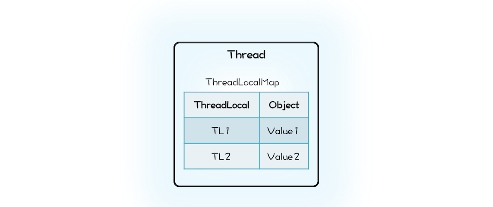

### 3. 并发设计模式

###### 3.1 Immutability模式：如何利用不变性解决并发问题？

```

    场景：
    
        最简单的解决并发问题的方法
        
        
    
    不变性（Immutability）模式：
    
        多个线程同时读写同一共享变量存在并发问题，如果只有读，而没有写，是没有并发问题的。
        
        解决并发问题，其实最简单的办法就是：让共享变量只有读操作，而没有写操作。
        
        这个办法如此重要，以至于被上升到了一种解决并发问题的 设计模式：不变性（Immutability）模式。
        
            所谓不变性，简单来讲，就是：对象一旦被创建之后，状态就不再发生变化。
            换句话说，就是变量一旦被赋值，就不允许修改了（没有写操作）；
            没有修改操作，也就是保持了不变性
    
    
    
    
    实现一个具备不可变性的类：
         
         1、将一个类 所有的属性 都设置成 final 的，并且 只允许存在 只读方法，那么这个类基本上就具备不可变性了
         
         2、更严格的做法是这个类本身也是 final 的，也就是不允许继承。
                因为子类可以覆盖父类的方法，有可能改变不可变性，所以推荐你在实际工作中，使用这种更严格的做法。
                
         
    Java SDK 中的不变类：
    
        例如经常用到的 String 和 Long、Integer、Double 等基础类型的包装类 都具备不可变性，
        
        这些对象的 线程安全性 都是靠 不可变性 来保证的。
        
        
        如果你仔细翻看这些 类的声明、属性 和 方法，你会发现它们都严格遵守 不可变类的三点要求：
        
            类 和 属性 都是 final 的，所有方法 均是 只读的。
    
    
    
    不变类的修改：
    
        创建一个新的不可变对象：
        
            参照String 的实现，发现如果具备不可变性的类，需要提供 类似修改 的功能：
                
                需要创建一个新的不可变对象
                
                这是与可变对象的一个重要区别，可变对象往往是修改自己的属性。
    
    
        内存浪费问题：
        
            所有的修改操作都创建一个新的不可变对象，创建的对象太多了，造成内存浪费问题
            
            
            解决方法：
            
                利用 享元模式 避免创建重复对象
                
             
                如果你熟悉面向对象相关的设计模式，相信你一定能想到享元模式（Flyweight Pattern）。
                利用享元模式可以减少创建对象的数量，从而减少内存占用。
                Java 语言里面 Long、Integer、Short、Byte 等这些基本数据类型的包装类都用到了享元模式。
                
                
            享元模式：
            
                本质上其实就是一个 对象池
                
                利用享元模式创建对象的逻辑也很简单：
                
                    创建之前，首先去对象池里看看是不是存在；
                    如果已经存在，就利用对象池里的对象；
                    如果不存在，就会新创建一个对象，并且把这个新创建出来的对象放进对象池里。
                    
                    
                参考：
                    LongCache#cache[]     -->  仅缓存了 [-128,127] 之间的数字  无法缓存所有，这个区间使用的最频繁            
        
            
        不能用来做锁🔐：
        
            享元模式 导致 看起来是不同的对象，实际是同一个对象！
            
                eg：
                
                    class A {
                      Long al = Long.valueOf(1);
                      public void setAX(){
                        synchronized (al) {
                          // 省略代码无数
                        }
                      }
                    }
                    class B {
                      Long bl = Long.valueOf(1);
                      public void setBY(){
                        synchronized (bl) {
                          // 省略代码无数
                        }
                      }
                    }
                    
                实际上： al 和 bl 是一个对象，结果 A 和 B 共用的是一把锁。
                
                
                其实基本上 所有的基础类型的包装类 都不适合做锁，
                因为它们内部用到了享元模式，这会导致看上去私有的锁，其实是共有的。
                
                例如在上面代码中，本意是 A 用锁 al，B 用锁 bl，各自管理各自的，互不影响。
                但实际上 al 和 bl 是一个对象，结果 A 和B 共用的是一把锁。
        
    
    使用 Immutability 模式的注意事项：
    
        1. 对象的所有属性都是 final 的，并不能保证不可变性；
        2. 不可变对象也需要正确发布。
        
        在 Java 语言中，final 修饰的属性一旦被赋值，就不可以再修改，但是如果属性的类型是普通对
        象，那么这个普通对象的属性是可以被修改的。例如下面的代码中，Bar 的属性 foo 虽然是 final
        的，依然可以通过 setAge() 方法来设置 foo 的属性 age。所以，在使用 Immutability 模式的时候
        一定要确认保持不变性的边界在哪里，是否要求属性对象也具备不可变性。
    
    
    
    
    总结：
    
        利用 Immutability 模式解决并发问题，也许你觉得有点陌生，其实你天天都在享受它的战果。
        
        Java语言里面的 String 和 Long、Integer、Double 等基础类型的包装类都具备不可变性，这些对象的线程安全性都是靠不可变性来保证的。
        
        Immutability 模式是最简单的解决并发问题的方法，
        建议当你试图解决一个并发问题时，可以首先尝试一下 Immutability 模式，看是否能够快速解决。
        
        具备不变性的对象，只有一种状态，这个状态由对象内部所有的不变属性共同决定。
        
        
        无状态：
        
            其实还有一种更简单的不变性对象，那就是无状态。
            无状态对象内部 没有属性，只有方法。
            
            除了无状态的对象，你可能还听说过无状态的服务、无状态的协议等等。
            
            无状态有很多好处，最核心的一点就是性能。
            
            在多线程领域，无状态对象没有线程安全问题，无需同步处理，自然性能很好；
            
            在分布式领域，无状态意味着可以无限地水平扩展，
            所以分布式领域里面性能的瓶颈一定不是出在无状态的服务节点上。
    
    
        
    
```

###### 3.2 Copy-on-Write模式：不是延时策略的COW
```

    场景（Copy-on-Write 模式的应用领域）：
    
        Immutability 模式
        
        Java 领域 - 并发容器：
        
            CopyOnWriteArrayList 和 CopyOnWriteArraySet
        
        
        操作系统领域：
        
        
            创建进程、文件系统
            
        
            fork() 创建进程：
            
                Linux 中 fork() 子进程的时候，并不复制整个进程的地址空间，而是让父子进程共享同一个地址空间；
                只用在父进程或者子进程需要写入的时候才会复制地址空间，从而使父子进程拥有各自的地址空间。
            
            使用 Copy-on-Write 更多地体现的是一种延时策略，
            只有在真正需要复制的时候才复制，而不是提前复制好，
            同时 Copy-on-Write 还支持 按需复制，所以 Copy-on-Write 在操作系统领域是能够提升性能的。
            
            相较而言，
            Java 提供的 Copy-on-Write 容器，由于在修改的同时会复制整个容器，所以在提升读操作性能的同时，是以内存复制为代价的。
            同样是应用 Copy-on-Write，不同的场景，对性能的影响是不同的。
            
        
        
        Docker 容器镜像的设计
        
        分布式源码管理系统 Git背后的设计思想
        
        
        函数式编程领域：     <===    最大的应用领域
        
            函数式编程的 基础是 不可变性（Immutability），所以函数式编程里面 所有的修改操作 都需要 Copy-on-Write 来解决。
            
            
            疑问：所有数据的修改都需要复制一份，性能是不是会成为瓶颈呢？
            
                你的担忧是有道理的，之所以函数式编程早年间没有兴起，性能绝对拖了后腿。
                但是随着硬件性能的提升，性能问题已经慢慢变得可以接受了。
                而且，Copy-on-Write 也远不像 Java 里的CopyOnWriteArrayList 那样笨：整个数组都复制一遍。
                Copy-on-Write 也是可以 按需复制 的。
            

```


###### 3.3 线程本地存储模式：没有共享，就没有伤害
```

    场景：
        
        避免共享 -> 解决并发问题
        
    
    思想：
        
        避免共享        - 没有共享，就没有伤害
        
    
    如何避免共享：
            
        多个人争一个球总容易出矛盾，那就每个人发一个球。
        
        对应到并发编程领域，就是每个线程都拥有自己的变量，彼此之间不共享，也就没有并发问题了。
    
    
    
    JDK 实现：
        
        ThreadLocal
        
        
        引用：
        
            Thread  -->  ThreadLocal.ThreadLocalMap --> K：ThreadLocal（LOGIN_USER） / V：Data（USER）
            
            
            Java 的实现里面 ThreadLocalMap 则是属于 Thread。
            
            在 Java 的实现方案里面，ThreadLocal 仅仅是一个代理工具类，内部并不持有任何与线程相关的数据，
            所有和线程相关的数据都存储在 Thread 里面，这样的设计容易理解。
            而从数据的亲缘性上来讲，ThreadLocalMap 属于 Thread 也更加合理。
            
            
            当然还有一个更加深层次的原因，那就是不容易产生内存泄露。
            
            在我们的设计方案中，ThreadLocal持有的 Map 会持有 Thread 对象的引用，这就意味着，只要 ThreadLocal 对象存在，
            那么 Map 中的 Thread 对象就永远不会被回收。
            ThreadLocal 的生命周期往往都比线程要长，所以这种设计方案很容易导致内存泄露。
            
            而 Java 的实现中 Thread 持有 ThreadLocalMap，
            而且 ThreadLocalMap 里对 ThreadLocal 的引用还是 弱引用（WeakReference），
            所以只要 Thread 对象可以被回收，那么 ThreadLocalMap 就能被回收。
            
            Java 的这种实现方案虽然看上去复杂一些，但是更加安全。
            Java 的 ThreadLocal 实现应该称得上深思熟虑了，不过即便如此深思熟虑，还是 不能 百分百地让程序员 避免内存泄露，
            例如在 线程池中使用 ThreadLocal，如果不谨慎就 可能导致 内存泄露 。
            
            
        操作：
        
            LOGIN_USER.set(USER);  
            
                -->     Thread -> Map -> set(K,V)    ==> K：this（LOGIN_USER）/ V：USER
                
            LOGIN_USER.get();
            
                -->     Thread -> Map -> get(K)    ==> K：this（LOGIN_USER）/ return V（USER）
    
            
            LOGIN_USER.remove();
            
                -->     Thread -> Map -> remove(K)    ==> K：this（LOGIN_USER）
                
     
           
    ThreadLocal 与内存泄露：
    
        在线程池中使用 ThreadLocal 为什么 可能导致 内存泄露 呢？
         
            原因就出在 线程池中 线程的存活时间 太长，
            往往都是 和程序 同生共死的，
            这就意味着 Thread 持有的 ThreadLocalMap 一直都不会被回收，
            
            再加上 ThreadLocalMap 中的 Entry 对 ThreadLocal 是弱引用（WeakReference），
            所以只要 ThreadLocal 结束了自己的生命周期是可以被回收掉的。
            
            但是 Entry 中的 Value 却是被 Entry 强引用 的，
            所以即便 Value 的生命周期结束了，Value 也是无法被回收的，
            从而导致内存泄露。
        
         
        那在线程池中，我们该如何正确使用 ThreadLocal 呢？
         
            其实很简单，既然 JVM 不能做到自动释放对 Value 的强引用，那我们手动释放就可以了。
         
            如何能做到手动释放呢？
         
                估计你马上想到 try{}finally{} 方案了，这个简直就是手动释放资源的利器。
                
                ExecutorService es;
                ThreadLocal tl;
                es.execute(()->{
                  
                  // ThreadLocal 增加变量
                  tl.set(obj);
                  
                  try {
                    // 省略业务逻辑代码
                  } finally {
                  
                    // 手动清理 ThreadLocal 
                    tl.remove();
                  }
                  
                });

        
        
    InheritableThreadLocal 与继承性：
        
        引用：
        
            Thread  ->  ThreadLocal.ThreadLocalMap inheritableThreadLocals
        
        
        通过 ThreadLocal 创建的线程变量，其子线程是无法继承的：
        
            也就是说你在线程中通过ThreadLocal 创建了线程变量 V，而后该线程创建了子线程，
            你在子线程中是无法通过ThreadLocal 来访问父线程的线程变量 V 的
        
        
        如果你需要子线程继承父线程的线程变量，那该怎么办呢？
        
            其实很简单，Java 提供了InheritableThreadLocal 来支持这种特性，
            InheritableThreadLocal 是 ThreadLocal 子类，所以用法和 ThreadLocal 相同
        
        
        but，不准在线程池中使用：
            
            完全不建议 你在 线程池中 使用 InheritableThreadLocal
            
            不仅仅是因为它具有 ThreadLocal 相同的缺点 —— 可能导致内存泄露
            
            更重要的原因是：
            
                线程池中线程的创建是动态的，很容易导致 继承关系错乱
                
                如果你的业务逻辑依赖 InheritableThreadLocal，那么很可能导致 业务逻辑计算错误
                
                而 这个错误 往往 比内存泄露 更要命
                
    
    
    总结：
    
        线程本地存储模式 本质上是一种 避免共享的方案，由于没有共享，所以自然也就没有并发问题。
        
        如果你需要在并发场景中使用一个线程不安全的工具类，最简单的方案就是避免共享。
        
        
        避免共享有两种方案：
        
            一种方案是将这个工具类作为局部变量使用，
            另外一种方案就是线程本地存储模式。
        
            
        这两种方案：
        
            局部变量方案的缺点是在高并发场景下会频繁创建对象，
            
            而线程本地存储方案，每个线程只需要创建一个工具类的实例，所以不存在频繁创建对象的问题。
        
                线程本地存储模式是解决并发问题的常用方案，所以 Java SDK 也提供了相应的实现：ThreadLocal。
        
        
        Java SDK 的实现已经是深思熟虑了，不过即便如此，仍不能尽善尽美，
        例如在线程池中使用 ThreadLocal 仍可能导致内存泄漏，
        所以使用ThreadLocal 还是需要你打起精神，足够谨慎。    


```
 
 
 


##### 3.4 Guarded Suspension模式：等待唤醒机制的规范实现
```
    
    本质：
        
        Guarded Suspension 模式本质上是一种 等待唤醒机制 的实现
        
    
    
    总结：
    
        Guarded Suspension 模式本质上是一种 等待唤醒机制 的实现，只不过 Guarded Suspension 模式将其规范化了。
        
        规范化的好处是：
        
            你无需重头思考如何实现，也无需担心实现程序的可理解性问题，同时也能避免一不小心写出个 Bug 来。
            
        但 Guarded Suspension 模式在解决实际问题的时候，往往还是需要扩展的，扩展的方式有很多，
        
        本篇文章就直接对 GuardedObject 的功能进行了增强，
        
        Dubbo 中 DefaultFuture 这个类也是采用的这种方式，
        你可以对比着来看，相信对 DefaultFuture的实现原理会理解得更透彻。
        
        当然，你也可以创建新的类来实现对 Guarded Suspension 模式的扩展。
        
    
    
    多线程版本的 if：
           
        Guarded Suspension 模式也常被称作 Guarded Wait 模式、Spin Lock 模式（因为使用了 while循环去等待），这些名字都很形象，
        
        不过它还有一个更形象的 非官方名字：多线程版本的 if
        
        单线程场景中，if 语句是不需要等待的，
        因为在只有一个线程的条件下，如果这个线程被阻塞，那就没有其他活动线程了，
        这意味着 if 判断条件的结果也不会发生变化了。
        
        但是多线程场景中，等待就变得有意义了，这种场景下，if 判断条件的结果是可能发生变化的。
        
        所以，用“多线程版本的 if”来理解这个模式会更简单。

```


##### 3.5 Balking模式：再谈线程安全的单例模式
```
    
    


```