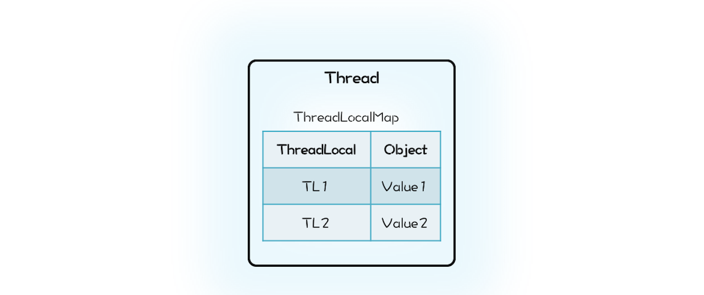
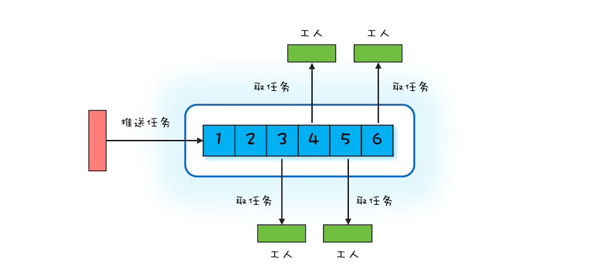

### 3. 并发设计模式

###### 3.1 Immutability模式：如何利用不变性解决并发问题？

```****

    场景：
    
        最简单的解决并发问题的方法
        
        
    
    不变性（Immutability）模式：
    
        多个线程同时读写同一共享变量存在并发问题，如果只有读，而没有写，是没有并发问题的。
        
        解决并发问题，其实最简单的办法就是：让共享变量只有读操作，而没有写操作。
        
        这个办法如此重要，以至于被上升到了一种解决并发问题的 设计模式：不变性（Immutability）模式。
        
            所谓不变性，简单来讲，就是：对象一旦被创建之后，状态就不再发生变化。
            换句话说，就是变量一旦被赋值，就不允许修改了（没有写操作）；
            没有修改操作，也就是保持了不变性
    
    
    
    
    实现一个具备不可变性的类：
         
         1、将一个类 所有的属性 都设置成 final 的，并且 只允许存在 只读方法，那么这个类基本上就具备不可变性了
         
         2、更严格的做法是这个类本身也是 final 的，也就是不允许继承。
                因为子类可以覆盖父类的方法，有可能改变不可变性，所以推荐你在实际工作中，使用这种更严格的做法。
                
         
    Java SDK 中的不变类：
    
        例如经常用到的 String 和 Long、Integer、Double 等基础类型的包装类 都具备不可变性，
        
        这些对象的 线程安全性 都是靠 不可变性 来保证的。
        
        
        如果你仔细翻看这些 类的声明、属性 和 方法，你会发现它们都严格遵守 不可变类的三点要求：
        
            类 和 属性 都是 final 的，所有方法 均是 只读的。
    
    
    
    不变类的修改：
    
        创建一个新的不可变对象：
        
            参照String 的实现，发现如果具备不可变性的类，需要提供 类似修改 的功能：
                
                需要创建一个新的不可变对象
                
                这是与可变对象的一个重要区别，可变对象往往是修改自己的属性。
    
    
        内存浪费问题：
        
            所有的修改操作都创建一个新的不可变对象，创建的对象太多了，造成内存浪费问题
            
            
            解决方法：
            
                利用 享元模式 避免创建重复对象
                
             
                如果你熟悉面向对象相关的设计模式，相信你一定能想到享元模式（Flyweight Pattern）。
                利用享元模式可以减少创建对象的数量，从而减少内存占用。
                Java 语言里面 Long、Integer、Short、Byte 等这些基本数据类型的包装类都用到了享元模式。
                
                
            享元模式：
            
                本质上其实就是一个 对象池
                
                利用享元模式创建对象的逻辑也很简单：
                
                    创建之前，首先去对象池里看看是不是存在；
                    如果已经存在，就利用对象池里的对象；
                    如果不存在，就会新创建一个对象，并且把这个新创建出来的对象放进对象池里。
                    
                    
                参考：
                    LongCache#cache[]     -->  仅缓存了 [-128,127] 之间的数字  无法缓存所有，这个区间使用的最频繁            
        
            
        不能用来做锁🔐：
        
            享元模式 导致 看起来是不同的对象，实际是同一个对象！
            
                eg：
                
                    class A {
                      Long al = Long.valueOf(1);
                      public void setAX(){
                        synchronized (al) {
                          // 省略代码无数
                        }
                      }
                    }
                    class B {
                      Long bl = Long.valueOf(1);
                      public void setBY(){
                        synchronized (bl) {
                          // 省略代码无数
                        }
                      }
                    }
                    
                实际上： al 和 bl 是一个对象，结果 A 和 B 共用的是一把锁。
                
                
                其实基本上 所有的基础类型的包装类 都不适合做锁，
                因为它们内部用到了享元模式，这会导致看上去私有的锁，其实是共有的。
                
                例如在上面代码中，本意是 A 用锁 al，B 用锁 bl，各自管理各自的，互不影响。
                但实际上 al 和 bl 是一个对象，结果 A 和B 共用的是一把锁。
        
    
    使用 Immutability 模式的注意事项：
    
        1. 对象的所有属性都是 final 的，并不能保证不可变性；
        2. 不可变对象也需要正确发布。
        
        在 Java 语言中，final 修饰的属性一旦被赋值，就不可以再修改，但是如果属性的类型是普通对
        象，那么这个普通对象的属性是可以被修改的。例如下面的代码中，Bar 的属性 foo 虽然是 final
        的，依然可以通过 setAge() 方法来设置 foo 的属性 age。所以，在使用 Immutability 模式的时候
        一定要确认保持不变性的边界在哪里，是否要求属性对象也具备不可变性。
    
    
    
    
    总结：
    
        利用 Immutability 模式解决并发问题，也许你觉得有点陌生，其实你天天都在享受它的战果。
        
        Java语言里面的 String 和 Long、Integer、Double 等基础类型的包装类都具备不可变性，这些对象的线程安全性都是靠不可变性来保证的。
        
        Immutability 模式是最简单的解决并发问题的方法，
        建议当你试图解决一个并发问题时，可以首先尝试一下 Immutability 模式，看是否能够快速解决。
        
        具备不变性的对象，只有一种状态，这个状态由对象内部所有的不变属性共同决定。
        
        
        无状态：
        
            其实还有一种更简单的不变性对象，那就是无状态。
            无状态对象内部 没有属性，只有方法。
            
            除了无状态的对象，你可能还听说过无状态的服务、无状态的协议等等。
            
            无状态有很多好处，最核心的一点就是性能。
            
            在多线程领域，无状态对象没有线程安全问题，无需同步处理，自然性能很好；
            
            在分布式领域，无状态意味着可以无限地水平扩展，
            所以分布式领域里面性能的瓶颈一定不是出在无状态的服务节点上。
    
    
        
    
```

###### 3.2 Copy-on-Write模式：不是延时策略的COW
```

    场景（Copy-on-Write 模式的应用领域）：
    
        Immutability 模式
        
        Java 领域 - 并发容器：
        
            CopyOnWriteArrayList 和 CopyOnWriteArraySet
        
        
        操作系统领域：
        
        
            创建进程、文件系统
            
        
            fork() 创建进程：
            
                Linux 中 fork() 子进程的时候，并不复制整个进程的地址空间，而是让父子进程共享同一个地址空间；
                只用在父进程或者子进程需要写入的时候才会复制地址空间，从而使父子进程拥有各自的地址空间。
            
            使用 Copy-on-Write 更多地体现的是一种延时策略，
            只有在真正需要复制的时候才复制，而不是提前复制好，
            同时 Copy-on-Write 还支持 按需复制，所以 Copy-on-Write 在操作系统领域是能够提升性能的。
            
            相较而言，
            Java 提供的 Copy-on-Write 容器，由于在修改的同时会复制整个容器，所以在提升读操作性能的同时，是以内存复制为代价的。
            同样是应用 Copy-on-Write，不同的场景，对性能的影响是不同的。
            
        
        
        Docker 容器镜像的设计
        
        分布式源码管理系统 Git背后的设计思想
        
        
        函数式编程领域：     <===    最大的应用领域
        
            函数式编程的 基础是 不可变性（Immutability），所以函数式编程里面 所有的修改操作 都需要 Copy-on-Write 来解决。
            
            
            疑问：所有数据的修改都需要复制一份，性能是不是会成为瓶颈呢？
            
                你的担忧是有道理的，之所以函数式编程早年间没有兴起，性能绝对拖了后腿。
                但是随着硬件性能的提升，性能问题已经慢慢变得可以接受了。
                而且，Copy-on-Write 也远不像 Java 里的CopyOnWriteArrayList 那样笨：整个数组都复制一遍。
                Copy-on-Write 也是可以 按需复制 的。
            

```


###### 3.3 线程本地存储模式：没有共享，就没有伤害
```

    场景：
        
        避免共享 -> 解决并发问题
        
    
    思想：
        
        避免共享        - 没有共享，就没有伤害
        
    
    如何避免共享：
            
        多个人争一个球总容易出矛盾，那就每个人发一个球。
        
        对应到并发编程领域，就是每个线程都拥有自己的变量，彼此之间不共享，也就没有并发问题了。
    
    
    
    JDK 实现：
        
        ThreadLocal
        
        
        引用：
        
            Thread  -->  ThreadLocal.ThreadLocalMap --> K：ThreadLocal（LOGIN_USER） / V：Data（USER）
            
            
            Java 的实现里面 ThreadLocalMap 则是属于 Thread。
            
            在 Java 的实现方案里面，ThreadLocal 仅仅是一个代理工具类，内部并不持有任何与线程相关的数据，
            所有和线程相关的数据都存储在 Thread 里面，这样的设计容易理解。
            而从数据的亲缘性上来讲，ThreadLocalMap 属于 Thread 也更加合理。
            
            
            当然还有一个更加深层次的原因，那就是不容易产生内存泄露。
            
            在我们的设计方案中，ThreadLocal持有的 Map 会持有 Thread 对象的引用，这就意味着，只要 ThreadLocal 对象存在，
            那么 Map 中的 Thread 对象就永远不会被回收。
            ThreadLocal 的生命周期往往都比线程要长，所以这种设计方案很容易导致内存泄露。
            
            而 Java 的实现中 Thread 持有 ThreadLocalMap，
            而且 ThreadLocalMap 里对 ThreadLocal 的引用还是 弱引用（WeakReference），
            所以只要 Thread 对象可以被回收，那么 ThreadLocalMap 就能被回收。
            
            Java 的这种实现方案虽然看上去复杂一些，但是更加安全。
            Java 的 ThreadLocal 实现应该称得上深思熟虑了，不过即便如此深思熟虑，还是 不能 百分百地让程序员 避免内存泄露，
            例如在 线程池中使用 ThreadLocal，如果不谨慎就 可能导致 内存泄露 。
            
            
        操作：
        
            LOGIN_USER.set(USER);  
            
                -->     Thread -> Map -> set(K,V)    ==> K：this（LOGIN_USER）/ V：USER
                
            LOGIN_USER.get();
            
                -->     Thread -> Map -> get(K)    ==> K：this（LOGIN_USER）/ return V（USER）
    
            
            LOGIN_USER.remove();
            
                -->     Thread -> Map -> remove(K)    ==> K：this（LOGIN_USER）
                
     
           
    ThreadLocal 与内存泄露：
    
        在线程池中使用 ThreadLocal 为什么 可能导致 内存泄露 呢？
         
            原因就出在 线程池中 线程的存活时间 太长，
            往往都是 和程序 同生共死的，
            这就意味着 Thread 持有的 ThreadLocalMap 一直都不会被回收，
            
            再加上 ThreadLocalMap 中的 Entry 对 ThreadLocal 是弱引用（WeakReference），
            所以只要 ThreadLocal 结束了自己的生命周期是可以被回收掉的。
            
            但是 Entry 中的 Value 却是被 Entry 强引用 的，
            所以即便 Value 的生命周期结束了，Value 也是无法被回收的，
            从而导致内存泄露。
        
         
        那在线程池中，我们该如何正确使用 ThreadLocal 呢？
         
            其实很简单，既然 JVM 不能做到自动释放对 Value 的强引用，那我们手动释放就可以了。
         
            如何能做到手动释放呢？
         
                估计你马上想到 try{}finally{} 方案了，这个简直就是手动释放资源的利器。
                
                ExecutorService es;
                ThreadLocal tl;
                es.execute(()->{
                  
                  // ThreadLocal 增加变量
                  tl.set(obj);
                  
                  try {
                    // 省略业务逻辑代码
                  } finally {
                  
                    // 手动清理 ThreadLocal 
                    tl.remove();
                  }
                  
                });

        
        
    InheritableThreadLocal 与继承性：
        
        引用：
        
            Thread  ->  ThreadLocal.ThreadLocalMap inheritableThreadLocals
        
        
        通过 ThreadLocal 创建的线程变量，其子线程是无法继承的：
        
            也就是说你在线程中通过ThreadLocal 创建了线程变量 V，而后该线程创建了子线程，
            你在子线程中是无法通过ThreadLocal 来访问父线程的线程变量 V 的
        
        
        如果你需要子线程继承父线程的线程变量，那该怎么办呢？
        
            其实很简单，Java 提供了InheritableThreadLocal 来支持这种特性，
            InheritableThreadLocal 是 ThreadLocal 子类，所以用法和 ThreadLocal 相同
        
        
        but，不准在线程池中使用：
            
            完全不建议 你在 线程池中 使用 InheritableThreadLocal
            
            不仅仅是因为它具有 ThreadLocal 相同的缺点 —— 可能导致内存泄露
            
            更重要的原因是：
            
                线程池中线程的创建是动态的，很容易导致 继承关系错乱
                
                如果你的业务逻辑依赖 InheritableThreadLocal，那么很可能导致 业务逻辑计算错误
                
                而 这个错误 往往 比内存泄露 更要命
                
    
    
    总结：
    
        线程本地存储模式 本质上是一种 避免共享的方案，由于没有共享，所以自然也就没有并发问题。
        
        如果你需要在并发场景中使用一个线程不安全的工具类，最简单的方案就是避免共享。
        
        
        避免共享有两种方案：
        
            一种方案是将这个工具类作为局部变量使用，
            另外一种方案就是线程本地存储模式。
        
            
        这两种方案：
        
            局部变量方案的缺点是在高并发场景下会频繁创建对象，
            
            而线程本地存储方案，每个线程只需要创建一个工具类的实例，所以不存在频繁创建对象的问题。
        
                线程本地存储模式是解决并发问题的常用方案，所以 Java SDK 也提供了相应的实现：ThreadLocal。
        
        
        Java SDK 的实现已经是深思熟虑了，不过即便如此，仍不能尽善尽美，
        例如在线程池中使用 ThreadLocal 仍可能导致内存泄漏，
        所以使用ThreadLocal 还是需要你打起精神，足够谨慎。    


```
 
 
 


##### 3.4 Guarded Suspension模式：等待唤醒机制的规范实现
```
    
    本质：
        
        Guarded Suspension 模式本质上是一种 等待唤醒机制 的实现
        
            - 直译过来就是 “保护性地暂停”
    
    总结：
    
        Guarded Suspension 模式本质上是一种 等待唤醒机制 的实现，只不过 Guarded Suspension 模式将其规范化了。
        
        规范化的好处是：
        
            你无需重头思考如何实现，也无需担心实现程序的可理解性问题，同时也能避免一不小心写出个 Bug 来。
            
        但 Guarded Suspension 模式在解决实际问题的时候，往往还是需要扩展的，扩展的方式有很多，
        
        本篇文章就直接对 GuardedObject 的功能进行了增强，
        
        Dubbo 中 DefaultFuture 这个类也是采用的这种方式，
        你可以对比着来看，相信对 DefaultFuture的实现原理会理解得更透彻。
        
        当然，你也可以创建新的类来实现对 Guarded Suspension 模式的扩展。
        
    
    
    多线程版本的 if：
           
        Guarded Suspension 模式也常被称作 Guarded Wait 模式、Spin Lock 模式（因为使用了 while循环去等待），这些名字都很形象，
        
        不过它还有一个更形象的 非官方名字：多线程版本的 if
        
        单线程场景中，if 语句是不需要等待的，
        因为在只有一个线程的条件下，如果这个线程被阻塞，那就没有其他活动线程了，
        这意味着 if 判断条件的结果也不会发生变化了。
        
        但是多线程场景中，等待就变得有意义了，这种场景下，if 判断条件的结果是可能发生变化的。
        
        所以，用“多线程版本的 if”来理解这个模式会更简单。

```


##### 3.5 Balking模式：再谈线程安全的单例模式
```

    场景：
    
        “多线程版本的 if”   - 需要快速放弃
    
        
    比较：
    
        我们提到可以用“多线程版本的 if”来理解 Guarded Suspension 模式，
        不同于单线程中的 if，这个“多线程版本的 if”是需要等待的，而且还很执着，必须要等到条件为真。
        
        但很显然这个世界，不是所有场景都需要这么执着，有时候我们还需要快速放弃。
    
    
    
    经典实现：
        
        synchronized：       推荐！！！
            
            这种实现方式最为稳妥，建议你实际工作中也使用这个方案。
        
            Balking 模式本质上是一种规范化地解决“多线程版本的 if”的方案，对于上面自动保存的例子，
            使用Balking 模式规范化之后的写法如下所示，
            你会发现仅仅是将 edit() 方法中对共享变量 changed 的】赋值操作抽取到了 change() 中，
            这样的好处是将并发处理逻辑和业务逻辑分开。
        
        
        用 volatile 实现 Balking 模式：
            
           在某些特定场景下，也可以使用 volatile 来实现，但使用 volatile 的前提是：对 原子性 没有要求
           
    
    非常典型的应用场景：
    
        单次初始化：
        
            线程安全的单例模式本质上其实也是单次初始化
                     
                双重检查（Double Check）方案
                
                
                    // 获取实例（单例）
                    public static Singleton getInstance() {
                        // 第一次检查
                        if (singleton == null) {
                            // 获取🔐
                            synchronize (Singleton.class) {
                                // 获取锁后二次检查
                                if (singleton == null) {
                                    singleton = new Singleton();
                                }
                            }
                        }
                        return singleton;
                    }

        
    
    
    总结：
        
        Balking 模式和 Guarded Suspension 模式从实现上看似乎没有多大的关系，
        Balking 模式只需要用互斥锁就能解决，而 Guarded Suspension 模式则要用到管程这种高级的并发原语；
        
        但是从应用的角度来看，它们解决的都是“线程安全的 if”语义
        
        不同之处在于：
        
            Guarded Suspension 模式 会等待 if 条件为真，而 Balking 模式 不会等待。
        
        
        Balking 模式的经典实现是使用互斥锁，你可以使用 Java 语言内置 synchronized，也可以使用SDK 提供 Lock；
        如果你对互斥锁的性能不满意，可以尝试采用 volatile 方案，不过使用 volatile 方案需要你更加谨慎。
        
        当然你也可以尝试使用双重检查方案来优化性能，
        双重检查中的第一次检查，完全是出于对性能的考量：避免执行加锁操作，因为加锁操作很耗时。
        而加锁之后的二次检查，则是出于对安全性负责。
        
        双重检查方案在优化加锁性能方面经常用到
            
        
```

##### 3.6 Thread-Per-Message模式：最简单实用的分工方法
```

    场景：
        
        最简单的分工模式
        
        Thread-Per-Message 模式，对应到现实世界，其实就是委托代办。
        
    
    
    分工模式：
    
        我们曾经把并发编程领域的问题总结为三个核心问题：分工、同步和互斥。
        
            其中，同步和互斥相关问题更多地源自微观，
            
            而分工问题则是源自宏观。
        
        
        我们解决问题，往往都是从宏观入手
        
            在编程领域，软件的设计过程也是先从概要设计开始，而后才进行详细设计。
        
            同样，解决并发编程问题，首要问题也是解决 宏观的分工 问题：
        
            比较常用的模式主要有：
            
                Thread-Per-Message模式、Worker Thread 模式、生产者 - 消费者模式
        
    
        
    Thread-Per-Message模式：
        
        这种委托他人办理的方式，在并发编程领域被总结为一种设计模式，叫做Thread-Per-Message 模式，
        
        简言之就是为每个任务分配一个独立的线程。
     
     
    轻量级线程：
        
        Java 语言里，Java 线程是和操作系统线程一一对应的，这种做法本质上是将 Java 线程的调度权完全委托给操作系统，
        而操作系统在这方面非常成熟，所以这种做法的好处是稳定、可靠，
        但是也继承了操作系统线程的缺点：创建成本高。
    
        为了解决这个缺点，Java 并发包里提供了线程池等工具类。这个思路在很长一段时间里都是很稳妥的方案，但是这个方案并不是唯一的方案。
        
        
        业界还有另外一种方案，叫做轻量级线程：
        
            这个方案在 Java 领域知名度并不高，但是在其他编程语言里却叫得很响，
            例如 Go 语言、Lua 语言里的协程，本质上就是一种轻量级的线程。
        
        
            轻量级的线程，创建的成本很低，基本上和创建一个普通对象的成本相似；
        
        
            并且创建的速度和内存占用相比操作系统线程至少有一个数量级的提升，
            所以基于轻量级线程实现 Thread-Per-Message 模式就完全没有问题了。
    
    
    OpenJDK Loom项目 支持：
    
        Java 语言目前也已经意识到轻量级线程的重要性了，
        OpenJDK 有个 Loom 项目，就是要解决Java 语言的轻量级线程问题，
        在这个项目中，轻量级线程被叫做Fiber。  
        
        
    
    用 Fiber 实现 Thread-Per-Message 模式：
        
        Loom 项目在设计轻量级线程时，充分考量了当前 Java 线程的使用方式，采取的是尽量兼容的态度，所以使用上还是挺简单的。
        用 Fiber 实现 echo 服务，对比 Thread 的实现，你会发现改动量非常小，
        只需要把 new Thread(()->{…}).start() 换成 Fiber.schedule(()->{})就可以了。 
        
        
    
    
    
    总结：
    
        并发编程领域的 分工问题，指的是：如何高效地拆解任务并分配给线程。
        
            前面我们在并发工具类模块中已经介绍了不少解决分工问题的工具类，
            例如 Future、CompletableFuture 、CompletionService、Fork/Join 计算框架等，
            这些工具类都能很好地解决特定应用场景的问题，所以，这些工具类曾经是 Java 语言引以为傲的。
            不过这些工具类都继承了 Java 语言的老毛病：太复杂。
        
        如果你一直从事 Java 开发，估计你已经习以为常了，习惯性地认为这个复杂度是正常的。
        
            不过这个世界时刻都在变化，
            曾经正常的复杂度，现在看来也许就已经没有必要了，
            
            例如 Thread-PerMessage 模式如果使用线程池方案就会增加复杂度。
        
        Thread-Per-Message 模式在 Java 领域并不是那么知名，根本原因在于 Java 语言里的线程是一个重量级的对象，
        为每一个任务创建一个线程成本太高，尤其是在高并发领域，基本就不具备可行性。
        
        不过这个背景条件目前正在发生巨变，Java 语言未来一定会提供轻量级线程，
        这样基于轻量级线程实现 Thread-Per-Message 模式就是一个非常靠谱的选择。
        
        当然，对于一些并发度没那么高的异步场景，例如定时任务，采用 Thread-Per-Message 模式是完全没有问题的。
        
        实际工作中，我就见过完全基于 Thread-Per-Message 模式实现的分布式调度框架，这个框架为每个定时任务都分配了一个独立的线程。
        
    
    思考：
    
        Q： 使用 Thread-Per-Message 模式会为每一个任务都创建一个线程，在高并发场景中，很容易导致应用 OOM，那有什么办法可以快速解决呢？
        
        A： 1、引入线程池控制创建线程的大小，通过压测得到比较合理的线程数量配置
            2、在请求端增加一个限流模块，自我保护
            3、引入NIO或AIO，netty 就是这么干的
            
            
```


##### 3.7 Worker Thread模式：如何避免重复创建线程？
```
    
    场景：
        
        有效避免线程的频繁创建、销毁以及 OOM 问题
        
        
    Worker Thread 模式及其实现：
        
        Worker Thread 模式可以类比现实世界里车间的工作模式：
        
            车间里的工人，有活儿了，大家一起干，没活儿了就聊聊天等着。
            
            你可以参考下面的示意图来理解，Worker Thread 模式中 Worker Thread 对应到现实世界里，
            其实指的就是车间里的工人。
            
            不过这里需要注意的是，车间里的工人数量往往是确定的。
    

```
 
```

    编程领域该如何模拟车间的这种工作模式呢：        -或者说 Java 如何去实现 Worker Thread 模式呢？
    
        Java 线程池：
        
            ⽤阻塞队列做任务池，然后创建固定数量的线程消费阻塞队列中的任务。
            
        
            线程池优点：
                避免重复创建、销毁线程，同时能够限制创建线程的上限
                
                
            对比：
                ⽤ Java	的 Thread 实现 Thread-Per-Message 模式难以应对⾼并发场景，
                原因就在于 频繁创建、销毁 Java	线程的成本有点⾼，⽽且⽆限制地创建线程还可能导致应⽤ OOM。
                线程池，则恰好能解决这些问题。
                
            
            
            正确地创建线程池：
            
                Java 的线程池 既能够 避免⽆限制地创建线程导致 OOM，也能 避免⽆限制地接收任务导致 OOM。
                
                只不过后者经常容易被我们忽略。
                
                1、所以强烈建议你 ⽤创建 有界的队列 来接收任务。
                
                2、当请求量⼤于有界队列的容量时，就需要合理地拒绝请求。如何合理地拒绝呢？
                
                    这需要你结合具体的业务场景来制定，即便线程池默认的拒绝策略能够满⾜你的需求，
                    
                    也同样建议你 在创建线程池时，清晰地指明拒绝策略。
                
                3、同时，为了便于调试和诊断问题，
                
                    也强烈建议你 在实际⼯作中给线程赋予⼀个业务相关的名字。
                    
                
            避免线程死锁：
            
                先说解决方案：
                    
                    为不同的任务创建不同的线程池！！！
                
                
                
                错误示范：
                
                    某应⽤将⼀个⼤型的计算任务分成两个阶段，第⼀个阶段的任务会等待第⼆阶段的⼦任务完成。
                    在这个应⽤⾥，每⼀个阶段都使⽤了线程池，⽽且两个阶段使⽤的还是同⼀个线程池。
                    
                    使⽤线程池过程中，还要注意⼀种线程死锁的场景。
                    如果提交到相同线程池的任务不是相互独⽴的，⽽是有依赖关系的，那么就有可能导致线程死锁。
                
                
                
                排查问题：
                
                    当应⽤出现类似问题时，⾸选的诊断⽅法是查看线程栈。
                    
                    
                    相关指令：
                    
                        CPU 100% 排查 
                        
                            top -c        P
                            top -Hp xxx   P
                            printf "%x" yyy
                            jstack xxx | grep ‘0x2a34’ -C10 --color
                            
                            
                            jstack xxx > error.log
                        
                        
                    
                其实这种问题通⽤的解决⽅案是：
                
                    为不同的任务创建不同的线程池。
                
                
                    对于上⾯的这个应⽤，L1 阶段的任务和 L2 阶段的任务如果各⾃都有⾃⼰的线程池，就不会出现这种问题了。
                    
                    最后再次强调⼀下：提交到相同线程池中的任务⼀定是相互独⽴的，否则就⼀定要慎重。  
            


    总结：
        
        我们曾经说过，解决并发编程⾥的 分⼯问题，最好的办法是 和现实世界做对⽐。
        
        对⽐现实世界构建编程领域的模型，能够让模型更容易理解。
        
            Thread-Per-Message 模式，类似于 现实世界⾥的委托他⼈办理，
            
            Worker Thread 模式，则类似于 ⻋间⾥⼯⼈的⼯作模式。
        
        
        如果你在设计阶段，发现对业务模型建模之后，模型⾮常类似于⻋间的⼯作模式，那基本上就能确定可以在实现阶段采⽤ Worker Thread 模式来实现。
        
        
        Worker Thread 模式和 Thread-Per-Message 模式的区别：
        
            从现实世界的⻆度看，你委托代办⼈做事，往往是和代办⼈直接沟通的；
            对应到编程领域，其实现也是 主线程直接创建了⼀个⼦线程，主⼦线程之间是可以直接通信的。
            
            ⽽⻋间⼯⼈的⼯作⽅式则是 完全围绕任务展开的，⼀个具体的任务被哪个⼯⼈执⾏，预先是⽆法知道的；
            对应到编程领域，则是主线程提交任务到线程池，但主线程并不关⼼任务被哪个线程执⾏。
        
        
        Worker Thread 模式能避免线程频繁创建、销毁的问题，⽽且能够限制线程的最⼤数量。
        
            Java 语⾔⾥可以直接使⽤ 线程池来实现 Worker Thread 模式，线程池是⼀个⾮常基础和优秀的⼯具类，
            甚⾄有些⼤⼚的编码规范都不允许⽤ new Thread() 来创建线程的，必须使⽤线程池。
        
        
        不过使⽤线程池还是需要格外谨慎的：
            
            除了今天重点讲到的如何正确创建线程池、如何避免线程死锁问题，
            还需要注意前⾯我们曾经提到的 ThreadLocal 内存泄露问题。
            同时对于提交到线程池的任务，还要做好异常处理，避免异常的任务从眼前溜⾛，
            从业务的⻆度看，有时没有发现异常的任务后果往往都很严重。
            
            
            
```

 
 
 
##### 3.8 两阶段终止模式：如何优雅地终止线程？
```
    
    思考：
    
        启动多线程去执⾏⼀个异步任务。既启动，那⼜该如何终⽌呢？
        今天咱们就从技术的⻆度聊聊如何优雅地终⽌线程，正所谓有始有终。
    
        
    优雅地终⽌线程：
    
        不是⾃⼰终⽌⾃⼰，⽽是在⼀个 线程T1 中，终⽌ 线程T2；
        这⾥所谓的“优雅”，指的是给 T2 ⼀个机会料理后事，⽽不是被⼀剑封喉。
        
        
        Java 语⾔的 Thread 类中曾经提供了⼀个 stop() ⽅法，⽤来终⽌线程，可是早已不建议使⽤了，
        原因是这个⽅法⽤的就是⼀剑封喉的做法，被终⽌的线程没有机会料理后事。
    
    
    
    理解两阶段终⽌模式：
    
        成熟的⽅案：
        
            前辈们经过认真对⽐分析，已经总结出了⼀套成熟的⽅案，叫做两阶段终⽌模式。
        
        
        顾名思义，就是将终⽌过程分成两个阶段：
        
            第⼀个阶段主要是 线程T1 向 线程T2 发送终⽌指令
            
            ⽽第⼆阶段则是   线程T2 响应终⽌指令
            
        
        
        Java语言中的终止指令：
            
            先来看Java线程的状态转换图
            
```
 
```
            Java线程进⼊终⽌状态的前提是：
            
                线程进⼊ RUNNABLE 状态，
                
                ⽽实际上 线程也可能处在休眠状态，
                
                也就是说，我们要想终⽌⼀个线程，⾸先要 把线程的状态从 休眠状态 转换到 RUNNABLE状态。
            
            
            把线程的状态从 休眠状态 转换到 RUNNABLE状态：
            
                这个要靠 Java Thread类 提供的interrupt()⽅法，它可以将 休眠状态的线程 转换到 RUNNABLE状态。
            
                
            线程转换到 RUNNABLE 状态之后，我们如何再将其终⽌呢：
            
                RUNNABLE状态 转换到 终⽌状态，优雅的⽅式是 让 Java线程 ⾃⼰执⾏完run()⽅法，
                
                所以⼀般我们采⽤的⽅法是 设置⼀个标志位，
                
                然后线程会 在合适的时机检查这个标志位，
                
                如果发现符合终⽌条件，则⾃动退出run() ⽅法。
            
                
                这个过程其实就是我们前⾯提到的第⼆阶段：响应终⽌指令。
            
            
            
            综合上⾯这两点，我们能总结出终⽌指令，其实包括两⽅⾯内容：
            
                interrupt()⽅法  和  线程终⽌的标志位
                
            
            
    
    线程终⽌的标志位：
    
        1、Thread类 自带isInterrupted()标志位：
            
            
            // Thread标志位判断
            while (!Thread.currentThread().isInterrupted()) {
                ...
                
                try	{
                    Thread.sleep(2000);
                }	catch	(InterruptedException	e){
                    // 重新设置线程中断状态
                    Thread.currentThread().interrupt();
                }
                
                ...
            }
            
            
            tips：
            
                我们选择的标志位是线程的中断状态：Thread.currentThread().isInterrupted() ，
                需要注意的是，我们在捕获 Thread.sleep() 的中断异常之后，
                通过 Thread.currentThread().interrupt() 重新设置了线程的中断状态，
                因为 JVM 的异常处理会清除线程的中断状态。
            
            
            但是建议你在实际⼯作中谨慎使⽤：
            
                原因在于我们很可能在线程的	run() ⽅法中调⽤第三⽅类库提供的⽅法，
                ⽽我们没有办法保证第三⽅类库正确处理了线程的中断异常，
                例如第三⽅类库在捕获到Thread.sleep() ⽅法抛出的中断异常后，
                没有重新设置线程的中断状态，那么就会导致线程不能够正常终⽌。
                        
                
        2、设置自己的线程终止标志位：  （强烈建议！！！）
            
            // 自定义线程终⽌标志位
            volatile boolean terminated	= false;
                
            // 自定义标志位判断
            while (!terminated){
                ...
            }
            
            
            
            此时⽆论是否正确处理了线程的中断异常，都不会影响线程优雅地终⽌。
            
    
    
    
    如何优雅地终⽌线程池：
        
        Java领域⽤的 最多的还是线程池，⽽不是⼿动地创建线程。
        
        那我们该如何优雅地终⽌线程池呢？
        
        
        
        线程池提供了两个⽅法：shutdown()和shutdownNow()：
        
        
        这两个⽅法的区别：
        
            要了解它们的区别，就先需要了解线程池的实现原理：
            
                我们曾经讲过，Java 线程池是⽣产者 - 消费者模式的⼀种实现，
                
                提交给线程池的任务，⾸先是进⼊⼀个阻塞队列中，之后线程池中的线程从阻塞队列中取出任务执⾏。
                
                
            shutdown()⽅法：
                
                shutdown()⽅法是 ⼀种很保守的关闭线程池的⽅法。
                
                线程池 执⾏ shutdown() 后，就会拒绝接收新的任务，
                    
                但是会等待线程池中 正在执⾏的任务 和 已经进⼊阻塞队列的任务 都执⾏完之后 才最终关闭线程池。
                
                
            shutdownNow()⽅法 ：
                
                ⽽ shutdownNow() ⽅法，相对就激进⼀些了
                
                线程池 执⾏ shutdownNow() 后，会拒绝接收新的任务，
                
                同时还会 中断 线程池中 正在执⾏的任务，已经进⼊阻塞队列的任务 也被 剥夺了执⾏的机会，
                
                不过这些 被剥夺执⾏机会的任务 会作为 shutdownNow() ⽅法的 返回值返回。
                
                
                tips：
                    
                    因为	shutdownNow() ⽅法会中断正在执⾏的线程，所以提交到线程池的任务，如果需要优雅地结束，就需要正确地处理线程中断。
                    
                    如果提交到线程池的任务不允许取消，那就不能使⽤ shutdownNow() ⽅法终⽌线程池。
            
                    不过，如果提交到线程池的任务允许后续以补偿的⽅式重新执⾏，也是可以使⽤ shutdownNow() ⽅法终⽌线程池的。
        
        
                    《Java并发编程实战》这本书第 7 章《取消与关闭》的“shutdownNow 的局限性”⼀节中，
                    提到⼀种将 已提交但尚未开始执⾏的任务 以及 已经取消的正在执⾏的任务 保存起来，以便后续重新执⾏的⽅案，
                    你可以参考⼀下，⽅案很简答，这⾥就不详细介绍了
                    
                    
        
        shutdown() 和 shutdownNow() 也是两阶段终⽌模式：
        
            其实分析完 shutdown() 和 shutdownNow() ⽅法你会发现，
            
            它们实质上使⽤的也是两阶段终⽌模式，
            
            只是 终⽌指令的范围不同⽽已，
            
            前者 只影响 阻塞队列 接收任务，后者 范围扩⼤到 线程池中所有的任务。
        
        
    总结：
    
        两阶段终⽌模式是⼀种应⽤很⼴泛的并发设计模式，在 Java 语⾔中使⽤两阶段终⽌模式来优雅地终⽌线程，
        
        需要注意两个关键点：
        
            ⼀个是仅检查终⽌标志位是不够的，因为线程的状态可能处于休眠态；
            另⼀个是仅检查线程的中断状态也是不够的，因为我们依赖的第三⽅类库很可能没有正确处理中断异常。
        
        
        当你使⽤ Java 的线程池 来 管理线程 的时候，需要依赖 线程池提供的 shutdown() 和 shutdownNow() ⽅法来终⽌线程池。
        
        不过在使⽤时需要注意它们的应⽤场景，尤其是在使⽤shutdownNow() 的时候，⼀定要谨慎。            
        
```


##### 3.9 生产者-消费者模式：用流水线思想提高效率
```

    本质：
    
        ⽣产者 - 消费者模式的核⼼是 ⼀个任务队列，
        ⽣产者线程⽣产任务，并将任务添加到任务队列中，⽽消费者线程从任务队列中获取任务并执⾏。
    
    
    编程领域：
    
        Java线程池 本质上就是⽤⽣产者 - 消费者模式实现的，
        所以每当使⽤线程池的时候，其实就是在应⽤⽣产者 - 消费者模式。
    
    
    ⽣产者 - 消费者模式的优点：
    
        解耦：
        
            从架构设计的⻆度来看，⽣产者 - 消费者模式有⼀个很重要的优点，就是解耦。
                
            解耦对于⼤型系统的设计⾮常重要，⽽解耦的⼀个关键就是 组件之间的依赖关系 和 通信⽅式 必须受限。
            
            在⽣产者 - 消费者模式中，⽣产者和消费者没有任何依赖关系，它们彼此之间的 通信 只能通过任务队列，
            
            所以⽣产者 - 消费者模式是⼀个不错的解耦⽅案。
            
         
        异步：
               
            除了架构设计上的优点之外，⽣产者 - 消费者模式还有⼀个重要的优点就是⽀持异步，
            
            并且能够 平衡 ⽣产者和消费者的 速度差异。
            
            在⽣产者 - 消费者模式中，⽣产者线程只需要将任务添加到任务队列⽽⽆需等待任务被消费者线程执⾏完，
            
            也就是说任务的⽣产和消费是异步的，这是与传统的⽅法之间调⽤的本质区别，传统的⽅法之间调⽤是同步的。
        
        
        
        任务队列的作用：
        
            平衡生产者和消费者的速度差异
            
            
            我们假设⽣产者的速率很慢，⽽消费者的速率很⾼，⽐如是 1:3，
            如果⽣产者有	3 个线程，采⽤创建新的线程的⽅式，那么会创建 3 个⼦线程，
            ⽽采⽤⽣产者 - 消费者模式，消费线程只需要 1 个就可以了。
            Java 语⾔⾥，Java 线程和操作系统线程是⼀⼀对应的，线程创建得太多，会增加上下⽂切换的成本，
            所以 Java线程不是越多越好，适量即可。
            ⽽⽣产者 - 消费者模式恰好能⽀持你⽤适量的线程。
            
    
            
    支持批量执行以提升性能：
                
        利⽤⽣产者 - 消费者模式还可以轻松地⽀持⼀种分阶段提交的应⽤场景。
        我们知道写⽂件如果同步刷盘性能会很慢，所以对于不是很重要的数据，我们往往采⽤异步刷盘的⽅式。
        我曾经参与过⼀个项⽬，其中的⽇志组件是⾃⼰实现的，采⽤的就是异步刷盘⽅式，刷盘的时机是：
        
            1. ERROR 级别的⽇志需要⽴即刷盘；
            2. 数据积累到 500 条需要⽴即刷盘；
            3. 存在未刷盘数据，且 5 秒钟内未曾刷盘，需要⽴即刷盘。
        
        这个⽇志组件的异步刷盘操作本质上其实就是⼀种分阶段提交。
        下⾯我们具体看看⽤⽣产者 - 消费者模式如何实现。
        在下⾯的示例代码中，可以通过调⽤ info()和error() ⽅法写⼊⽇志，
        这两个⽅法都是创建了⼀个⽇志任务 LogMsg，并添加到阻塞队列中，
        调⽤ info()和error()⽅法的线程是⽣产者；⽽真正将⽇志写⼊⽂件的是消费者线程，
        在 Logger 这个类中，我们只创建了 1个消费者线程，在这个消费者线程中，会根据刷盘规则执⾏刷盘操作，逻辑很简单，这⾥就不赘述了。
        
    
    
    总结：
    
        Java语⾔提供的 线程池本身就是⼀种⽣产者 - 消费者模式的实现，
        
        但是 线程池中的线程 每次只能从任务队列中消费⼀个任务来执⾏，对于⼤部分并发场景这种策略都没有问题。
        
        但是有些场景还是需要⾃⼰来实现，例如需要批量执⾏以及分阶段提交的场景。
        
        
        ⽣产者 - 消费者模式在分布式计算中的应⽤也⾮常⼴泛。
        
        在分布式场景下，你可以借助 分布式消息队列（MQ）来实现⽣产者 - 消费者模式。
        
        MQ ⼀般都会⽀持两种消息模型：
            
            ⼀种是点对点模型，⼀种是发布订阅模型。
        
        这两种模型的区别在于：
        
            点对点模型⾥⼀个消息只会被⼀个消费者消费，和 Java	的线程池⾮常类似（Java	线程池的任务也只会被⼀个线程执⾏）；
        
            ⽽发布订阅模型⾥⼀个消息会被多个消费者消费，本质上是⼀种消息的⼴播，在多线程编程领域，你可以结合观察者模式实现⼴播功能。  
              
```


##### 3.10 设计模式模块热点问题答疑
```

    多线程设计模式：
    
        多线程设计模式是前⼈解决并发问题的经验总结，当我们试图解决⼀个并发问题时，⾸选⽅案往往是使⽤匹配的设计模式，这样能避免⾛弯路。
        
        同时，由于⼤家都熟悉设计模式，所以使⽤设计模式还能提升⽅案和代码的可理解性。
        
    
        
    避免共享的设计模式：
    
        Immutability模式、Copy-on-Write模式 和 线程本地存储模式
    
        本质上都是为了避免共享，只是实现⼿段不同⽽已。
        
        
        这 3 种设计模式的实现都很简单，但是实现过程中有些细节还是需要格外注意的：
        
            使⽤ Immutability模式 需要注意 对象属性的不可变性，
            
            使⽤	Copy-on-Write模式 需要注意 性能问题，
            
            使⽤ 线程本地存储模式 需要注意 异步执⾏问题。
        
        
        
        对象属性的不可变性：
        
            - Account 这个类不具备不可变性
        
            这个类初看上去属于不可变对象的中规中矩实现，⽽实质上这个实现是有问题的，
            原因在于 StringBuffer 不同于 String，StringBuffer 不具备不可变性，
            通过 getUser() ⽅法获取 user 之后，是可以修改 user 的。
            ⼀个简单的解决⽅案是让	getUser() ⽅法返回 String 对象。
        
        
        Java SDK 中为什么没有提供 CopyOnWriteLinkedList ?
        
            - 性能问题⼀定是其中⼀个很重要的原因，毕竟完整地复制	LinkedList 性能开销太⼤了。

        
        在异步场景中，是否可以使⽤ Spring 的事务管理器？
        
            - 答案显然是不能的
            
            Spring 使⽤ThreadLocal 来传递事务信息，因此这个事务信息是不能跨线程共享的。
            实际⼯作中有很多类库都是⽤ ThreadLocal 传递上下⽂信息的，
            这种场景下如果有异步操作，⼀定要注意上下⽂信息是不能跨线程共享的。
            
    
    
    多线程版本 IF 的设计模式：
    
        Guarded Suspension 模式 和 Balking 模式 都可以简单地理解为“多线程版本的 if”
        
        它们的区别：
        
            前者会 等待 if 条件变为真，⽽后者则不需要等待。
            
         
           
        Guarded Suspension 模式 的经典实现是 使⽤管程
        
            很多初学者会简单地⽤线程 sleep 的⽅式实现
        
            但不推荐你使⽤这种⽅式，最重要的原因是性能，如果	sleep 的时间太⻓，会影响响应时间；
            
            sleep 的时间太短，会导致线程频繁地被唤醒，消耗系统资源。
        
        
        
        实现 Balking 模式最容易忽视的就是竞态条件问题：
        
            因此，在多线程场景中使⽤ if语句 时，⼀定要多问⾃⼰⼀遍：是否存在竞态条件。
        
        
        
        三种最简单的分⼯模式：
        
            Thread-Per-Message 模式、Worker Thread 模式和⽣产者 - 消费者模式是三种最简单实⽤的多线程分⼯⽅法。
            
            虽说简单，但也还是有许多细节需要你多加⼩⼼和注意。
            
            
            Thread-Per-Message 模式：
            
                在实现的时候需要注意是否存在线程的频繁创建、销毁以及是否可能导致 OOM
                
                在⾼并发场景中，最简单的办法其实是限流。
                当然，限流⽅案也并不局限于解决 Thread-Per-Message 模式中的 OOM 问题。
            
            
            Worker Thread 模式：
            
                需要注意潜在的线程死锁问题
                
            
                形象描述：
                    ⼯⼚⾥只有⼀个⼯⼈，他的⼯作就是同步地等待⼯⼚⾥其他⼈给他提供东⻄，然⽽并没有其他⼈，他将等到天荒地⽼，海枯⽯烂！
                    
                    因此，共享线程池 虽然能够 提升线程池的使⽤效率，
                    但⼀定要保证⼀个前提，那就是：任务之间没有依赖关系。 
                
                
                
            ⽣产者 - 消费者模式：
                    
                Java 线程池本身就是⼀种⽣产者 - 消费者模式的实现，所以⼤部分场景你都不需要⾃⼰实现，直接使⽤ Java	的线程池就可以了。
                
                但若能 ⾃⼰灵活地实现 ⽣产者	-消费者模式 会更好，⽐如可以实现批量执⾏和分阶段提交，
                
                不过这过程中还需要注意如何优雅地终⽌线程：
                
                    两阶段终⽌模式 是⼀种通⽤的解决⽅案
                
                
                但其实终⽌ ⽣产者	- 消费者 服务还有⼀种更简单的⽅案，叫做“毒丸”对象：
                
                    简单来讲，“毒丸”对象是⽣产者⽣产的⼀条特殊任务，然后当消费者线程读到“毒丸”对象时，会⽴即终⽌⾃身的执⾏。
                    
                    
                    ⽤“毒丸”对象终⽌写⽇志线程，整体的实现过程还是很简单的：
                    
                        类 Logger 中声明了⼀个“毒丸”对象 poisonPill ，
                        当消费者线程从阻塞队列	bq 中取出⼀条	LogMsg 后，先判断是否是“毒丸”对象，
                        如果是，则 break while 循环，从⽽终⽌⾃⼰的执⾏。        
        
        
            
    总结：
    
        多线程的设计模式当然不⽌我们提到的这	9 种，不过这⾥提到的这 9 种设计模式⼀定是最简单实⽤的。
        
                         
```