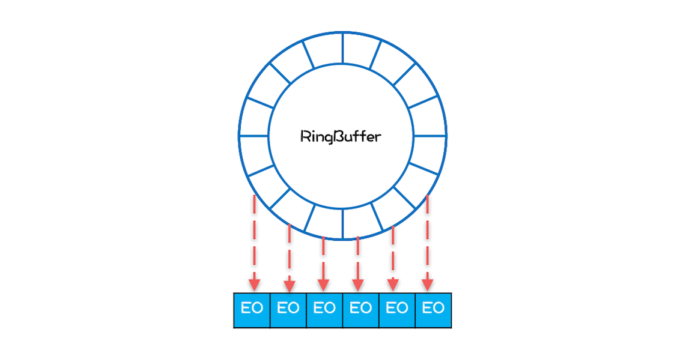

### 4. 案例分析

###### 4.1 案例分析（一）：高性能限流器Guava RateLimiter

```
    

```


###### 4.2 案例分析（二）：高性能网络应用框架Netty
```
    
    Netty - ⽹络程序的标配：
        
        Netty 是⼀个⾼性能⽹络应⽤框架，应⽤⾮常普遍，⽬前在 Java领域⾥，Netty 基本上成为 ⽹络程序的标配 了。
        Netty 框架功能丰富，也⾮常复杂，今天我们主要分析 Netty框架中的 线程模型，⽽ 线程模型 直接影响着 ⽹络程序的 性能。
        
        
        在介绍 Netty的线程模型 之前，我们⾸先需要把问题搞清楚，了解 ⽹络编程 性能的瓶颈 在哪⾥，
        然后再看 Netty的线程模型 是 如何解决 这个问题的。
        
    
        
    网络编程性能的瓶颈：
    
        阻塞式 I/O（BIO）：
        
            BIO 模型⾥，所有 read()操作 和 write()操作 都会阻塞 当前线程 的，
            如果客户端已经和服务端建⽴了⼀个连接，⽽迟迟不发送数据，那么服务端的	read() 操作会⼀直阻塞，
            所以使⽤ BIO 模型，⼀般都会为每个 socket 分配⼀个独⽴的线程，
            这样就 不会因为 线程阻塞在⼀个 socket 上⽽影响对其他 socket 的读写。
            
            BIO 的线程模型如下图所示，每⼀个socket 都对应 ⼀个独⽴的线程；
            为了避免频繁创建、消耗线程，可以采⽤线程池，但是 socket 和线程之间的对应关系并不会变化。
    
```
 
```    
        
        BIO 的线程模型：
        
            BIO 这种线程模型 适⽤于 socket连接 不是很多 的场景；
            
            
            百万连接：
            
                现在的互联⽹场景，往往需要服务器能够⽀撑⼗万甚⾄百万连接，
                
                ⽽ 创建⼗万甚⾄上百万个线程 显然 并不现实，所以	BIO线程模型 ⽆法解决 百万连接的问题。
            
            
            痛点 - 等待I/O就绪：
            
                如果仔细观察，你会发现互联⽹场景中，虽然连接多，
                
                但是 每个连接上的请求 并不频繁，所以 线程 ⼤部分时间 都在等待 I/O就绪。
                
                也就是说 线程⼤部分时间 都阻塞在那⾥，这完全是浪费，
                
                如果我们能够解决这个问题，那就不需要这么多线程了。
            
            
            线程模型优化：
                
                顺着这个思路，我们可以将线程模型优化为下图这个样⼦，
                
                可以⽤ ⼀个线程 来处理 多个连接 ，这样 线程的利⽤率 就 上来了，同时 所需的线程数量 也跟着 降下来 了。
                
                
                BIO 相关的 API 是⽆法实现的：
                
                    因为 BIO 相关的 socket 读写操作 都是阻塞式 的，⽽⼀旦调⽤了阻塞式 API，
                    
                    在 I/O就绪 前，调⽤线程 会 ⼀直阻塞，也就 ⽆法处理 其他的	socket 连接了。
```
  
```                 
                
            
        NIO：
        
            Java⾥还提供了 ⾮阻塞式（NIO）API，
            
            利⽤ ⾮阻塞式API 就能够实现 ⼀个线程处理多个连接 了。
            
            
            具体如何实现：
            
                现在普遍都是采⽤ Reactor 模式，包括 Netty 的实现。
                
                所以，要想理解 Netty的实现，就需要先了解⼀下 Reactor 模式。
```
  
```             
            
            Reactor 模式：
            
                下⾯是 Reactor 模式的类结构图，
                
                
                Handle            ==>     ⽹络连接
                
                Event Handle      ==>     事件处理器         
                
                    handle_event()      ==>     处理 I/O 事件：
                        
                        一个 Event Handle（事件处理器） 处理⼀个 I/O Handle（⽹络连接）
                
                    get_handle()        ==>     返回 这个 I/O 的 Handle（⽹络连接）
                    
                    
                    Synchronous Event Demultiplexer      ==>     操作系统 提供的 I/O 多路复⽤API
                        
                        例如 POSIX 标准⾥的 select() 以及 Linux ⾥⾯的 epoll()
                        
                
                       
                详述：
                    其中 Handle 指的是 I/O句柄，在 Java⽹络编程⾥，它 本质上 就是 ⼀个⽹络连接。
                    
                    Event Handler 很容易理解，就是⼀个事件处理器，其中 handle_event() ⽅法 处理 I/O 事件，
                    
                    也就是每个 Event Handler 处理⼀个	I/O Handle；
                    
                    get_handle() ⽅法 可以返回 这个 I/O 的 Handle。
                    
                    Synchronous Event Demultiplexer 可以理解为 操作系统 提供的 I/O 多路复⽤API，
                    
                    例如 POSIX 标准⾥的 select() 以及 Linux ⾥⾯的 epoll()。
        
        
                
                Reactor 类：
                
                    Reactor 模式的核⼼⾃然是 Reactor 这个类，
                    
                        register_handler() 注册 ⼀个事件处理器
                    
                        remove_handler()   删除 ⼀个事件处理器
                    
                        handle_events() ⽅式是核⼼，也是 Reactor 模式的发动机，
                            
                            这个⽅法的核⼼逻辑如下：
                            
                                ⾸先通过 同步事件 多路选择器 提供的 select() ⽅法 监听⽹络事件，
                                
                                当有 ⽹络事件 就绪 后，就 遍历 事件处理器 来 处理 该⽹络事件。
                                
                                由于 ⽹络事件 是 源源不断 的，
                                
                                所以在 主程序中 启动 Reactor 模式，需要以 while(true){} 的⽅式调⽤ handle_events() ⽅法。
        
        
                                
        Netty 中的线程模型：
        
            Netty 的实现虽然参考了 Reactor 模式，但是并没有完全照搬，
            
            Netty 中最核⼼的概念是 事件循环（EventLoop）：
            
                其实也就是 Reactor模式中 的 Reactor，
            
                负责 监听⽹络事件 并 调⽤事件处理器 进⾏处理。
            
            
            在 4.x 版本的 Netty 中：
            
                ⽹络连接 和 EventLoop 是稳定的 多对1 关系，
            
                ⽽ EventLoop 和 Java线程 是 1对1 关系，
                
                
            这⾥的稳定指的是 关系⼀旦确定就不再发⽣变化：
            
                也就是说⼀个⽹络连接只会对应唯⼀的⼀个 EventLoop，⽽⼀个 EventLoop 也只会 对应到⼀个 Java线程，
            
                所以⼀个⽹络连接只会对应到⼀个 Java线程。
            
            
            ⼀个⽹络连接对应到⼀个 Java线程 上 的好处：
            
                最⼤的好处就是 对于⼀个⽹络连接的 事件处理 是 单线程 的，这样就 避免了各种并发问题。
                
                Netty 中的线程模型可以参考下图，这个图和前⾯我们提到的理想的线程模型图⾮常相似，
                
                核⼼⽬标都是⽤⼀个线程处理多个⽹络连接。                        
                                
                            
```
  
```  
            
            
            Netty中还有⼀个核⼼概念是 EventLoopGroup：
            
                顾名思义，⼀个 EventLoopGroup 由 ⼀组EventLoop 组成。
                
                实际使⽤中，⼀般都会创建两个 EventLoopGroup：
                
                    ⼀个称为 bossGroup
                    
                    ⼀个称为 workerGroup
                
                
                为什么会有 两个EventLoopGroup：
                
                    这个和 socket 处理⽹络请求的机制有关，
                    
                    socket 处理TCP⽹络连接请求，是 在⼀个独⽴的socket 中，
                    
                    每当 有⼀个TCP连接成功建⽴，都会 创建⼀个新的socket，之后对 TCP连接 的 读写 都是由 新创建处理的socket 完成的。
                    
                    也就是说 处理TCP连接请求 和 读写请求 是 通过两个不同的socket 完成的。
                    
                
                
                连接请求：
                   
                    上⾯我们在讨论⽹络请求的时候，为了简化模型，只是讨论了读写请求，⽽没有讨论连接请求。
                    
                    在Netty中：
                    
                        bossGroup   ⽤来处理 连接请求
                        
                        workerGroup ⽤来处理 读写请求
                    
                    
                    bossGroup 处理完连接请求后，会将这个连接提交给 workerGroup 来处理，workerGroup ⾥⾯有多个 EventLoop，
                    
                    
                    新的连接会交给哪个 EventLoop 来处理：
                    
                        这就需要⼀个 负载均衡算法，Netty中 ⽬前使⽤的是 轮询算法。
                        
               
        总结：
            
            Netty 是⼀个款优秀的⽹络编程框架，性能⾮常好，
            
            为了实现⾼性能的⽬标，Netty 做了很多优化，
            
            例如优化了 ByteBuffer、⽀持零拷⻉等等，和 并发编程 相关的 就是它的 线程模型 了。
            
            Netty 的线程模型设计得很精巧：
            
                每个⽹络连接都关联到了⼀个线程上
                
                这样做的好处是：
                
                    对于⼀个⽹络连接，读写操作都是单线程执⾏的，从⽽避免了并发程序的各种问题。
                
                
            要想深⼊理解 Netty 的线程模型，还需要对⽹络相关知识有⼀定的理解：
            
                关于	Java IO 的演进过程，可以参考Scalable IO in	Java，
            
                ⾄于 TCP/IP ⽹络编程的知识，可以参考韩国尹圣⾬写的经典教程——《TCP/IP ⽹络编程》。
            
                        
```

###### 4.3 案例分析（三）：高性能队列Disruptor
```

    ⾼性能的有界内存队列：
    
        Java SDK 提供了 2个有界队列：
        
            ArrayBlockingQueue 和 LinkedBlockingQueue，
            
            它们都是基于 ReentrantLock 实现的，在⾼并发场景下，锁的效率并不⾼，
            
            
        ⾼并发场景下 的替代品:
            
            有⼀种性能更⾼的有界队列：Disruptor
    
        
    Disruptor应⽤⼴泛：   
         
        Disruptor 是⼀款⾼性能的有界内存队列，
        
        ⽬前应⽤⾮常⼴泛，Log4j2、Spring Messaging、HBase、Storm 都⽤到了 Disruptor
    
    
    Disruptor的性能为什么这么⾼：
        
        1. 内存分配更加合理，使⽤ RingBuffer 数据结构，
        
            数组元素在初始化时⼀次性全部创建，提升缓存命中率；
            
            对象循环利⽤，避免频繁GC。
            
        2. 能够避免伪共享，提升缓存利⽤率。
        
        3. 采⽤⽆锁算法，避免频繁加锁、解锁的性能消耗。
        
        4. ⽀持批量消费，消费者可以⽆锁⽅式消费多个消息。
        
    
    
    Disruptor 如何使⽤：
    
        相较⽽⾔，Disruptor 的使⽤⽐ Java SDK 提供 BlockingQueue 要复杂⼀些，但是总体思路还是⼀致的，
        
        
        ⼤致情况如下：
        
            在 Disruptor 中，
            
            
            生产：
            
                ⽣产者⽣产的对象（也就是消费者消费的对象）称为 Event，
                
                使⽤ Disruptor必须⾃定义 Event，例如示例代码的⾃定义 Event 是 LongEvent；
            
            
            指定队列⼤⼩：
            
                构建 Disruptor 对象除了要 指定队列⼤⼩外，
                
                还需要传⼊⼀个 EventFactory，示例代码中传⼊的是LongEvent::new；
            
            
            消费：
            
                消费 Disruptor 中的 Event 需要通过 handleEventsWith()⽅法 注册⼀个事件处理器，
                
                发布 Event 则需要通过 publishEvent() ⽅法。   
    
    
    
    
    RingBuffer 如何提升性能：
        
        
        对比：
        
            Java SDK 中 ArrayBlockingQueue 使⽤ 数组 作为底层的 数据存储，
            
            ⽽ Disruptor 是 使⽤ RingBuffer 作为 数据存储。
        
        
        本质：
        
            RingBuffer 本质上也是 数组，
            
            所以仅仅将数据存储 从数组换成RingBuffer 并不能提升性能，
            
            但是 Disruptor 在 RingBuffer 的基础上还 做了很多优化，
            
        
        RingBuffer 优化：   
            
            其中⼀项优化就是和 内存分配 有关的
            
            
            
            程序的局部性原理：
            
                在介绍这项优化之前，你需要先了解⼀下程序的局部性原理
            
                简单来讲，程序的局部性原理指的是：
                
                    在⼀段时间内程序的执⾏会限定在⼀个局部范围内。
                
                
                这⾥的“局部性”可以从两个⽅⾯来理解：
                
                    ⼀个是时间局部性，另⼀个是空间局部性。
                    
                    
                1、时间局部性：
                
                    指的是程序中的某条指令⼀旦被执⾏，不久之后这条指令很可能再次被执⾏；
                    
                    如果某条数据被访问，不久之后这条数据很可能再次被访问。
                    
                2、空间局部性：
                
                    是指某块内存⼀旦被访问，不久之后这块内存附近的内存也很可能被访问。
                
            
                    
            CPU 的缓存 就利⽤了 程序的局部性原理：
            
                CPU 从内存中 加载数据X 时，会将 数据X 缓存在 ⾼速缓存Cache 中，
                实际上 CPU 缓存X 的同时，还缓存了 X 周围的数据，因为根据程序具备局部性原理，X 周围的数据也很有可能被访问。
                
                从另外⼀个⻆度来看，如果程序能够很好地体现出局部性原理，也就能更好地利⽤ CPU 的缓存，从⽽提升程序的性能。
                
                Disruptor 在设计 RingBuffer 的时候就充分考虑了这个问题，
                
                
                
            对⽐ ArrayBlockingQueue 分析：
            
                ArrayBlockingQueue：
                
                    ⽣产者线程向 ArrayBlockingQueue 增加⼀个元素，每次增加元素 E 之前，都需要创建⼀个对象 E，
                    
                    如下图所示，ArrayBlockingQueue 内部有 6个元素，这6个元素 都是由⽣产者线程创建的，
                    
                    由于 创建这些元素的时间 基本上是 离散的，所以这些 元素的内存地址 ⼤概率 也不是连续的。
                    
```
 
```                
                
                Disruptor：
                
                    Disruptor 内部的 RingBuffer 也是⽤数组实现的，
                    
                    但是这个 数组中的 所有元素 在初始化时是 ⼀次性全部创建 的，所以这些 元素的内存地址 ⼤概率 是连续的。
                    
                    
                    Disruptor 内部 RingBuffer 的结构可以简化成下图，
                    
                    
                    
            数组中所有元素内存地址连续能提升性能吗？
                    
                能！为什么呢？
                
                因为消费者线程在消费的时候，是遵循 空间局部性原理 的，
                
                消费完第1个元素，很快就会消费第2个元素；
                
                当消费第1个元素 E1 的时候，CPU 会把 内存中 E1 后⾯的数据 也加载进 Cache，
                
                如果 E1 和 E2 在内存中的地址是连续的，那么 E2 也就会被加载进 Cache 中，然后当消费第 2 个元素的时候，
                
                由于 E2 已经在 Cache 中了，所以就不需要从内存中加载了，
                
                这样就能⼤⼤提升性能。
             
             
               
            Event 可以循环利⽤：
                
                除此之外，在 Disruptor 中，⽣产者线程通过 publishEvent() 发布 Event 的时候，
                
                并不是创建⼀个新的 Event，⽽是通过 event.set() ⽅法修改 Event， 
                
                也就是说	RingBuffer 创建的 Event 是可以循环利⽤的，
                
                这样还能避免 频繁创建、删除Event 导致的频繁 GC 问题。
                
```
 
```    
                
    伪共享：
    
        ⾼效利⽤ Cache，能够⼤⼤提升性能，所以要努⼒构建 能够⾼效利⽤ Cache 的 内存结构。
        
        ⽽从另外⼀个⻆度看，努⼒ 避免不能⾼效利⽤ Cache 的内存结构也同样重要。
        
        有⼀种叫做“伪共享（False sharing）”的 内存布局 就会使 Cache 失效
        
        
        
        什么是“伪共享”：
        
            伪共享指的是 由于共享缓存⾏ 导致 缓存⽆效 的场景
            
            
            伪共享 和 CPU内部的Cache 有关，Cache内部 是按照 缓存⾏（Cache Line）管理的，缓存⾏的⼤⼩ 通常是 64 个字节；
            
            CPU 从内存中加载数据 X，会同时加载 X 后⾯（ 64 - size(X) ）个字节的数据。
            
            
            
            Java SDK 的 ArrayBlockingQueue，其内部维护了 4 个成员变量：
            
                分别是： 
                        队列数组 items                  final Object[] items;
                        
                        出队索引 takeIndex              int takeIndex;
                        
                        ⼊队索引 putIndex               int putIndex;
                        
                        队列中的元素总数 count            int count;
                        
        
            
            当 CPU 从内存中加载 takeIndex 的时候，会同时将 putIndex 以及 count 都加载进 Cache。
            
            下图是某个时刻 CPU 中 Cache 的状况，为了简化，缓存⾏中我们仅列出了 takeIndex 和 putIndex。 


```
 
```   
        
        缓存失效：
        
            假设线程 A 运⾏在 CPU-1 上，执⾏⼊队操作，⼊队操作会修改 putIndex，
            
            ⽽修改 putIndex 会导致 其所在的 所有核上的 缓存⾏ 均失效；
            
            此时假设运⾏在 CPU-2 上的线程执⾏出队操作，出队操作 需要读取 takeIndex，
            
            由于 takeIndex 所在的缓存⾏已经失效，所以 CPU-2 必须从内存中重新读取。
            
            ⼊队操作本不会修改 takeIndex，但是由于	takeIndex 和 putIndex 共享的是⼀个缓存⾏，
            
            就导致出队操作不能很好地利⽤ Cache，这其实就是伪共享。
            
            简单来讲，伪共享指的是由于共享缓存⾏导致缓存⽆效的场景。
            
            
            
            ArrayBlockingQueue 的 ⼊队和出队 操作是 ⽤锁来保证互斥 的，所以⼊队和出队不会同时发⽣。
            
            如果允许⼊队和出队同时发⽣，那就会导致 线程A 和 线程B 争⽤同⼀个缓存⾏，这样也会导致 性能问题。
            
```
 
```     
                 
        避免伪共享： 
        
            缓存⾏填充   
                
            为了更好地利⽤缓存，我们必须避免伪共享
        
        
            ⽅案很简单：
            
                每个变量 独占⼀个缓存⾏、不共享缓存⾏ 就可以了，具体技术是 缓存⾏填充。
                
                
                ⽐如 想让 takeIndex 独占⼀个缓存⾏，可以在 takeIndex 的 前后 各填充 56个字节，
                这样就 ⼀定能保证 takeIndex 独占⼀个缓存⾏。
                
                
                下⾯的示例代码出⾃	Disruptor，Sequence 对象中的	value 属性就能避免伪共享，因为这个属性前后都填充了56个字节。
                
                Disruptor 中很多对象，例如 RingBuffer、RingBuffer内部的数组 都⽤到了这种 填充技术 来避免伪共享。
    
    
                    
    Disruptor 中的⽆锁算法：
    
        ArrayBlockingQueue 是利⽤ 管程 实现的，中规中矩，⽣产、消费操作 都需要加锁，
        
        实现起来简单，但是性能并不⼗分理想。
        
        Disruptor 采⽤的是⽆锁算法，很复杂，但是核⼼⽆⾮是⽣产和消费两个操作。
        
        Disruptor 中最复杂的是⼊队操作，所以我们重点来看看⼊队操作是如何实现的。
        
        
        对于⼊队操作：
        
            最关键的要求是 不能覆盖 没有消费的元素；
        
        对于出队操作：
        
            最关键的要求是 不能读取 没有写⼊的元素，所以 Disruptor 中 也⼀定会维护类似 出队索引 和 ⼊队索引 这样两个关键变量。
        
        
        Disruptor 中的 RingBuffer 维护了⼊队索引，但是并没有维护出队索引，这是因为在 Disruptor 中多个消费者可以同时消费，
        
        每个消费者都会有⼀个出队索引，所以 RingBuffer 的出队索引是所有消费者⾥⾯最⼩的那⼀个。
        
        
        
        Disruptor ⽣产者 ⼊队操作，看上去很复杂，其实逻辑很简单：
            
            如果没有⾜够的空余位置，就出让 CPU 使⽤权，然后重新计算；
            
            反之则⽤ CAS 设置⼊队索引。
            
            
    
    
    
    总结：
        
        Disruptor 在优化并发性能⽅⾯可谓是做到了极致
        
        优化的思路⼤体是两个⽅⾯：
        
            ⼀个是利⽤⽆锁算法避免锁的争⽤，
            
            另外⼀个则是将硬件（CPU）的性能发挥到极致。
            
        尤其是后者，在 Java 领域基本上属于经典之作了。
        
        
        发挥硬件的能⼒⼀般是 C 这种 ⾯向硬件的语⾔ 常⼲的事⼉，C语⾔ 领域经常通过 调整内存布局优化内存占⽤，
        
        ⽽ Java领域 则⽤的很少，原因在于 Java 可以 智能地优化内存布局，内存布局对 Java程序员的透明的。
        
        这种智能的优化⼤部分场景是很友好的，但是如果你想通过填充⽅式避免伪共享就必须绕过这种优化，
        
        关于这⽅⾯ Disruptor 提供了经典的实现，你可以参考。
        
        
        由于伪共享问题如此重要，所以 Java 也开始重视它了，⽐如 Java 8 中，
        
        提供了避免伪共享的注解：@sun.misc.Contended，
        
        通过这个注解就能轻松避免伪共享（需要设置	JVM 参数 -XX:-RestrictContended）。
        
        不过避免伪共享 是以 牺牲内存 为代价的，所以具体使⽤的时候还是 需要仔细斟酌。        
            
            
               
```


###### 4.4 案例分析（四）：高性能数据库连接池HiKariCP
```
    
    

```