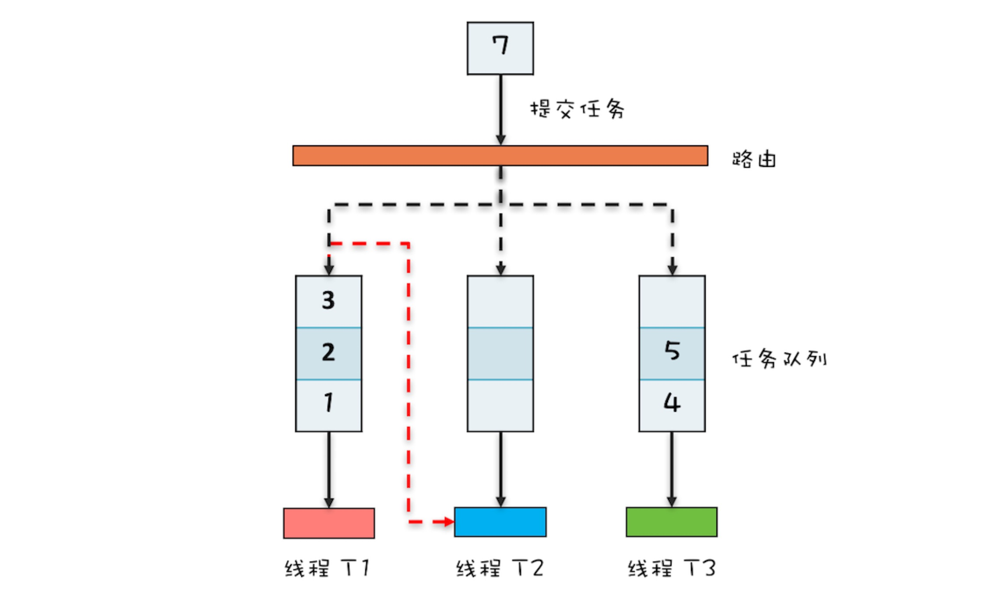

##### 互斥
 
 ```
 所谓互斥，指的是同一时刻，只允许一个线程访问共享变量。
 
 并发程序里还有一部分是关于正确性的，用专业术语叫“线程安全”。
 而导致不确定的主要源头是可见性问题、有序性问题和原子性问题，
 为了解决这三个问题，Java 语言引入了内存模型，
 内存模型提提供了一系列的规则，利用这些规则，我们可以避免可见性问题、有序性问题，
 但是还不足以完全解决线程安全问题。  --> 原子性问题！！！  解决线程安全问题的核心方案还是互斥。---> 锁🔐
 ```

#####   原子性
 ```
 我们潜意识里面觉得 
 count+=1 这个操作是一个不可分割的整体，就像一个原子一样，线程的切换
 可以发生在 count+=1 之前，也可以发生在 count+=1 之后，但就是不会发生在中间。
 我们把一个或者多个操作在 CPU 执行的过程中不被中断的特性称为原子性。
 CPU 能保证的原子操作是 CPU 指令级别的，而不是高级语言的操作符，这是违背我们直觉的地方。
 因此，很多时候我们需要在高级语言层面保证操作的原子性。
 


 Java 并发程序都是基于多线程的，自然也会涉及到任务切换，也许你想不到，任务切换竟然也是并
 发编程里诡异 Bug 的源头之一。任务切换的时机大多数是在时间片结束的时候，我们现在基本都使
 用高级语言编程，高级语言里一条语句往往需要多条 CPU 指令完成，例如上面代码中的count +=1，至少需要三条 CPU 指令。
 
 
     指令 1：首先，需要把变量 count 从内存加载到 CPU 的寄存器；
     指令 2：之后，在寄存器中执行 +1 操作；
     指令 3：最后，将结果写入内存（缓存机制导致可能写入的是 CPU 缓存而不是内存）。
 
 操作系统做任务切换，可以发生在任何一条CPU 指令执行完，是的，是 CPU指令，而不是高级语言里的一条语句。
 
 
 
 要写好并发程序，首先要知道并发程序的问题在哪里，只有确定了“靶子”，才有可能把问题解决，
 毕竟所有的解决方案都是针对问题的。并发程序经常出现的诡异问题看上去非常无厘头，但是深究
 的话，无外乎就是直觉欺骗了我们，只要我们能够深刻理解可见性、原子性、有序性在并发场景下
 的原理，很多并发 Bug 都是可以理解、可以诊断的。
 ```


##### 导致并发bug的原因

```

    计算机体系机构、操作系统、编译程序 层面为提高效率，对软硬件做出的优化的同时，引入了新的问题 --> 并发bug：
    
    导致可见性的原因是 缓存
    导致有序性的原因是 编译优化
    导致原子性的原因是 CPU指令级别的任务切换
    
    
    
    可见性、原子性和有序性问题：并发编程Bug的源头
    
        为了合理利用 CPU 的高性能，平衡这三者的速度差异，
        计算机体系机构、操作系统、编译程序都做出了贡献，主要体现为：
            1. CPU 增加了缓存，以均衡与内存的速度差异；
            2. 操作系统增加了进程、线程，以分时复用 CPU，进而均衡 CPU 与 I/O 设备的速度差异；
            3. 编译程序优化指令执行次序，使得缓存能够得到更加合理地利用。
        
        
        
    并发程序幕后的故事：   CPU、内存、I/O 三者的速度差异
    
        这些年，我们的 CPU、内存、I/O 设备都在不断迭代，不断朝着更快的方向努力。
        但是，在这个快速发展的过程中，有一个核心矛盾一直存在，就是这三者的速度差异。
        CPU 和内存的速度差异可以形象地描述为：CPU 是天上一天，内存是地上一年
        （假设 CPU 执行一条普通指令需要一天，那么 CPU 读写内存得等待一年的时间）。
        内存和 I/O 设备的速度差异就更大了，内存是天上一天，I/O设备是地上十年。
        
    
    程序里大部分语句都要访问内存，有些还要访问 I/O，根据木桶理论（一只水桶能装多少水取决于它最短的那块木板），
    程序整体的性能取决于最慢的操作——读写 I/O 设备，
    也就是说单方面提高CPU 性能是无效的。

```

##### Java 内存模型

```

合理的方案应该是 按需禁用 缓存以及编译优化！      ==> 重点：按需！！！

那么，如何做到“按需禁用”呢？对于并发程序，何时禁用缓存以及编译优化只有程序员知道，
那所谓“按需禁用”其实就是指按照程序员的要求来禁用。
所以，为了解决可见性和有序性问题，只需要提供给程序员按需禁用缓存和编译优化的方法即可。---> JVM内存模型


Java 内存模型是个很复杂的规范，可以从不同的视角来解读，站在我们这些程序员的视角，本质上
可以理解为，Java 内存模型规范了 JVM 如何提供按需禁用缓存和编译优化的方法。
具体来说，这些方法包括 volatile、synchronized 和 final 三个关键字，
以及六项 Happens-Before 规则。

```


###### Happens-Before 规则
      
```


Happens-Before 并不是说前面一个操作发生在后续操作的前面，
它真正要表达的是：前面一个操作的结果对后续操作是可见的。

        划重点：可见！！！ 
                
               这里重点是 前面的结果 对后面 可见!!!   ✅   
                
                    至于中间(各版本的)JVM怎么去实现，并不关心，我这里只提供规范！！！你尽管去实现即可！！！
                
                
               不能按直觉 错误的理解为 简单的操作顺序，          ❌
               因为：错误的理解 强调的是 发生顺序，但是 发生并 != 可见 ！！！  
                
               不要被直觉所欺骗!!!


-- Java 内存模型规范了 JVM 如何提供按需禁用缓存和编译优化的方法。

    Happens-Before 约束了编译器的优化行为，虽允许编译器优化，但是要求编译器优化后一定遵守Happens-Before 规则。


这是说一点我自己的理解：既然 JVM 需要遵循 JVM内存模型 的 Happens-Before 规则！！！
 
 那么我大致推导一下：
 
 假如现在只有A、B两个操作，那么 JVM 可能只需遵守 Happens-Before 规则1、2                  ---> 此时称为 编译优化1
 
 而假如现在有A、B、C三个操作，那么 JVM 可能就需遵守 Happens-Before 规则1、2、3、4          ---> 此时称为 编译优化2
 
 那么，这里的 编译优化1 就可能 == 编译优化2，也可能 !=编译优化2  ！！！
 
 这样，我觉得就全部都通了！！！
 
```


###### 原子性

``` 

“同一时刻只有一个线程执行” 这个条件非常重要，我们称之为互斥。

如果我们能够保证对共享变量的修改是互斥的，那么，无论是单核 CPU 还是多核 CPU，就都能保证原子性了。


解决原子性问题，是要保证中间状态对外不见。


```


###### 锁

``` 

锁和锁要保护的资源是有对应关系的，
比如你用你家的锁保护你家的东西，我用我家的锁保护我家的东西。
在并发编程世界里，锁和资源也应该有这个关系。

千万不要出现，锁自家门来保护他家资产的事情！！！


受保护资源和锁之间合理的关联关系应该是 N:1 的关系
也就是说可以用一把锁来保护多个资源，但是不能用多把锁来保护一个资源


synchronized：
当修饰静态方法的时候，锁定的是当前类的 Class 对象，
当修饰非静态方法的时候，锁定的是当前实例对象 this。


加锁本质就是在锁对象的对象头中写入当前线程id

对 synchronized的理解，它并不能改变CPU时间片切换的特点，只是当其他线程要访问这个资源时，发现锁还未释放，所以只能在外面等待


可变对象不能作为锁！！！

```

###### 细粒度锁
```
用一把锁有个问题，就是性能太差，会导致取款、查看余额、修改密码、查看密码这四个操作都是串行的。
而我们用两把锁，取款和修改密码是可以并行的。
用不同的锁对受保护资源进行精细化管理，能够提升性能。
这种锁还有个名字，叫细粒度锁。


用细粒度锁来锁定多个资源时，要注意死锁的问题！！！


class Account {
  private int balance;
  // 转账
  synchronized void transfer(Account target, int amt){
    if (this.balance > amt) {
      this.balance -= amt;
      target.balance += amt;
    }
  } 
}

在这段代码中，临界区内有两个资源，分别是转出账户的余额 this.balance 和转入账户的余额target.balance，
并且用的是一把锁 this，符合我们前面提到的，多个资源可以用一把锁来保护，
这看上去完全正确呀。真的是这样吗？可惜，这个方案仅仅是看似正确，为什么呢？

问题就出在 this 这把锁上，this 这把锁可以保护自己的余额 this.balance，却保护不了别人的余额target.balance，
就像你不能用自家的锁来保护别人家的资产，也不能用自己的票来保护别人的座位一样。

```

###### 等待 - 通知机制
```

Java 语言是如何支持等待 - 通知机制的。

一个完整的等待 - 通知机制：
线程首先获取互斥锁，当线程要求的条件不满足时，释放互斥锁，进入等待状态；
当要求的条件满足时，通知等待的线程，重新获取互斥锁。


用 synchronized 实现等待 - 通知机制：

在 Java 语言里，等待 - 通知机制可以有多种实现方式，
比如 Java 语言内置的 synchronized 配合wait()、notify()、notifyAll() 这三个方法就能轻松实现。


wait()  -->  进入等待  并且会释放锁🔐！！！

在并发程序中，当一个线程进入临界区后，由于某些条件不满足，需要进入等待状态。

当调用 wait() 方法后，当前线程就会被阻塞，并且进入到等待队列中，这个等待队列也是互斥锁的等待队列。

线程在进入等待队列的同时，会释放持有的互斥锁，线程释放锁后，其他线程就有机会获得锁，并进入临界区了。


notify() / notifyAll()  -->  唤醒等待中的线程  并重新去尝试获取锁！

当条件满足时调用 notify()，会通知等待队列（互斥锁的等待队列）中的线程，告诉它条件曾经满足过。


notify() 是会随机地通知等待队列中的一个线程，而 notifyAll() 会通知等待队列中的所有线程。


实际上使用 notify() 也很有风险，它的风险在于可能导致某些线程永远不会被通知到。    活锁  ===>  类似 --> 死锁！！！   相互交错通知，相互永久等待！！！
除非经过深思熟虑，否则尽量使用 notifyAll()。

                                        
   wait与sleep区别在于：
       1. wait会释放所有锁而sleep不会释放锁资源.
       2. wait只能在同步方法和同步块中使用，而sleep任何地方都可以.
       3. wait无需捕捉异常，而sleep需要.
       
       4. sleep是Thread的方法，而wait是Object类的方法
       5. sleep方法调用的时候必须指定时间
       
   两者相同点：都会让渡CPU执行时间，等待再次调度！                                     
                                        
                                                                                       
```


###### 并发编程中我们需要注意的问题：安全性问题、活跃性问题、性能问题。

```

并发编程中我们需要注意的问题有很多，很庆幸前人已经帮我们总结过了，

主要有三个方面，分别是：安全性问题、活跃性问题和性能问题。


并发 Bug 的三个主要源头：

    原子性问题、可见性问题和有序性问题。

    也就是说，理论上线程安全的程序，就要避免出现原子性问题、可见性问题和有序性问题。
    
    
    
那是不是所有的代码都需要认真分析一遍是否存在这三个问题呢？
    
    当然不是，其实只有一种情况需要：存在共享数据并且该数据会发生变化，
    
    通俗地讲就是有多个线程会同时读写同一数据。
    
    
那如果能够做到不共享数据或者数据状态不发生变化，不就能够保证线程的安全性了嘛。
有不少技术方案都是基于这个理论的，例如线程本地存储（Thread Local Storage，TLS）、不变模式等等。


竞态条件（Race Condition）。所谓竞态条件，指的的是程序的执行结果依赖线程执行的顺序。

    例如上面的例子，如果两个线程完全同时执行，那么结果是 1；如果两个线程是前后执行，那么结果就是 2。
    在并发环境里，线程的执行顺序是不确定的，如果程序存在竞态条件问题，那就意味着程序执行的结果是不确定的，
    而执行结果不确定这可是个大 Bug。


"活锁" -->  解决办法：等待一个随机时间！！！  简单有效


"饥饿" --> 解决方案很简单，有三种方案：一是保证资源充足，二是公平地分配资源，三就是避免持有锁的线程长时间执行。

    所谓“饥饿”指的是线程因无法访问所需资源而无法执行下去的情况。
    “不患寡，而患不均”，
    如果线程优先级“不均”，在 CPU 繁忙的情况下，优先级低的线程得到执行的机会很小，就可能发生线程“饥饿”；
    持有锁的线程，如果执行的时间过长，也可能导致“饥饿”问题。
    
    
    方案二的适用场景相对来说更多一些。  -->  公平锁🔐
    
    
    
    
    第一，既然使用锁会带来性能问题，那最好的方案自然就是使用无锁的算法和数据结构了。
        在这方面有很多相关的技术，例如线程本地存储 (Thread Local Storage, TLS)、写入时复制 (Copy-onwrite)、乐观锁等；
        Java 并发包里面的原子类也是一种无锁的数据结构；
        Disruptor 则是一个无锁的 内存队列，性能都非常好
    
    第二，减少锁持有的时间。
        互斥锁本质上是将并行的程序串行化，所以要增加并行度，一定要减少持有锁的时间。
        这个方案具体的实现技术也有很多，例如使用细粒度的锁，一个典型的例子就是Java 并发包里的 ConcurrentHashMap，它使用了所谓分段锁的技术；
        还可以使用读写锁，也就是读是无锁的，只有写的时候才会互斥。
        
        
性能方面的度量指标有很多，我觉得有三个指标非常重要，就是：吞吐量、延迟和并发量。

        1. 吞吐量：指的是单位时间内能处理的请求数量。吞吐量越高，说明性能越好。
        2. 延迟：指的是从发出请求到收到响应的时间。延迟越小，说明性能越好。
        3. 并发量：指的是能同时处理的请求数量，一般来说随着并发量的增加、延迟也会增加。
           所以延迟这个指标，一般都会是基于并发量来说的。例如并发量是 1000 的时候，延迟是 50 毫秒。
    
```


###### 安全性问题

###### 活跃性问题

###### 性能问题


##### 管程

```

所谓管程，指的是管理共享变量以及对共享变量的操作过程，让他们支持并发。


什么是管程？
    不知道你是否曾思考过这个问题：
    为什么 Java 在 1.5 之前仅仅提供了 synchronized 关键字及wait()、notify()、notifyAll() 这三个看似从天而降的方法？

    在刚接触 Java 的时候，我以为它会提供信号量这种编程原语，因为操作系统原理课程告诉我，用信号量能解决所有并发问题，结果我发现不是。
    后来我找到了原因：Java 采用的是管程技术，synchronized 关键字及 wait()、notify()、notifyAll() 这三个方法都是管程的组成部分。
    而管程和信号量是等价的，所谓等价指的是用管程能够实现信号量，也能用信号量实现管程。
    但是管程更容易使用，所以 Java 选择了管程。
    
    管程，对应的英文是 Monitor，很多 Java 领域的同学都喜欢将其翻译成“监视器”，这是直译。
    操作系统领域一般都翻译成“管程”，这个是意译，而我自己也更倾向于使用“管程”。
    
    所谓管程，指的是管理共享变量以及对共享变量的操作过程，让他们支持并发。
    翻译为 Java 领域的语言，就是管理类的成员变量和成员方法，让这个类是线程安全的。那管程是怎么管的呢？
    
    
    
Java 内置的管程方案（synchronized）使用简单，
    synchronized 关键字修饰的代码块，在编译期会自动生成相关加锁和解锁的代码，但是仅支持一个条件变量；
    而 Java SDK 并发包实现的管程支持多个条件变量，不过并发包里的锁，需要开发人员自己进行加锁和解锁操作。

并发编程里两大核心问题——互斥和同步，都可以由管程来帮你解决。
    学好管程，理论上所有的并发问题你都可以解决，并且很多并发工具类底层都是管程实现的，
    所以学好管程，就是相当于掌握了一把并发编程的万能钥匙。

```

##### 通用的线程生命周期

```

通用的线程生命周期基本上可以用下图这个“五态模型”来描述。

这五态分别是：初始状态、可运行状态、运行状态、休眠状态和终止状态。


    在 Java 领域，实现并发程序的主要手段就是多线程。线程是操作系统里的一个概念，
    虽然各种不同的开发语言如 Java、C# 等都对其进行了封装，但是万变不离操作系统。
    Java 语言里的线程本质上就是操作系统的线程，它们是一一对应的。
    
    在操作系统层面，线程也有“生老病死”，专业的说法叫有生命周期。对于有生命周期的事物，
    要学好它，思路非常简单，只要能搞懂生命周期中各个节点的状态转换机制就可以了。


这“五态模型”的详细情况如下所示。
    1. 初始状态，指的是线程已经被创建，但是还不允许分配 CPU 执行。这个状态属于编程语言特有的，
    不过这里所谓的被创建，仅仅是在编程语言层面被创建，而在操作系统层面，真正的线程还没有创建。
    2. 可运行状态，指的是线程可以分配 CPU 执行。在这种状态下，真正的操作系统线程已经被成功
    创建了，所以可以分配 CPU 执行。
    3. 当有空闲的 CPU 时，操作系统会将其分配给一个处于可运行状态的线程，被分配到 CPU 的线程
    的状态就转换成了运行状态。
    4. 运行状态的线程如果调用一个阻塞的 API（例如以阻塞方式读文件）或者等待某个事件（例如条
    件变量），那么线程的状态就会转换到休眠状态，同时释放 CPU 使用权，休眠状态的线程永远
    没有机会获得 CPU 使用权。当等待的事件出现了，线程就会从休眠状态转换到可运行状态。
    5. 线程执行完或者出现异常就会进入终止状态，终止状态的线程不会切换到其他任何状态，进入终
    止状态也就意味着线程的生命周期结束了。

```

##### Java 中线程的生命周期

```

介绍完通用的线程生命周期模型，想必你已经对线程的“生老病死”有了一个大致的了解。
那接下来我们就来详细看看 Java 语言里的线程生命周期是什么样的。

    Java 语言中线程共有六种状态，分别是：
        1. NEW（初始化状态）
        2. RUNNABLE（可运行 / 运行状态）
        3. BLOCKED（阻塞状态）
        4. WAITING（无时限等待）
        5. TIMED_WAITING（有时限等待）
        6. TERMINATED（终止状态）
        
    这看上去挺复杂的，状态类型也比较多。
    但其实在操作系统层面，Java 线程中的 BLOCKED、WAITING、TIMED_WAITING 是一种状态，即前面我们提到的休眠状态。
    也就是说只要 Java 线程处于这三种状态之一，那么这个线程就永远没有 CPU 的使用权。
    
    
  stop() 和 interrupt() 方法的主要区别是什么呢？
  
      stop() 方法会真的杀死线程，不给线程喘息的机会，
      如果线程持有 ReentrantLock 锁，被 stop() 的 线程并不会自动调用 ReentrantLock 的 unlock() 去释放锁，
      那其他线程就再也没机会获得ReentrantLock 锁，
      这实在是太危险了。所以该方法就不建议使用了，
      类似的方法还有 suspend()和 resume() 方法，这两个方法同样也都不建议使用了，所以这里也就不多介绍了。
      
      而 interrupt() 方法就温柔多了，interrupt() 方法仅仅是通知线程，线程有机会执行一些后续操作，同时也可以无视这个通知。
      被 interrupt 的线程，是怎么收到通知的呢？一种是异常，另一种是主动检测。
      
      
          还有一种是主动检测，如果线程处于 RUNNABLE 状态，并且没有阻塞在某个 I/O 操作上，
          例如中断计算圆周率的线程 A，这时就得依赖线程 A 主动检测中断状态了。
          如果其他线程调用线程 A 的interrupt() 方法，那么线程 A 可以通过 isInterrupted() 方法，检测是不是自己被中断了。
          
          
          
          
          
          可能出现无限循环，线程在sleep期间被打断了，抛出一个InterruptedException异常，
          try catch捕捉此异常，应该重置一下中断标示，因为抛出异常后，中断标示会自动清除掉！
          
          Thread th = Thread.currentThread();
          while(true) {
            if(th.isInterrupted()) {
              break;
            }
            // 省略业务代码无数
            try {
              Thread.sleep(100);
            }catch (InterruptedException e)｛
               // try catch捕捉此异常，应该重置一下中断标示，因为抛出异常后，中断标示会自动清除掉！
              Thread.currentThread().interrupt();
              e.printStackTrace();
            }
          }
    
```


##### 创建多少线程才是合适的？

```

我们所谓提升性能，从度量的角度，主要是：降低延迟，提高吞吐量。

    一个方向是优化算法，                  -->  算法范畴
    另一个方向是将硬件的性能发挥到极致。    -->  并发编程领域       硬件：一个是 I/O，一个是 CPU
    
    
    简言之，在并发编程领域，提升性能本质上就是提升硬件的利用率，再具体点来说，就是提升 I/O 的利用率和 CPU 的利用率。
    
    


```


##### 方法调用是先计算参数
```

    logger.debug("The var1：" + var1 + ", var2:" + var2);
    
        先计算debug的参数，再判断是不是debug级别 --> 来决定做不做输出！！！   
            -- 这里不管是不是debug级别，参数都是会先执行计算的，所以会做字符串拼接！
            
  
    logger.debug("The var1：{}, var2:{}", var1, var2);
    
         更好地写法应该是下面这样，这种写法仅仅是将参数压栈，而没有参数的计算。
             使用{}占位符是写日志的一个良好习惯。
                                 
```


###### Java SDK 并发包通过 Lock 和 Condition 两个接口来实现管程，其中 Lock 用于解决互斥问题，Condition 用于解决同步问题。

```
    1、Lock：
    
        死锁问题，解决方案： 破坏不可抢占条件
        
            但是这个方案 synchronized 没有办法解决。
                原因是 synchronized 申请资源的时候，如果申请到，线程直接进入阻塞状态了，而线程进入阻塞状态，啥都干不了，
                也释放不了线程已经占有的资源。
            
            但我们希望的是：
                对于“不可抢占”这个条件，占用部分资源的线程进一步申请其他资源时，如果申请不到，
                可以主动释放它占有的资源，这样不可抢占这个条件就破坏掉了。
    
    
        
            
            体现在 API 上，就是 Lock 接口的三个方法：
                // 支持中断的 API
                void lockInterruptibly() 
                    throws InterruptedException;
                // 支持超时的 API
                boolean tryLock(long time, TimeUnit unit) 
                    throws InterruptedException;
                // 支持非阻塞获取锁的 API
                boolean tryLock();
    
        --- Java SDK 并发包里的 Lock 有别于 synchronized 隐式锁的三个特性：能够响应中断、支持超时 和 非阻塞地获取锁
        
    
    2、Condition：
    
            不过，这里你需要注意，
            Lock 和 Condition 实现的管程，线程等待和通知需要调用 await()、signal()、signalAll()，
            它们的语义和 wait()、notify()、notifyAll() 是相同的。
            
            但是不一样的是，
            Lock&Condition 实现的管程里只能使用前面的 await()、signal()、signalAll()，
            而后面的 wait()、notify()、notifyAll() 只有在 synchronized 实现的管程里才能使用。
            
            如果一不小心在
            Lock&Condition 实现的管程里调用了 wait()、notify()、notifyAll()，那程序可就彻底玩儿完了。
            
            
            
    Semaphore：
    
            信号量模型：
                
                信号量模型还是很简单的，可以简单概括为：一个计数器，一个等待队列，三个方法。
                在信号量模型里，计数器和等待队列对外是透明的，所以只能通过信号量模型提供的三个方法来访问它们，
                这三个方法分别是：init()、down() 和 up()。
                
                
                这三个方法详细的语义具体如下所示：
                    
                    init()：设置计数器的初始值。
                    down()：计数器的值减 1；如果此时计数器的值小于 0，则当前线程将被阻塞，否则当前线程可以继续执行。
                    up()：计数器的值加 1；如果此时计数器的值小于或者等于 0，则唤醒等待队列中的一个线程，并将其从等待队列中移除。
       
                这里提到的 init()、down() 和 up() 三个方法都是原子性的，并且这个原子性是由信号量模型的实现方保证的。
                           在 Java SDK 里面，信号量模型是由 java.util.concurrent.Semaphore 实现的，
                           Semaphore 这个类能够保证这三个方法都是原子操作。
                           
                           
                在 Java SDK 并发包里，down() 和 up() 对应的则是 acquire() 和 release()。
                
                
                
            我理解的信号量和管程相比:
                信号量可以实现的独特功能就是同时允许多个线程进入临界区，
                但是信号量不能做的就是同时唤醒多个线程去争抢锁，
                只能唤醒一个阻塞中的线程，
                而且信号量模型是没有Condition的概念的，即阻塞线程被醒了直接就运行了而不会去检查此时临界条件是否已经不满足了，
                基于此考虑信号量模型才会设计出只能让一个线程被唤醒，否则就会出现因为缺少Condition检查而带来的线程安全问题。
                正因为缺失了Condition，所以用信号量来实现阻塞队列就很麻烦，因为要自己实现类似Condition的逻辑。
                                              
```


######  ReadWriteLock - 读写锁         -->  读多写少 的并发场景 
```

    针对 读多写少 这种 并发场景：
        Java SDK 并发包提供了读写锁——ReadWriteLock，非常容易使用，并且性能很好。


    什么是读写锁？

        读写锁，并不是 Java 语言特有的，而是一个广为使用的通用技术，
        
        所有的读写锁都遵守以下三条基本原则：
        
            1. 允许多个线程同时读共享变量；
            2. 只允许一个线程写共享变量；
            3. 如果一个写线程正在执行写操作，此时禁止读线程读共享变量。
            
            
            
    读写锁与互斥锁的一个重要区别：
        读写锁允许多个线程同时读共享变量，而互斥锁是不允许的，
        这是读写锁在读多写少场景下性能优于互斥锁的关键。
        但读写锁的写操作是互斥的，当一个线程在写共享变量的时候，是不允许其他线程执行写操作和读操作。
        
        
        
    读写锁类似于 ReentrantLock，也支持公平模式和非公平模式。
        读锁和写锁都实现了java.util.concurrent.locks.Lock 接口，
        所以除了支持 lock() 方法外，tryLock()、lockInterruptibly()等方法也都是支持的。
    
    但是有一点需要注意，那就是只有写锁支持条件变量，读锁是不支持条件变量的，
        读锁调用 newCondition() 会抛出 UnsupportedOperationException 异常。
        
        
    ReadWriteLock 支持多个线程同时读，但是当多个线程同时读的时候，所有的写操作会被阻塞；
        对此优化参见：StampedLock
    
    
    
    先是获取读锁，然后再升级为写锁，这样看上去好像是没有问题的，对此还有个专业的名字，叫锁的升级。
        可惜 ReadWriteLock 并不支持这种升级。
        在上面的代码示例中，读锁还没有释放，此时获取写锁，会导致写锁永久等待，
        最终导致相关线程都被阻塞，永远也没有机会被唤醒。
    
    ReadWriteLock 锁的升级是不允许的，这个你一定要注意。 
        不过，虽然锁的升级是不允许的，但是锁的降级却是允许的。
        以下代码来源自ReentrantReadWriteLock 的官方示例，略做了改动。
        你会发现在代码①处，获取读锁的时候线程还是持有写锁的，这种锁的降级是支持的。
    
```


###### StampedLock          @since 1.8
```

    在读多写少的场景中，还有没有更快的技术方案呢？
    还真有，Java 在 1.8 这个版本里，提供了一种叫 StampedLock 的锁，它的性能就比读写锁还要好。
    
    
    StampedLock 支持的三种锁模式：
    
        我们先来看看在使用上 StampedLock 和 ReadWriteLock 有哪些区别：
        
        ReadWriteLock 支持两种模式：一种是读锁，一种是写锁。
        StampedLock   支持三种模式：写锁、悲观读锁 和 乐观读。     ===> （重点：是 【乐观读】!!!  不是 【乐观读锁】!!! -->  乐观读 这个操作是无锁的 ）
        
        其中，写锁、悲观读锁的语义和 ReadWriteLock 的写锁、读锁的语义非常类似，
            允许多个线程同时获取悲观读锁，但是只允许一个线程获取写锁，写锁和悲观读锁是互斥的。
            
        不同的是：StampedLock 里的写锁和悲观读锁加锁成功之后，都会返回一个 stamp；
            然后解锁的时候，需要传入这个 stamp。
            
            
            
    StampedLock 的性能之所以比 ReadWriteLock 还要好，其关键是 StampedLock 支持 乐观读 的方式。
    
        ReadWriteLock 支持多个线程同时读，但是当多个线程同时读的时候，所有的写操作会被阻塞；
        而 StampedLock 提供的 乐观读，是允许一个线程获取写锁的，也就是说不是所有的写操作都被阻塞。
    
            注意这里，我们用的是“乐观读”这个词，而不是“乐观读锁”，
            是要提醒你，乐观读这个操作是无锁的，
            所以相比较 ReadWriteLock 的读锁，乐观读的性能更好一些。        
            
    // 乐观读  Returns a stamp that can later be validated, or zero if exclusively locked.
    long tryOptimisticRead()；
    
        进一步理解乐观读
        如果你曾经用过数据库的乐观锁，可能会发现 StampedLock 的乐观读和数据库的乐观锁有异曲同工之妙。
        
            再介绍一下数据库里的乐观锁。
            数据库乐观锁的场景：在 ERP 的生产模块里，会有多个人通过 ERP系统提供的 UI 同时修改同一条生产订单，那如何保证生产订单数据是并发安全的呢？
            我采用的方案就是乐观锁。
            你会发现数据库里的乐观锁，查询的时候需要把 version 字段查出来(给到当前UI页面)，更新的时候要利用 version字段(作为更新参数一并带回去) 做验证。
            
        这个 version 字段就类似于 StampedLock 里面的 stamp。
            这样对比着看，相信你会更容易理解 StampedLock 里乐观读的用法。
        
            
   使用 StampedLock 一定不要调用中断操作，如果需要支持中断功能，
        一定使用可中断的悲观读锁readLockInterruptibly() 和写锁 writeLockInterruptibly()。
        这个规则一定要记清楚。 
            
            readLock()、writeLock()  不支持中断     ===>    此时，如果阻塞中 调用了 interrupt()，会导致CPU飙升至100% ！！！
            readLockInterruptibly()、writeLockInterruptibly()  支持中断
    

```


###### CountDownLatch 和 CyclicBarrier
```

CountDownLatch 和 CyclicBarrier  是 Java 并发包提供的两个非常易用的 【线程同步工具类】

    这两个工具类用法的区别在这里还是有必要再强调一下：

        CountDownLatch 主要用来解决：一个线程等待多个线程的场景，可以类比旅游团团长要等待所有的游客到齐才能去下一个景点；
        而CyclicBarrier 是：一组线程之间互相等待，更像是几个驴友之间不离不弃。
        
        除此之外 CountDownLatch 的计数器是不能循环利用的，也就是说一旦计数器减到 0，再有线程调用 await()，该线程会直接通过。
        但CyclicBarrier 的计数器是可以循环利用的，而且具备自动重置的功能，一旦计数器减到 0 会自动重置到你设置的初始值。
        除此之外，CyclicBarrier 还可以设置回调函数，可以说是功能丰富。
    
    
    
    CyclicBarrier：
        CyclicBarrier的 回调函数 执行在一个回合里 最后执行 await() 的线程上，而且 同步调用 回调函数xx_callable()，
        调用完callable之后，才会开始第二回合。
        所以callable如果不另开一线程异步执行，就起不到性能优化的作用了。
```


###### 并发容器
```
   Java 并发包有很大一部分内容都是关于并发容器的，因此学习和搞懂这部分的内容很有必要。

    Java 中的容器主要可以分为四个大类，分别是： List、Map、Set 和 Queue
    
        但并不是所有的 Java容器都是线程安全的。
        例如，我们常用的 ArrayList、HashMap 就不是线程安全的。
        在介绍线程安全的容器之前，我们先思考这样一个问题：如何将非线程安全的容器变成线程安全的容器？

            在前面《12 | 如何用面向对象思想写好并发程序？》我们讲过实现思路其实很简单，只要把非线程安全的容器封装在对象内部，然后控制好访问路径就可以了。
    
    
    
    同步容器：   -- JDK1.5之前
    
        基于 synchronized 这个同步关键字实现的 同步容器：
            Collections.synchronizedList、Collections.synchronizedMap、Collections.synchronizedSet ...
            
            Java 提供的同步容器还有 Vector、Stack 和 Hashtable，
            这三个容器不是基于包装类实现的，但同样是基于 synchronized 实现的，
            对这三个容器的遍历，同样要加锁保证互斥。
    
    
        组合操作需要注意竞态条件问题：
            例如上面提到的 addIfNotExist() 方法就包含组合操作。
            组合操作往往隐藏着竞态条件问题，
            即便每个操作都能保证原子性，也并不能保证组合操作的原子性，这个一定要注意。
            
            在容器领域一个容易被忽视的“坑”是用迭代器遍历容器，例如 通过迭代器遍历容器 list，
            对每个元素调用 foo() 方法，这就存在并发问题，这些组合的操作不具备原子性。


    并发容器：  -- JDK1.5之后
    
        List：
            List 里面只有一个实现类就是CopyOnWriteArrayList：
            
                CopyOnWrite，顾名思义就是写的时候会将共享变量新复制一份出来，这样做的好处是读操作完全无锁。
            
                那 CopyOnWriteArrayList 的实现原理是怎样的呢？
                    CopyOnWriteArrayList 内部维护了一个数组，成员变量 array 就指向这个内部数组，所有的读操作都是基于 array 进行的，
                    迭代器 Iterator 遍历的就是 array 数组。
    
                如果在遍历 array 的同时，还有一个写操作，例如增加元素，CopyOnWriteArrayList 是如何处理的呢？
                    CopyOnWriteArrayList 会将 array 复制一份，然后在新复制处理的数组上执行增加元素的操作，
                    执行完之后再将 array 指向这个新的数组。
                    通过下图你可以看到，读写是可以并行的，遍历操作一直都是基于原 array 执行，而写操作则是基于新 array 进行。
        
        
                使用 CopyOnWriteArrayList 需要注意的“坑”主要有两个方面：
                一个是应用场景：
                    CopyOnWriteArrayList 仅适用于写操作非常少的场景，而且能够容忍读写的短暂不一致。
                    例如上面的例子中，写入的新元素并不能立刻被遍历到。
                另一个需要注意的是：
                    CopyOnWriteArrayList 迭代器是只读的，不支持增删改。
                    因为迭代器遍历的仅仅是一个快照，而对快照进行增删改是没有意义的。
                    
                    
        Map：
            Map 接口的两个实现是 ConcurrentHashMap 和 ConcurrentSkipListMap
                它们从应用的角度来看，主要区别在于：
                    ConcurrentHashMap 的 key 是无序的，而 ConcurrentSkipListMap 的 key 是有序的。
                    所以如果你需要保证 key 的顺序，就只能使用 ConcurrentSkipListMap。
        
        
        
                ConcurrentSkipListMap 里面的 SkipList 本身就是一种数据结构，中文一般都翻译为“跳表”。
                跳表插入、删除、查询操作平均的时间复杂度是 O(log n)，理论上和并发线程数没有关系，
                所以在并发度非常高的情况下，若你对 ConcurrentHashMap 的性能还不满意，可以尝试一下ConcurrentSkipListMap。
        
                
            java8之前的版本hashmap执行put方法时会有环形链表的风险，java8以后改成了红黑树。
            
            
        Set：
            Set 接口的两个实现是 CopyOnWriteArraySet 和 ConcurrentSkipListSet
            使用场景可以参考前面讲述的 CopyOnWriteArrayList 和 ConcurrentSkipListMap，
            它们的原理都是一样的，这里就不再赘述了。
          
            
        Queue：
            Java 并发包里面 Queue 这类并发容器是最复杂的，你可以从以下两个维度来分类。
            
            一个维度是阻塞与非阻塞：
                所谓阻塞指的是当队列已满时，入队操作阻塞；当队列已空时，出队操作阻塞。
            
            另一个维度是单端与双端：
                单端指的是只能队尾入队，队首出队；而双端指的是队首队尾皆可入队出队。
            
            Java 并发包里 阻塞队列 都用 Blocking 关键字标识，
            单端队列 使用 Queue 标识，
            双端队列使用 Deque 标识。  
            
            
            这两个维度组合后，可以将 Queue 细分为四大类，分别是：
            
                1.单端阻塞队列：
                    其实现有 ArrayBlockingQueue、LinkedBlockingQueue、SynchronousQueue、
                            LinkedTransferQueue、PriorityBlockingQueue 和 DelayQueue
                
                    内部一般会持有一个队列，这个队列可以是数组（其实现是 ArrayBlockingQueue）也可以是链表（其实现是 LinkedBlockingQueue）；
                    甚至还可以不持有队列（其实现是 SynchronousQueue），此时生产者线程的入队操作必须等待消费者线程的出队操作。
                    而 LinkedTransferQueue 融合LinkedBlockingQueue 和 SynchronousQueue 的功能，性能比 LinkedBlockingQueue 更好；
                    PriorityBlockingQueue 支持按照优先级出队；DelayQueue 支持延时出队。
                    
                2.双端阻塞队列：
                    其实现是 LinkedBlockingDeque
                
                3.单端非阻塞队列：
                    其实现是 ConcurrentLinkedQueue
                    
                4.双端非阻塞队列：
                    其实现是 ConcurrentLinkedDeque
                    
                    
                另外，使用队列时，需要格外注意队列是否支持有界（所谓有界指的是内部的队列是否有容量限制）。
                实际工作中，一般都不建议使用无界的队列，因为数据量大了之后很容易导致 OOM。
                上面我们提到的这些 Queue 中，只有 ArrayBlockingQueue 和 LinkedBlockingQueue 是支持有界的，
                所以在使用其他无界队列时，一定要充分考虑是否存在导致 OOM 的隐患。
                
                
                总结
                    
                    Java 并发容器的内容很多，但鉴于篇幅有限，我们只是对一些关键点进行了梳理和介绍。
                    而在实际工作中，你不单要清楚每种容器的特性，还要能选对容器，这才是关键，
                    至于每种容器的用法，用的时候看一下 API 说明就可以了，这些容器的使用都不难。
                    在文中，我们甚至都没有介绍Java 容器的快速失败机制（Fail-Fast），原因就在于当你选对容器的时候，根本不会触发它。
```

###### 原子类   - 无锁工具类        CPU 提供了 CAS指令(单条CPU指令 --> 原子性)
```
    无锁方案相对互斥锁方案，最大的好处就是：性能。

        互斥锁方案为了保证互斥性，需要执行加锁、解锁操作，而加锁、解锁操作本身就消耗性能；
        同时拿不到锁的线程还会进入阻塞状态，进而触发线程切换，线程切换对性能的消耗也很大。 
        
        相比之下，无锁方案则完全没有加锁、解锁的性能消耗，同时还能保证互斥性，既解决了问题，又没有带来新的问题，可谓绝佳方案。
        
        
    无锁方案的实现原理：
        
        其实原子类性能高的秘密很简单，硬件支持而已。
        
        CPU 为了解决并发问题，提供了 CAS 指令（CAS，全称是 Compare And Swap，即“比较并交换”）。
        
            CAS 指令包含 3 个参数：共享变量的内存地址 A、用于比较的值 B 和共享变量的新值 C；
        
              【CAS语义】  ====>  并且只有当内存中地址 A 处的值等于 B 时，才能将内存中地址 A 处的值更新为新值 C。
        
       【作为一条 CPU 指令】，CAS 指令 本身 是能够保证 原子性 的。
       
    
    
    使用 CAS 来解决并发问题，一般都会伴随着 自旋
        
        而所谓【自旋，其实就是 循环尝试】。
    
        例如，实现一个线程安全的count += 1操作，“CAS+ 自旋”的实现方案如下所示，
        首先计算 newValue =count+1，如果 cas(count,newValue) 返回的值不等于 count，
        则意味着线程在执行完代码①处之后，执行代码②处之前，count 的值被其他线程更新过。
        那此时该怎么处理呢？
            可以采用自旋方案，可以重新读 count 最新的值来计算 newValue 并尝试再次更新，直到成功。
        
        
        CAS 这种无锁方案，完全没有加锁、解锁操作，即便两个线程完全同时执行 addOne() 方法，
        也不会有线程被阻塞，所以相对于互斥锁方案来说，性能好了很多。
        
        但是在 CAS 方案中，有一个问题可能会常被你忽略，那就是 【ABA】 的问题。
        
            什么是 ABA 问题呢？
                前面我们提到“如果 cas(count,newValue) 返回的值不等于count，意味着线程在执行完代码①处之后，执行代码②处之前，
                count 的值被其他线程更新过”，那如果 cas(count,newValue) 返回的值等于count，
                是否就能够认为 count 的值没有被其他线程更新过呢？
                显然不是的，假设 count 原本是A，线程 T1 在执行完代码①处之后，执行代码②处之前，有可能 count 被线程 T2 更新成了 B，
                之后又被 T3 更新回了 A，这样线程 T1 虽然看到的一直是 A，但是其实已经被其他线程更新过了，这就是 ABA 问题。
                
                可能大多数情况下我们并不关心 ABA 问题，例如数值的原子递增，但也不能所有情况下都不关心，
                例如原子化的更新对象很可能就需要关心 ABA 问题，因为两个 A 虽然相等，但是第二个 A 的属性可能已经发生变化了。
                所以在使用 CAS 方案的时候，一定要先 check 一下。
        
        
        do {
          // 获取当前值
          oldV = xxxx；
          // 根据当前值计算新值
          newV = ...oldV...
        } while (!compareAndSet(oldV,newV);
        
        
        原子类概览
            Java SDK 并发包里提供的原子类内容很丰富，我们可以将它们分为五个类别：
                原子化的基本数据类型、原子化的对象引用类型、原子化数组、原子化对象属性更新器 和 原子化的累加器。
            
            这五个类别提供的方法基本上是相似的，并且每个类别都有若干原子类。
            
            
                原子化的对象引用类型 - ABA：
                    解决 ABA 问题的思路其实很简单，增加一个版本号维度就可以了。
        
        
    总结：
    
        无锁方案相对于互斥锁方案，优点非常多，首先性能好，其次是基本不会出现死锁问题（但可能出现饥饿和活锁问题，因为自旋会反复重试）。
        Java 提供的原子类大部分都实现了 compareAndSet()方法，
        基于 compareAndSet() 方法，你可以构建自己的无锁数据结构，
        但是建议你不要这样做，这个工作最好还是让大师们去完成，原因是无锁算法没你想象的那么简单。
        
        Java 提供的原子类能够解决一些简单的原子性问题，但你可能会发现，上面我们所有原子类的方法都是针对一个共享变量的，
        如果你需要解决多个变量的原子性问题，建议还是使用互斥锁方案。
        原子类虽好，但使用要慎之又慎。
        
```


###### 线程池
```

    重量级：
    
        创建对象，仅仅是在 JVM 的堆里分配一块内存而已；
        而创建一个线程，却需要调用操作系统内核的API，然后操作系统要为线程分配一系列的资源，这个成本就很高了，
        所以线程是一个重量级的对象，应该避免频繁创建和销毁。
        
    
    生产者-消费者 模式：
    
        线程池的 使用方 是 生产者，线程池 本身 是 消费者。
        
        ThreadPoolExecutor 本质上是一个 生产者 - 消费者 模式的实现，
        内部有一个任务队列，
        这个任务队列 是 生产者 和 消费者 通信 的媒介，
        ThreadPoolExecutor 可以有多个工作线程，但是这些工作线程都 共享 一个任务队列。
    
    
    Java 中的线程池：
        
        最核心的是ThreadPoolExecutor
        通过名字你也能看出来，它强调的是 Executor，而不是一般意义上的池化资源。
        
            
        ThreadPoolExecutor(      // 你可以把线程池类比为一个项目组，而线程就是项目组的成员。
        
          int corePoolSize,     // 表示线程池保有的最小线程数。
                                        有些项目很闲，但是也不能把人都撤了，至少要留 corePoolSize 个人坚守阵地。
                                        
          int maximumPoolSize,  // 表示线程池创建的最大线程数。
                                        当项目很忙时，就需要加人，但是也不能无限制地加，最多就加到 maximumPoolSize 个人。
                                        当项目闲下来时，就要撤人了，最多能撤到corePoolSize 个人。
                                        
          long keepAliveTime,   
          TimeUnit unit,        // 上面提到项目根据忙闲来增减人员，那在编程世界里，如何定义忙和闲呢？
                                         很简单，一个线程如果在一段时间内，都没有执行任务，说明很闲，
                                         keepAliveTime 和 unit就是用来定义这个“一段时间”的参数。
                                         也就是说，如果一个线程空闲了keepAliveTime &unit这么久，而且线程池的线程数大于 corePoolSize ，
                                         那么这个空闲的线程就要被回收了。
                                         
          BlockingQueue<Runnable> workQueue,    // 工作队列
          
          ThreadFactory threadFactory,          // 通过这个参数你可以自定义如何创建线程，
                                                        例如你可以给线程指定一个有意义的名字。
                                                        
          RejectedExecutionHandler handler      // 通过这个参数你可以自定义任务的拒绝策略。
                                                        如果线程池中所有的线程都在忙碌，并且工作队列也满了（前提是工作队列是有界队列），
                                                        那么此时提交任务，线程池就会拒绝接收。
                                                        至于拒绝的策略，你可以通过 handler 这个参数来指定。
                                                        
                 ThreadPoolExecutor 已经提供了以下 4种策略：       
                         AbortPolicy：         默认的拒绝策略，会 throws RejectedExecutionException。   
                         CallerRunsPolicy：    提交任务的线程自己去执行该任务。
                         DiscardPolicy：       直接丢弃任务，没有任何异常抛出。
                         DiscardOldestPolicy： 丢弃最老的任务，其实就是把最早进入工作队列的任务丢弃，然后把新任务加入到工作队列。
                         
        )

            
        Java 在 1.6 版本还增加了 allowCoreThreadTimeOut(boolean value) 方法，它可以让所有线程都
        支持超时，这意味着如果项目很闲，就会将项目组的成员都撤走。
        
    
    不建议使用 Executors 的最重要的原因是：
    
        Executors 提供的很多方法默认使用的都是无界的LinkedBlockingQueue，
        高负载情境下，无界队列很容易导致 OOM，而 OOM 会导致所有请求都无法处理，这是致命问题。
        所以强烈建议使用有界队列。
        
        LinkedBlockingQueue 默认是 无界的，在构造函数带上 初始容量 就变成 有界 了！！！
        
    
    异常处理：
    
        使用线程池，还要注意异常处理的问题，
        例如通过 ThreadPoolExecutor 对象的 execute() 方法提交任务时，如果任务在执行的过程中出现运行时异常，会导致执行任务的线程终止；
        不过，最致命的是任务虽然异常了，但是你却获取不到任何通知，这会让你误以为任务都执行得很正常。
        虽然线程池提供了很多用于异常处理的方法，但是最稳妥和简单的方案还是 捕获所有异常 并按需处理，
        
        你可以参考下面的示例代码：
            
            try {
              // 业务逻辑
            } catch (RuntimeException x) {
              // 按需处理
            } catch (Throwable x) {
              // 按需处理
            } 
    
    
    QA：
        Q：老师，有个问题一直不是很明确：
            ①一个项目中如果多个业务需要用到线程池，是定义一个公共的线程池比较好，还是按照业务定义各自不同的线程池？
            ②如果定义一个公共的线程池那里面的线程数的理论值应该是按照老师前面章节讲的去计算吗？还是按照如果有多少个业务就分别去计算他们各自创建线程池线程数的加和?
            ③如果不同的业务各自定义不同的线程池，那线程数的理论值也是按照前面的去计算吗？
        
        A：作者回复: 
            建议不同类别的业务用不同的线程池， 至于线程池的数量，各自计算各自的，然后去做压测。
            虽然你的系统有多个线程池，但是并不是所有的线程池里的线程都是忙碌的，你只需要针对有性能瓶颈的业务优化就可以了。
        
        
        Q：在工程中，线程池的定义一般是在全局还是局部呢？
            如果全局的话，是不用shutdown吗？
            不关闭线程池有没有问题呢？
        
        A：作者回复: 
            一般都全局。
            如果需要优雅退出就需要shutdown。
            不关闭，会有coresize个线程一直回收不了。
    
        
  
    
    
    

    
```


###### Future
``` 
    
    场景：
                
        对于 简单的 并行任务，可以通过“线程池 + Future”的方案来解决
        
            Future 可以很容易获得 异步任务的 执行结果
        
            任务之间有依赖关系，可以用 Future 来解决。   
            get 阻塞获取结果  -->  （类似：Thread.join()、CountDownLatch、阻塞队列...）
            
        
    
    
    
    API：    
        
        void execute(Runnable command);  // 可以提交任务，但是 拿不到执行结果
        
        
        // 提交 Runnable 任务
        Future<?> submit(Runnable task);
            
            Runnable 接口的 run() 方法是没有返回值的，
            所以 submit(Runnable task) 这个方法返回的 Future 仅可以用来断言任务已经结束了，
            类似于 Thread.join()。
        
        
        // 提交 Callable 任务
        <T> Future<T> submit(Callable<T> task);
            
            Callable 有返回值
        
        
        // 提交 Runnable 任务及结果引用  
        <T> Future<T> submit(Runnable task, T result);
        
                假设这个方法返回的 Future 对象是 f， f.get() 的返回值就是传给 submit() 方法的参数result。
                
                需要你注意的是 Runnable 接口的实现类 Task 声明了一个有参构造函数 Task(Result r) ，
                创建 Task 对象的时候传入了 result 对象，这样就能在类 Task 的 run() 方法中对 result 进行各种操作了。
                result相当于主线程和子线程之间的桥梁，通过它主子线程可以共享数据。
        
        
        它们的返回值都是 Future 接口，Future 接口有5 个方法：
        
            // 取消任务      -> 试图取消执行此任务   任务已完成：返回false; 任务已开始：尝试取消；
            boolean cancel(boolean mayInterruptIfRunning);
            
            // 判断任务是否已取消  
            boolean isCancelled();
            
            // 判断任务是否已结束
            boolean isDone();
            
            // 获得任务执行结果                  --这两个 get() 方法都是阻塞式的
            get();
            
            // 获得任务执行结果，支持超时
            get(long timeout, TimeUnit unit);
    
    
    
    FutureTask：
    
        FutureTask 实现了 Runnable 和 Future 接口，
        由于实现了   Runnable 接口，所以可以将 FutureTask 对象作为任务提交给 ThreadPoolExecutor 去执行，也可以直接被 Thread 执行；
        又因为实现了 Future   接口，所以也能用来获得任务的执行结果。
            
            // 创建 FutureTask
            FutureTask<Integer> futureTask = new FutureTask<>(()-> 1+2);
            // 创建线程池
            ExecutorService es = Executors.newCachedThreadPool();
            // 提交 FutureTask 
            es.submit(futureTask);
            // 获取计算结果
            Integer result = futureTask.get();
            
    
    
    
    
    
    总结：         --任务之间有依赖关系，可以用 Future 来解决。   （Thread.join()、CountDownLatch、阻塞队列...）
        
        利用 Java 并发包提供的 Future 可以很容易获得异步任务的执行结果，
        无论异步任务是通过线程池ThreadPoolExecutor 执行的，还是通过手工创建子线程来执行的。
        Future 可以类比为现实世界里的提货单，
        比如去蛋糕店订生日蛋糕，蛋糕店都是先给你一张提货单，你拿到提货单之后，没有必要一直在店里等着，可以先去干点其他事，
        比如看场电影；等看完电影后，基本上蛋糕也做好了，然后你就可以凭提货单领蛋糕了。
        
        利用多线程可以快速将一些串行的任务并行化，从而提高性能；
        如果任务之间有依赖关系，比如 当前任务 依赖 前一个任务的执行结果，这种问题基本上都可以用 Future 来解决。
        在分析这种问题的过程中，建议你用有向图描述一下任务之间的依赖关系，同时将线程的分工也做好，类似于烧水泡茶最优分工方案那幅图。
        对照图来写代码，好处是更形象，且不易出错。
    

    
```


###### CompletableFuture
```

    应用场景：
        
        如果任务之间有 聚合关系，无论是 AND 聚合还是 OR 聚合，都可以通过 CompletableFuture 来解决
        
            可以替代 countdownLatch , 或者 threadPoolExecutor 和future 
            
            completableFuture 中各种关系（并行、串行、聚合），实际上就覆盖了各种需求场景。
            例如 ： 线程A 等待 线程B 或者 线程C 等待 线程A和B 
        
        
    特点：
    
        链式操作
        一个结果 作为 下一个的参数
        CompletableFuture的写法和RXJava的使用很类似
        
    
    异步化：
    
        是并行方案得以实施的基础，更深入地讲其实就是：利用多线程优化性能这个核心方案得以实施的基础。
        看到这里，相信你应该就能理解异步编程最近几年为什么会大火了，因为优化性能是互联网大厂的一个核心需求啊。
        Java 在 1.8 版本提供了 CompletableFuture 来支持异步编程，
        CompletableFuture 有可能是你见过的最复杂的工具类了，不过功能也着实让人感到震撼。
    
        
    语义清晰：
    
        runAsync()      // 异步运行
        supplyAsync()   // 提供异步
        thenCombine()   // 然后合并
    
    
    
    创建 CompletableFuture 对象：
    
        // 使用默认线程池  --> ForkJoinPool
        static CompletableFuture<Void>  runAsync(Runnable runnable);        // Runnable 无返回值
        static <U> CompletableFuture<U> supplyAsync(Supplier<U> supplier);  // Supplier get()获取返回值
        
        // 可以指定线程池  
        static CompletableFuture<Void> runAsync(Runnable runnable, Executor executor);          // Runnable 无返回值
        static <U> CompletableFuture<U> supplyAsync(Supplier<U> supplier, Executor executor);   // Supplier get()获取返回值
    
        
        创建 CompletableFuture 对象主要靠代码中展示的这 4 个静态方法，我们先看前两个。
        在烧水泡茶的例子中，
        我们已经使用了runAsync(Runnable runnable)和supplyAsync(Supplier<U> supplier)，
        它们之间的区别是：
            Runnable 接口的 run() 方法没有返回值，
            而 Supplier 接口的 get() 方法是有返回值的。
        
        前两个方法和后两个方法的区别在于：后两个方法可以指定线程池参数。
        
        默认情况下 CompletableFuture 会使用公共的 ForkJoinPool 线程池，
        这个线程池默认创建的线程数是 CPU 的核数
        （也可以通过 JVM option:-Djava.util.concurrent.ForkJoinPool.common.parallelism 来设置 ForkJoinPool 线程池的线程数）。
        如果所有 CompletableFuture 共享一个线程池，那么一旦有任务执行一些很慢的 I/O 操作，
        就会导致线程池中所有线程都阻塞在 I/O 操作上，从而造成线程饥饿，进而影响整个系统的性能。
        
        所以，强烈建议你 要根据不同的业务类型创建不同的线程池，以避免互相干扰。
        
    
    
        创建完 CompletableFuture 对象之后，
        会自动地异步执行 runnable.run() 方法或者 supplier.get()方法，
        对于一个异步操作，你需要关注两个问题：一个是异步操作什么时候结束，另一个是如何获取异步操作的执行结果。
        因为 CompletableFuture 类实现了 Future 接口，所以这两个问题你都可以通过 Future 接口来解决。
        
        另外，CompletableFuture 类还实现了 CompletionStage 接口，这个接口内容实在是太丰富了，
        在 1.8 版本里有 40 个方法，这些方法我们该如何理解呢？

       
    
    如何理解 CompletionStage 接口：    // 直译：完成-阶段
    
        我觉得，你可以站在分工的角度类比一下 工作流。
        任务是有时序关系的，比如有 串行关系、并行关系、汇聚关系 等。
        
        这样说可能有点抽象，这里还举前面烧水泡茶的例子，其中洗水壶和烧开水就是串行关系，
        洗水壶、烧开水和洗茶壶、洗茶杯这两组任务之间就是并行关系，而烧开水、拿茶叶和泡茶就是汇聚关系。
        
        
        描述串行关系：
            
             thenApply      // 相关的方法是 R apply(T t);        既能 接收参数, 也支持 返回值
                  
             thenAccept     // 相关的方法是 void accept(T t);    虽然支持参数，但却不支持回值
              
             thenRun        // 方法里的参数是 Runnable           既 不能接收参数，也 不支持 返回值
              
             thenCompose    // thenCompose 系列方法，这个系列的方法会新创建出一个子流程，最终结果和 thenApply 系列是相同的
                  
                  
            
        并行：
            
             xxxAsync        // 串行方法加上 Async后缀 表示异步执行
            
            
            
        
            
        描述 AND 汇聚关系：
            
            CompletionStage<R> thenCombine(other, fn);
            CompletionStage<R> thenCombineAsync(other, fn);
            CompletionStage<Void> thenAcceptBoth(other, consumer);
            CompletionStage<Void> thenAcceptBothAsync(other, consumer);
            CompletionStage<Void> runAfterBoth(other, action);
            CompletionStage<Void> runAfterBothAsync(other, action);

            // 这些接口的区别也是源自 fn、consumer、action 这三个核心参数不同    --->  能否传参、是否有返回值
            
        
        
        描述 OR 汇聚关系：
        
            CompletionStage applyToEither(other, fn);
            CompletionStage applyToEitherAsync(other, fn);
            CompletionStage acceptEither(other, consumer);
            CompletionStage acceptEitherAsync(other, consumer);
            CompletionStage runAfterEither(other, action);
            CompletionStage runAfterEitherAsync(other, action);
        
            // 这些接口的区别也是源自 fn、consumer、action 这三个核心参数不同    --->  能否传参、是否有返回值

        
        
        异常处理：  --->  异步场景下 提供接口 以代替 同步操作中的 try-catch-finally 功能
        
            虽然上面我们提到的 fn、consumer、action 它们的核心方法都不允许抛出可检查异常，
            但是却无法限制它们抛出运行时异常，
            例如下面的代码，执行 7/0 就会出现除零错误这个运行时异常。
            
            非异步编程里面，我们可以使用 try{}catch{}来捕获并处理异常，那在异步编程里面，异常该如何处理呢？
            
            
            try-catch：                                          // 类似于 try{}catch{}中的 catch{}
                CompletionStage exceptionally(fn);               
            
            try-finally：                                        // 类似于 try{}finally{}中的finally{}
                CompletionStage<R> whenComplete(consumer);       
                CompletionStage<R> whenCompleteAsync(consumer);
                CompletionStage<R> handle(fn);
                CompletionStage<R> handleAsync(fn);
                
                whenComplete() 和 handle() 系列方法就类似于 try{}finally{}中的finally{}，
                无论是否发生异常都会执行 whenComplete() 中的回调函数 consumer 和 handle() 中的回调函数 fn
                           
                whenComplete() 和 handle() 的区别在于：
                    whenComplete() 不支持返回结果，而handle() 是支持返回结果的。
                    
                
    总结：
        曾经一提到异步编程，大家脑海里都会随之浮现回调函数，
        例如在 JavaScript 里面异步问题基本上都是靠回调函数来解决的，
        回调函数在处理异常以及复杂的异步任务关系时往往力不从心，对此业界还发明了个名词：回调地狱（Callback Hell）。
        
        应该说在前些年，异步编程还是声名狼藉的。
        不过最近几年，伴随着ReactiveX的发展（Java 语言的实现版本是 RxJava），回调地狱已经被完美解决了，
        异步编程已经慢慢开始成熟，Java 语言也开始官方支持异步编程：在 1.8 版本提供了CompletableFuture，
        
        在 Java 9 版本则提供了更加完备的 Flow API，异步编程目前已经完全工业化。
        因此，学好异步编程还是很有必要的。
        CompletableFuture 已经能够满足简单的异步编程需求，如果你对异步编程感兴趣，可以重点关注RxJava 这个项目，
        利用 RxJava，即便在 Java 1.6 版本也能享受异步编程的乐趣。
            
            
           
            
            
```


###### CompletionService
``` 

    场景：
        
        批量的并行任务，则可以通过 CompletionService 来解决
     
        
    创建：
    
        ExecutorCompletionService(Executor executor);
        
        ExecutorCompletionService(Executor executor, BlockingQueue<Future<V>> completionQueue);
        
        
            这两个构造方法都需要传入一个线程池，
            如果不指定 completionQueue，那么默认会使用无界的LinkedBlockingQueue。
            
            任务执行结果的 Future 对象就是加入到 completionQueue 中。
           
           
           submit -> 提交     
           CompletionService --> 批量执行
           take   -> Future 对象 -> get 返回值 
        
        
    API：
        
        Future<V> submit(Callable<V> task);
        Future<V> submit(Runnable task, V result);
        Future<V> take() throws InterruptedException;
        Future<V> poll();
        Future<V> poll(long timeout, TimeUnit unit) throws InterruptedException;
        
        
            take()、poll() 都是从阻塞队列中获取并移除一个元素；
            
            它们的区别在于：
            
                如果阻塞队列是空的，那么调用 take() 方法的线程会被阻塞，而 poll() 方法会返回 null 值。 
            
                poll(long timeout,TimeUnit unit) 方法支持以超时的方式获取并移除阻塞队列头部的一个元素，
                如果等待了timeout unit 时间，阻塞队列还是空的，那么该方法会返回 null 值。


    总结：
        
        CompletionService 将线程池Executor 和阻塞队列 BlockingQueue 的功能融合在了一起，能够让 批量异步任务 的 管理 更简单。
        
        除此之外，CompletionService 能够让 异步任务的执行 结果 有序化，先执行完的 先进入 阻塞队列，
        
        利用这个特性，你可以 轻松实现 后续处理的 有序性，避免 无谓的等待，
        同时还可以快速实现诸如Forking Cluster 这样的需求。
        
        CompletionService 的实现类 ExecutorCompletionService，需要你自己创建线程池，
        虽看上去有些啰嗦，
        但好处是 你可以让多个 ExecutorCompletionService 的 线程池隔离，
        这种 隔离性 能避免 几个特别耗时的任务 拖垮整个应用的 风险。

``` 


######  Fork/Join：单机版的MapReduce
``` 


    场景：
        
        分治任务
        
        分治的核心思想是“分而治之”：
            将一个大的任务拆分成小的子任务去解决，然后再把子任务的结果聚合起来从而得到最终结果。
        
    
    
    并发编程 可以分为 三个层面的问题，分别是：分工、协作 和 互斥
    
    
        分工：
            
            线程池、Future、CompletableFuture 和 CompletionService
        
        协作：
            
        
        互斥：
            
   
        
   分治任务模型：
   
        分治任务模型可分为两个阶段：
            一个阶段是   任务分解， 也就是 将任务 迭代地 分解为子任务，直至子任务可以直接计算出结果；
            另一个阶段是 结果合并， 即     逐层合并 子任务的 执行结果，直至获得最终结果。
        
        
   Fork/Join 的使用：
   
       Fork/Join 是一个 并行计算 的框架，主要就是用来 支持分治任务模型的，
       
           Fork 对应的是：分治任务模型里的任务分解       
           Join 对应的是：结果合并
       
       Fork/Join 计算框架主要包含两部分：
       
            一部分是：   分治任务的    线程池     ForkJoinPool
            另一部分是： 分治         任务       ForkJoinTask
            
            这两部分的关系：类似于 ThreadPoolExecutor 和 Runnable 的关系，
                都可以理解为 提交任务 到 线程池，只不过 分治任务 有自己 独特类型 ForkJoinTask。 
                
       
       
       ForkJoinTask 是一个抽象类，它的方法有很多，最核心的是 fork() 方法和 join() 方法
       
            fork() 方法 会 异步 地执行 一个子任务
            join() 方法 会 阻塞 当前线程 来 等待子任务的 执行结果
            
            ForkJoinTask 有两个子类—— RecursiveAction 和 RecursiveTask        --> recursive：递归
            
                通过名字你就应该能知道，它们都是用递归的方式来处理分治任务的
                
                这两个子类都定义了抽象方法 compute()，不过区别是：
                
                    RecursiveAction 定义的 compute() 没有 返回值
                    RecursiveTask   定义的 compute() 有   返回值
                    
                    这两个子类也是抽象类，在使用的时候，需要你定义子类去扩展。
       
       
   ForkJoinPool 工作原理：
   
       Fork/Join 并行计算的核心组件是 ForkJoinPool
       
           ThreadPoolExecutor 本质上是一个生产者 - 消费者模式的实现，
                内部有一个任务队列，这个任务队列是生产者和消费者通信的媒介；
                ThreadPoolExecutor 可以有多个工作线程，但是这些工作线程都共享一个任务队列。
           
           ForkJoinPool 本质上也是一个生产者 - 消费者的实现，但是 更加智能
           
           ThreadPoolExecutor 内部 只有一个 任务队列
           ForkJoinPool       内部 有多个   任务队列
           
           当我们通过 ForkJoinPool 的 invoke() 或者 submit() 方法 提交任务 时，
           ForkJoinPool 根据一定的 路由规则 把 任务 提交到 一个任务队列 中，
           如果任务在执行过程中会创建出 子任务，那么 子任务 会 提交到 工作线程 对应的 任务队列中。
       
       
       任务窃取 机制：
                  
           如果工作线程对应的任务队列空了，是不是就没活儿干了呢？
           不是的，ForkJoinPool 支持一种叫做“任务窃取”的机制，
           如果工作线程空闲了，那它可以“窃取”其他工作任务队列里的任务，
           
           例如下图中，线程 T2 对应的任务队列已经空了，它可以“窃取”线程 T1 对应的任务队列的任务。
           如此一来，所有的工作线程都不会闲下来了。
           
           
       双端队列：
        
           ForkJoinPool 中的 任务队列 采用的是 双端队列
           工作线程正常 获取任务 和 “窃取任务” 分别是从 任务队列 不同的端 消费，这样能 避免 很多不必要的 数据竞争
           我们这里介绍的仅仅是简化后的原理
                
   
   总结：
       
       Fork/Join 并行计算框架主要解决的是 分治任务。
       
       分治的核心思想是“分而治之”：将一个大的任务拆分成小的子任务去解决，然后再把子任务的结果聚合起来从而得到最终结果。
       
       这个过程非常类似于大数据处理中的 MapReduce，所以你可以把 Fork/Join 看作单机版的 MapReduce。
       
       Fork/Join 并行计算框架的核心组件是 ForkJoinPool。
       ForkJoinPool 支持任务 窃取机制，
       能够让所有线程的工作量基本均衡，不会出现有的线程很忙，而有的线程很闲的状况，所以性能很好。
       
       Java1.8 提供的 Stream API 里面并行流也是以 ForkJoinPool 为基础的。
       
       
       不过需要你注意的是：
       
           默认情况下 所有的并行流计算 都共享一个 ForkJoinPool，这个共享的 ForkJoinPool 默认的线程数是 CPU的核数；
       
           如果所有的并行流计算都是 CPU 密集型计算的话，完全没有问题，
           但是如果存在 I/O 密集型的并行流计算，那么很可能会因为一个很慢的 I/O 计算而拖慢整个系统的性能。
       
           所以建议用 不同的 ForkJoinPool 执行 不同类型 的 计算任务。
         
```

   


###### 并发工具类模块热点问题答疑
``` 
    
    最佳实践：
    
        1、while(true) 总不让人省心
    
        2、signalAll() 总让人省心
        
        3、Semaphore 需要锁中锁
        
        4. 锁的申请和释放要成对出现
        
        5. 回调总要关心执行线程是谁
        
        6. 共享线程池：有福同享就要有难同当
        
        7. 线上问题定位的利器：线程栈 dump

```


###### Tips
```
    1、所有的阻塞操作，都需要设置超时时间，这是个很好的习惯。
    
    2、System.out.println, 因为其实现有使用隐式锁，一些情况还会有锁粗化产生。
    
    

```

###### 扩展
```

    1、缓存一致性问题：
        今天我们用 ReadWriteLock 实现了一个简单的缓存，这个缓存虽然解决了缓存的初始化问题，但是没有解决缓存数据与源头数据的同步问题，
        这里的数据同步指的是保证缓存数据和源头数据的一致性。
        
        解决数据同步问题的一个最简单的方案就是超时机制。
            所谓超时机制指的是加载进缓存的数据不是长久有效的，而是有时效的，当缓存的数据超过时效，也就是超时之后，这条数据在缓存中就失效了。
            而访问缓存中失效的数据，会触发缓存重新从源头把数据加载进缓存。
            
        当然也可以在源头数据发生变化时，快速反馈给缓存，但这个就要依赖具体的场景了。
        例如 MySQL作为数据源头，可以通过近实时地解析 binlog 来识别数据是否发生了变化，
        如果发生了变化就将最新的数据推送给缓存。另外，还有一些方案采取的是数据库和缓存的双写方案。
        总之，具体采用哪种方案，还是要看应用的场景。
        
        

    2、 有/无界队列：
    
        一般都说线程池有界队列使用ArrayBlockingQueue，无界队列使用LinkedBlockingQueue，
            我很奇怪，有界无界不是取决于创建的时候传不传capacity参数么，
            我现在想创建线程池的时候，new LinkedBlockingQueue(2000)这样定义有界队列，请问可以吗？
    
            可以，
            ArrayBlockingQueue有界 是因为必须传capacity参数，
            LinkedBlockingQueue 传capacity参数就是有界，不传就是无界
        

```